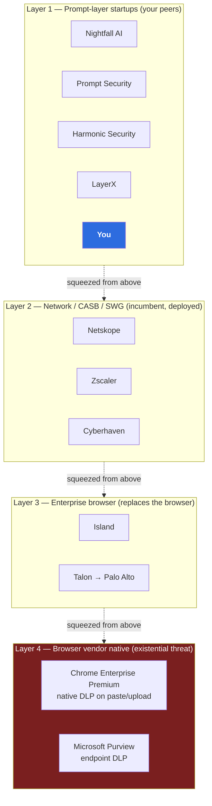

# 00 — Critique and Positioning

> **Status:** Phase 0 design. Landscape facts current to knowledge cutoff (Jan 2026) and marked
> `[verify]` where they move fast. Assumptions referenced as `A1`, `B3` etc. resolve to
> [`ASSUMPTIONS.md`](../ASSUMPTIONS.md).

---

## 0. The short version

If you read one section, read this one.

1. **The Grammarly analogy is the first bug.** Grammarly is bought by the person it helps. This is
   bought by someone else to constrain the user. Mechanically it's Grammarly; politically it's a
   breathalyzer interlock. Every UX instinct imported from the first framing is wrong.
2. **You are best at the detections that matter least.** Regex nails IC numbers. Nobody's career ends
   over an IC number. Careers end over the unreleased earnings, the M&A codename, the customer list,
   the source code — **none of which has a regex, an NER class, or a public training set.** Your
   accuracy is inversely proportional to the stakes.
3. **The highest-value feature in your product was hiding in your "deferred" pile, and it needs no ML
   at all.** Org-custom sensitivity — project codenames, internal IDs — is a customer-supplied
   dictionary. Trivial to build, highest value, creates switching cost. **Now in Phase 0** (approved
   2026-07-16). The single most actionable finding in this document.
4. **Reframe the Ignore+reason loop.** As ML training data it's poisoned by adversarial users and
   worth ~nothing. As a **compliance artifact** — *"here are the 47 times your staff overrode the
   control, and what they typed as justification"* — it's the report the buyer actually wants. Same
   feature, different product.
5. **The desktop apps are an uncovered hole in your threat model.** ChatGPT and Claude ship native
   desktop clients. Block someone in the browser and the uncovered channel is one click away.
6. **Your market may be closing, and the escape is a *second* sentence, not a first.** Enterprise LLM
   tiers sell zero-retention contractually, so the buyer's cheapest fix is procurement. The answer —
   **policing the boundary between sanctioned and unsanctioned AI** — is what makes the product
   durable. But it goes *second*. **Lead with the mechanic: typing-time, context-preserving
   pseudonymization**, the thing Layer 2 structurally cannot do and Layer 4 won't do well.
7. **Verdict: build it, but sell it as a seatbelt, not a vault** — and know that the wedge
   (multilingual) is not the moat (vendor-neutrality).

---

## 1. Brutal critique

### 1.1 The analogy is the first bug

"Grammarly for prompt privacy" imports a mental model that poisons every design decision downstream.

| | Grammarly | This product |
|---|---|---|
| Who buys | the user | the user's employer |
| What it does to you | makes you look smarter | stops you doing your job for a moment |
| Failure mode | you ignore a suggestion | you file a ticket, or you route around it |
| If you uninstall | you lose a benefit | **the buyer loses their control** |

Grammarly's suggestions are *offers*. Yours are *refusals*. A product whose core action is refusal
cannot borrow the interaction design of a product whose core action is flattery. The tell is in your
own brief: *"Clean → auto-submit transparently, minimal added friction."* That sentence is written by
someone still imagining they're building for the user. They're not. The friction **is** the product —
it's what the compliance officer is buying. The correct goal isn't *minimize* friction; it's **place
friction precisely, and nowhere else.** Those sound similar and produce different software.

The honest analogy is the alcohol interlock on a fleet vehicle. Nobody driving the van wanted it. The
fleet operator bought it. It's still a good product. It is not sold, designed, or measured like
Grammarly.

### 1.2 You are best at the detections that matter least

This is the deepest problem in the concept and it is not solvable by better engineering.

| What you detect | How | Precision | Actual harm if leaked |
|---|---|---|---|
| Malaysian IC, cards, IBAN, API keys | regex + checksum | ~100% | Real but **bounded** — PDPA exposure, a fine, a disclosure |
| Names, addresses, emails | NER | good | Low-moderate |
| **Unreleased financials, M&A codename, customer list, source code, litigation strategy** | **nothing** | **—** | **Existential. This is what ends careers.** |

Your detection quality is **inversely proportional to the stakes**. The stuff you catch perfectly is
the stuff that costs a fine; the stuff that costs the company is invisible to every layer you've
specified. And it's invisible for a structural reason, not a training-data reason: *"Project
Nightjar closes Thursday"* is not sensitive because of its **form**. It's sensitive because of a fact
about the company that no public corpus contains.

An investor's ML advisor will find this in about four minutes. The response cannot be "L3 will handle
it" — L3 is a small LLM making a semantic judgement with no knowledge of the customer's business, and
it will be mediocre at exactly this.

**But there is a very good answer, and you've filed it under "deferred."** See §1.3.

### 1.3 The highest-value feature needs no ML, and you deferred it

Your brief lists *"Custom/org-specific sensitivity (project codenames, internal IDs) without
retraining"* as a sub-bullet of doc 03. It is not a sub-bullet. It is the answer to §1.2 and probably
the most commercially important thing in the product:

- **It's the high-stakes class.** Codenames and internal IDs are precisely the career-ending
  category that L1/L2/L3 all miss.
- **It requires no ML.** It's a customer-supplied dictionary — Aho-Corasick over a wordlist. Fast,
  ~100% precision on exact match, sub-millisecond, and **auditable**: you can show a compliance
  officer the list. You cannot show them a logit.
- **It's the only thing here the customer can't get from Google.** A native browser DLP will never
  know that "Nightjar" matters at this company.
- **It creates switching cost.** A customer who has spent two hours curating their sensitive-terms
  dictionary has made an investment they won't repeat for a competitor. That's the closest thing to
  lock-in this product can have, and it costs you a week of engineering.
- **It makes the buyer a participant.** The compliance officer *configures* it. That's an
  onboarding ritual that converts a purchase into a commitment.

**Decision (approved 2026-07-16): org-custom dictionary matching is a Phase 0 L1 feature**, alongside
the regional regex fast-path. It is cheap, it is differentiated, and it is the only part of the
detection stack whose value is not capped by model quality.

*Not scope creep against decision #7. That decision was a boundary against the six-month file-parsing
swamp (§1.7) — a fundamentally different kind of cost. This is a sub-millisecond, no-ML, auditable
L1 addition that happens to sit on the other side of the highest-value/lowest-difficulty quadrant.
Deferring the cheap thing because it shares a doc with the expensive thing would be filing by
accident rather than by cost.* See [ADR 0004](adr/0004-org-custom-dictionary-in-phase-0.md).

### 1.4 The desktop-app hole

ChatGPT and Claude both ship **native desktop clients** `[verify: current platform coverage]`. Your
extension sees none of it. The failure sequence is:

1. User hits your blocking modal.
2. User is now consciously aware the browser is policed.
3. The desktop app is on their dock.

You have *trained* the user to find the uncovered channel. A control that visibly blocks one door
while an unlocked door sits beside it doesn't reduce leakage — **it redirects leakage to a channel
you can't even audit.** Arguably that's worse than no control, because the compliance officer now has
a dashboard showing "leaks are down 90%" that is measuring displacement, not prevention.

Honest mitigations, none of which are yours to build:
- Application allowlisting / EDR blocks the desktop apps (customer's endpoint team does this)
- Accept the gap and **scope the claim to the browser** in writing

The second is the pre-seed answer. It must be said out loud in the sales conversation, because the
compliance officer *will* ask, and having the answer ready is worth more than pretending the gap
isn't there.

### 1.5 Trivial evasion

Anyone who wants to defeat this defeats it in seconds:

- `890101-14-5555` → `890101 14 5555`, `8 9 0 1 0 1 - 1 4 - 5 5 5 5`, or *"eight nine zero one..."*
- Homoglyphs (Cyrillic `а` for Latin `a`), zero-width joiners, base64
- Type it into Notepad, screenshot, upload the image *(Phase 0 doesn't scan images at all)*
- Just... phrase it: *"the customer whose IC ends in triple-five"*

Every one of these defeats L1 completely and most defeat L2. This is not a bug to fix — **an
adversarial user always wins against a client-side control**, because the control runs on their
machine, in their process, under their debugger. Chasing evasion is a treadmill that consumes your
entire ML budget and converts your product into an arms race against your own customers' employees.

**Correct posture: don't chase it.** State plainly that this defends against *accident and habit*,
not *intent*. See §6.

### 1.6 "Ignore + reason" is poisoned as training data — and valuable as something else

Your brief: the ignore reason *"is fed back for model improvement / adjudication."*

As training data this is close to worthless, and mildly toxic:
- Users type `.` or `not sensitive` or `asdf` to make the popup go away. Assume adversarial (your own
  brief says so).
- The users who click Ignore most are, by selection, the ones least invested in getting it right.
- You'd be training on labels produced by the population with the *strongest incentive to lie*, about
  the cases the model already found *hardest*. That's not active learning; it's active poisoning.

**But the same feature is excellent as a compliance artifact.** Reframe:

> *"In June, your staff overrode this control 47 times. Here is each prompt's finding class, the
> justification typed, and by whom. Three people account for 31 of them."*

That is the report the compliance officer buys the product for. It needs **no model improvement at
all** — it's a log. It converts your weakest ML input into your strongest sales asset, and it
sidesteps the poisoning problem by never treating the reason as a label.

**Recommendation:** the reason field's primary consumer is the **admin console**, not the training
pipeline. Doc 07 may *later* mine it with heavy adjudication; doc 00 positions it as evidence.

### 1.7 File scanning is a second company

*"must support broad file types: pdf, docx, xlsx, pptx, csv, txt, md, code, images/scans, zip, etc."*

That sentence is a 6-month project with a dedicated engineer. It is Tika-as-a-service plus an OCR
pipeline plus a malicious-file defense (zip bombs, decompression ratios, malformed-PDF parser
exploits, timeouts, size caps). Deferring it to Phase 1 (decision #7) was correct. What matters is
that **the deck must not imply it's a bullet point.** At A1 headcount (2–3 engineers), files are
Phase 1's *dominant* cost, not an increment.

### 1.8 The market may be closing under you

This is the critique I'd lead with if I were the skeptical advisor.

ChatGPT Enterprise, Claude for Work/Enterprise, and Gemini in Workspace all sell **zero data
retention and no-training-on-your-data, contractually** `[verify: current terms per vendor]`. So:

> **"Why do I need you? I'll buy ChatGPT Enterprise, mandate it, and my data is contractually safe."**

That is the cheapest fix available to your buyer, it requires no new vendor, and it's already in
their budget cycle. If prompt privacy is solved by procurement, your category evaporates.

**The answer — and it's a good one — is that this reframes the product rather than killing it.**
Buying ChatGPT Enterprise doesn't stop:
- an employee using their **personal** ChatGPT account (the sanctioned tool is *harder*: no chat
  history, corporate SSO friction, different UI)
- anyone pasting into **DeepSeek, Perplexity, or whatever launches next quarter**
- the fact that the company has **no idea** either is happening

So your durable job is **not "redact PII."** It's:

> **Enforce the boundary between sanctioned and unsanctioned AI, and prove it was enforced.**

That framing survives enterprise-tier adoption. Two things follow, and they're strategically
load-bearing:

1. **It survives — and inverts — the procurement threat.** The more sanctioned AI a company buys, the
   more it needs someone to prove the boundary holds. Your TAM **grows** with enterprise LLM adoption
   instead of shrinking. That's the rare case where the thing that looked like your extinction event
   is actually your tailwind.
2. **It strengthens the vendor-neutrality moat** (§5). The sanctioned tool is one vendor; you police
   everything else. Google will never build that — policing Gemini's competitors while exempting
   Gemini is a product nobody trusts.

### Recommendation — and the ordering is the whole point

**Lead with the mechanic: typing-time, context-preserving pseudonymization.**

It is the thing **Layer 2 structurally cannot do** — a proxy sees a *committed* request; it can
refuse or corrupt it, and its UX ceiling is a 403 page — and the thing **Layer 4 won't do well**,
because of §5's conflict. It puts the first meeting on ground you own.

**Do not lead with "visibility."** Even a sharpened version. The word is the CASB's own vocabulary:
discovery and shadow-IT reporting is *precisely* what Netskope and Zscaler already sell your buyer,
from a licence they've already paid for. Say "visibility" in sentence one and you have invited a
feature comparison against an incumbent **before your differentiation has landed** — a comparison you
don't need to enter and are not positioned to win. The word costs you the frame.

**Second, as the durability argument:** shadow-AI boundary policing is the answer to the question
that *will* be asked, probably in the first meeting:

> *"Why don't I just buy ChatGPT Enterprise and mandate it?"*

Deployed in that slot it's an asset. Deployed in the first slot it's an own goal.

**Visibility is retained — as evidence, not as the pitch.** It's what the audit trail produces
(§1.6), and it lands *after* the buyer already believes you're differentiated. Same capability,
different sentence, entirely different meeting.

---

## 2. Competitive landscape

> **All company facts below are `[verify]` before any investor conversation.** M&A and feature
> coverage in this category move quarterly and my knowledge has a cutoff. I would rather hand you a
> structure with gaps than a confident list that's a year stale.

### 2.1 Four layers, not one market

### 2.2 Layer 1 — the prompt-layer startups (your peers)

| Vendor | Form factor | Note `[verify]` |
|---|---|---|
| **Nightfall AI** | API/SaaS DLP, GenAI coverage | Established DLP brand extending into GenAI |
| **Prompt Security** | Browser extension + gateway | **Acquired by SentinelOne, closed 2025-09-05** ✅ *confirmed — founder research* |
| **Harmonic Security** | GenAI-native DLP | Closest to your positioning |
| **LayerX** | Browser-extension security platform | Extension form factor, broader than prompts |

**Read:** the peer set is real, funded, and English-first. None of them is defensible against Layer 4
either — which is why **acquisition is the category's likely outcome rather than an IPO.** The
SentinelOne/Prompt Security close (2025-09-05) is no longer a hypothesis; it's the category's proof
point, and it is a datapoint **for** you in two ways:

1. **The exit path is demonstrated, and the acquirer type is now known.** It wasn't Google or
   Microsoft — it was an endpoint-security incumbent buying a prompt-layer capability it couldn't
   grow organically. That's the shape of your outcome, and it tells you who to be legible to.
2. **It validates the category and shortens the window simultaneously.** An exit proves buyers exist
   and tells every incumbent the category is real. Read against §5: the 18–24 month head-start
   estimate should be treated as the *optimistic* end after this close, not the midpoint.

**That's not a reason not to build.** It's a reason to be honest in the deck about what a good
outcome looks like, and to build the thing an acquirer wants: a wedge into a market they can't reach
(SEA multilingual) and a team that can execute. An acquirer buys distribution-adjacent capability —
which is exactly what "we're already inside 40 Malaysian mid-market accounts" is.

### 2.3 Layer 2 — network / CASB / SWG

Netskope, Zscaler, Cyberhaven. Already deployed at your buyer, already have a security budget line,
already shipping GenAI controls `[verify]`.

**Why they don't kill you:** a proxy sees the request **after** the user committed to sending it. It
can block, or it can mangle. It cannot have a conversation with the user in the composer, it cannot
pseudonymize-and-rehydrate, and it cannot do typing-time anything. Its UX ceiling is a 403 page.
**Why they might:** they don't need to be good. They need to be *already bought*. "Good enough and
free with your existing Netskope licence" beats "excellent and a new procurement" more often than
founders like to admit.

### 2.4 Layer 4 — the browser vendors (the existential one)

**This is the competitor, not the startups.** Chrome Enterprise Premium ships native DLP on
paste/upload events (U8). Microsoft Purview does endpoint DLP covering browser upload paths (U9).
Both are distributed to your entire beachhead **already**, at zero marginal deployment cost, by the
company that also owns the browser you depend on.

You cannot out-engineer them. Google's multilingual NLP is better than yours will ever be — they
trained the models the field is built on. If EN/BM/ZH prompt DLP becomes a visible revenue line,
Google ships it in a quarter.

**What you have is §5: they have a conflict of interest, and it doesn't close.**

### 2.5 Layer 3 — enterprise browsers

Island; Talon (acquired by Palo Alto `[verify: ~$625M, 2023]`). Strongest possible control — they
*are* the browser. Also the hardest sell: you're asking a company to replace the browser on every
desk. Different deal size, different sales cycle, different buyer seniority. Not your competitor at
150 seats; very much your competitor at 5,000.

---

## 3. Is "extension" even the right form factor?

| | Sees typing | Removable | Covers desktop apps | Can pseudonymize **+ rehydrate** | Deploy cost |
|---|---|---|---|---|---|
| **Extension** | ✅ | ⚠️ until force-installed | ❌ | ✅ **only option** | Low |
| Forward proxy (TLS intercept) | ❌ send-time only | ✅ | ✅ | ❌ block/mangle only | High |
| CASB / SWG | ❌ | ✅ | ~ | ❌ | High (but often already paid) |
| Enterprise browser | ✅ | ✅ | ❌ | ✅ | Very high — replace the browser |
| Endpoint agent | ✅ | ✅ | ✅ | ⚠️ hard | High |

**Verdict: extension — and not for the reason you think.**

The reason is *not* that it's cheap or easy to ship. It's that **the pseudonymize-and-preserve-context
UX is only possible from inside the DOM.** A proxy sees a committed request; it can refuse or corrupt
it, but it cannot negotiate with the user, cannot offer `John Tan → PERSON_1`, and cannot rehydrate
the model's reply on the way back. If your differentiation is *"don't block — pseudonymize"* (and per
doc 04, it is), then the extension isn't a compromise you settled for. **It's a requirement the
product's core mechanic imposes.** That's a principled defense that survives the question *"why not
just build a proxy?"*

The honest caveat, and it's the whole of B3:

> **The extension is the right vehicle for the product, and the wrong vehicle for the control.**

A control the user can remove isn't a control. Force-install closes that gap — and per the B3
correction, it's genuinely a single registry key on Windows, not a Chrome Enterprise Core licence.
The remaining question is not technical. It's whether a 150-seat BPO's lone IT generalist will
actually run it. **That's doc 08's #1 pre-Phase-0 validation item, ranked above every engineering
task in this package.**

---

## 4. The buyer: the compliance officer, and what that costs you

### The argument

A tool whose core action is to stop you doing the thing you were trying to do **cannot be sold to the
person it stops.** The individual pays the entire cost — friction, false positives, broken flow —
while the benefit (a leak that didn't happen) is invisible and accrues to their employer. That's a
textbook externality, and externalities get corrected by the party that internalizes them: the
company.

The compliance officer's arithmetic is inverted. The leak is **their** career risk. The friction is
**someone else's** inconvenience. And they hold a budget line for exactly this.

Retention seals it. Consumer has no floor: every false positive is a reason to uninstall and nobody
stops you. Enterprise has force-install, a renewal conversation, and a buyer who **wants** the
friction, because the friction is the product.

**The consumer version is not a smaller enterprise product. It's a different product with worse unit
economics and no moat.**

### What this implies for the whole design

This is the part founders skip. Choosing this buyer re-specs the product:

| Because the buyer isn't the user… | The design must… |
|---|---|
| Policy is the buyer's, not the user's | Settings live in a **tenant console**, not an extension popup. The user gets **no** "disable detection" toggle. |
| The user's delight is not the goal | Optimize for **non-defection**, not satisfaction. Different metric, different UI. |
| The buyer needs evidence | **Audit trail is a first-class feature**, not telemetry. It's half of what they're paying for. |
| Ignore-reasons are read by the admin | Reframe the loop as **compliance evidence** (§1.6), not training data. |
| Uninstall is a security event | It must **page someone**. Silence on uninstall = the control failed silently. |
| Every FP is a ticket *the admin* eats | The precision target becomes quasi-contractual. Doc 07's asymmetry isn't an ML preference — it's a **commercial commitment**. |
| The buyer never uses the product | Your demo audience and your daily-active user are **different people with opposed interests**. Build two surfaces. |

**The uncomfortable one:** your best product decisions will make your users unhappier. You need to be
at peace with that or you'll keep sanding down the exact edges the buyer is paying for.

---

## 5. Wedge vs. moat — do not conflate these

This is where I'd expect the sharpest DD question, and where most decks in this category are mushy.

### The wedge: multilingual EN/BM/ZH — **and it is not a moat**

Let me be blunt about my own earlier position: I implied this was defensible. It isn't.

Google has better multilingual NLP than you will ever have. If EN/BM/ZH prompt DLP becomes a visible
revenue line, they ship it in a quarter. What you own is a **head start** — call it 18–24 months
*(estimate, low confidence)* — because the incumbents are English-first and genuinely bad at Malay,
at Chinese, and at the code-switched mixture your market actually types.

That head start is a real asset. It wins the beachhead and the first 20 logos. **Calling it a moat is
what gets you caught.**

There's also a technical reason it's a better head start than it looks — the fragmentation argument
in doc 03 (an English-first tokenizer shreds `890101-14-5555` into digit soup, destroying the
identifier's schema before the model ever sees it). That's a real engineering advantage. It is also
one Google could replicate with a vocabulary swap.

### The moat: vendor neutrality — **structural, and it widens**

Google sells Gemini. Microsoft sells Copilot.

Chrome Enterprise Premium's DLP and Microsoft Purview exist to make it **safe to keep your data
inside their ecosystem.** Their strategic goal is to **route** your prompts to their model, not to
**reduce** the prompts flowing to models. Neither will ever ship a first-class *"stop your data
reaching Gemini"* control, because that product's success metric is **directly opposed to the
platform's revenue.**

That's not a roadmap gap that closes when the market is proven. **It widens as Gemini grows.** The
more valuable Gemini is to Google, the less Google wants the thing that throttles it.

> **You are the only vendor with no LLM to sell.**

A compliance officer whose LLM, browser, and DLP are all one company has **no independent
verification** of any of them — and independent verification is the entire reason a compliance
function exists. This is precisely why CASBs sold into Microsoft shops that already had native
Microsoft controls. It's not a new bet; it's a bet that has paid before.

**The formulation for the deck:**

> **Multilingual gets us in the door. Vendor-neutrality is why we're still there when the platform
> notices.**

---

## 6. Threat model

### What this defends against — and it's a real list

- **Accidental paste.** The dominant real-world case: someone dumps a spreadsheet row or a customer
  record into a prompt without thinking.
- **Habitual carelessness.** The employee who does it every day because it's convenient and nothing
  has ever gone wrong.
- **"I didn't know that counted."** Genuine ignorance of what the policy considers sensitive —
  addressable purely by making the boundary visible.
- **Shadow AI drift.** Staff quietly migrating to unsanctioned tools (§1.8) — the highest-value
  detection and the easiest.
- **Absence of evidence.** Today the compliance officer cannot answer *"has this ever happened?"*
  The audit trail converts an unknown into a number. **That alone sells.**

### What it explicitly does NOT defend against

Stated plainly, because a good advisor will find every one of these and it's better to have named
them first:

| Not defended | Why | Mitigation |
|---|---|---|
| **A determined insider** | Runs on their machine, their process, their debugger | **None. Accepted.** Out of scope by design. |
| **A malicious or compromised provider client** | **The composer is the provider's own DOM.** Their JS reads every keystroke as it's typed — **before any redaction has run, independent of our extension, and unfixable by it.** We protect against the provider's **server**, never their **client**. | **None. Accepted.** If the provider's page is hostile, nothing running on that page saves you. |
| **Native desktop apps** (ChatGPT/Claude) | Not a browser | Customer's EDR/app-allowlisting. **Not ours.** (§1.4) |
| **Mobile / personal devices** | Not a browser we control | BYOD policy. Not ours. |
| **Other browsers** | Unless force-installed on all | Force-install list must cover the estate |
| **Obfuscation** (spacing, homoglyphs, spelling it out) | Trivial, unwinnable (§1.5) | **None. Accepted.** Don't chase. |
| **Screenshot → upload as image** | Phase 0 doesn't scan images | Phase 1 OCR — and even then, trivially defeated |
| **Copy-paste into a native app** | Outside the browser | Endpoint DLP. Different product. |
| **Direct API access** | No browser involved | Network layer. Different product. |
| **Uninstalling the extension** | Phase 0: one click | Force-install (B3) — **the whole enterprise story depends on this** |
| **Every other exfil channel** (email, Slack, Drive, USB) | You're a point solution | Their existing DLP. Say so. |
| **A provider breaking your adapter** | They ship UI weekly | Doc 05's adapter + self-test. **Ongoing tax, forever.** |

### The provider-client boundary, stated precisely

That second row deserves more than a table cell, because it defines the **shape** of what
pseudonymization means and it is cheap to say now and expensive to have surfaced in diligence.

We type into **their** text box. The raw text sits in **their** DOM for the entire time the user is
composing it. Nothing we build changes that — not the gate, not the on-device model, not the
offscreen engine. Our interception happens between the composer and the **network request**, so the
protection we actually provide is:

> **The provider's *servers*, logs, and training sets never see the sensitive value. The provider's
> *page* always could.**

**Why this is acceptable scope, not a hole to patch:** the threat we're addressing is the provider's
**legitimate** data handling — prompts landing in retention, in logs, in a training corpus. That's a
real, documented, contractually-relevant risk. A provider whose client-side JS covertly exfiltrates
your composer is running an *attack*, and against that attacker no browser-side control helps,
including ours. You cannot defend a page from the page.

**What it obliges us to do is scope the claim exactly.** Never say *"the provider never sees it."*
Say *"it never reaches their servers or their training set."* The first is false and an advisor will
prove it in one line of devtools. The second is true, is what the buyer actually cares about, and is
what the DPA and the retention terms are written against.

*(This also explains why de-pseudonymization is killed for Phase 0 — see doc 01 §5. Rehydration
would write the plaintext **back** into that same untrusted DOM, on a persisted, server-synced
surface, handing the provider's server through a normal product feature exactly the value the whole
pipeline withheld from it.)*

### The one-sentence honest summary

> **This is a seatbelt, not a vault. It protects the careless, not the malicious — and the careless
> are the ones actually causing the leaks.**

Do not let anyone sell it as a vault. The seatbelt claim is **true, defensible, and sufficient**:
seatbelts are mandatory, universally deployed, and a good business, and nobody claims they stop
someone determined to drive into a wall. The category dies when a vendor overclaims, a customer
leaks anyway, and the control is revealed as theater. **Underclaiming is a competitive strategy
here.**

---

## 7. Verdict

**Build it.** With four corrections to the concept as briefed:

1. **Lead with typing-time, context-preserving pseudonymization** (§1.8) — the mechanic Layer 2
   structurally cannot do and Layer 4 won't do well. **Shadow-AI boundary policing goes second**, as
   the durability argument answering *"why not just buy ChatGPT Enterprise?"* **Never lead with
   "visibility"**: it's the CASB's own word and it starts a comparison against a vendor already
   installed at the account.
2. **Pull org-custom dictionary into Phase 0** (§1.3). Highest value, no ML, days of work, and the
   only lock-in available to you. This is the finding I'd act on first. *(Approved.)*
3. **Reframe Ignore+reason as compliance evidence, not training data** (§1.6). Turns your most
   poisoned input into your best report.
4. **Say the threat model out loud** (§6). Seatbelt, not vault. Underclaiming is a moat of its own in
   a category that will be full of overclaimers.

**And know what you're signing up for:** the wedge is a head start, not a moat; the moat is that you
have no LLM to sell; and the whole enterprise story rests on B3 — an assumption currently supported
by an informed read and zero primary research. **Go make ten phone calls before you write a line of
the detection engine.**

---

### ADRs from this document

- [`adr/0001-buyer-is-the-compliance-officer.md`](adr/0001-buyer-is-the-compliance-officer.md)
- [`adr/0002-extension-form-factor.md`](adr/0002-extension-form-factor.md)
- [`adr/0003-wedge-vs-moat.md`](adr/0003-wedge-vs-moat.md)
