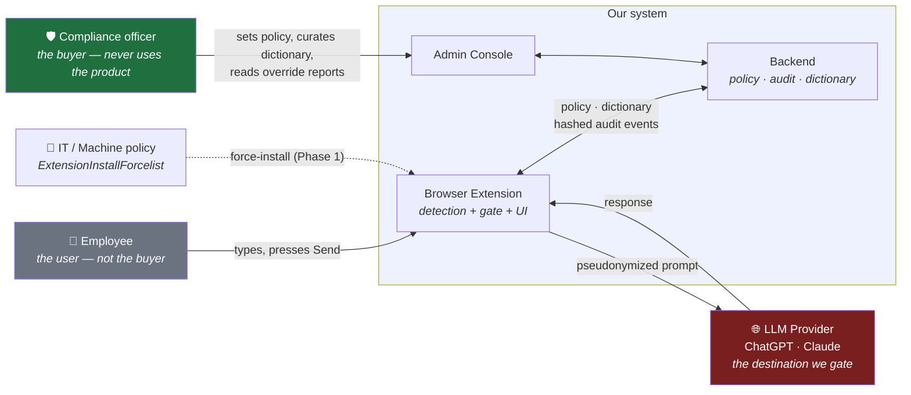
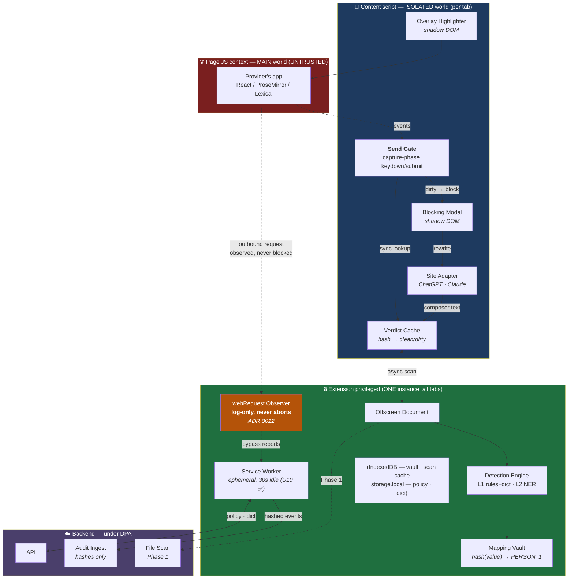
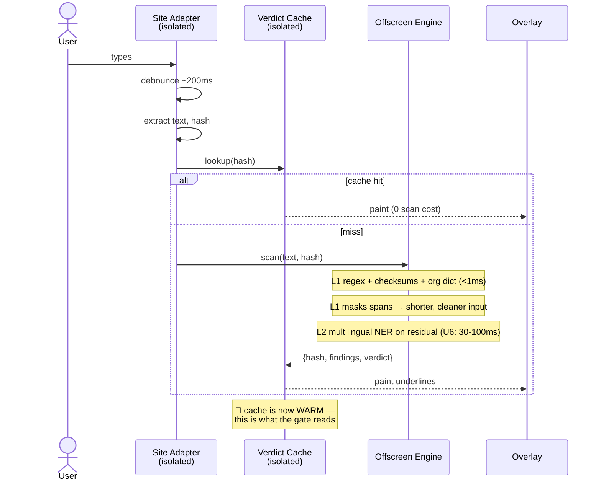
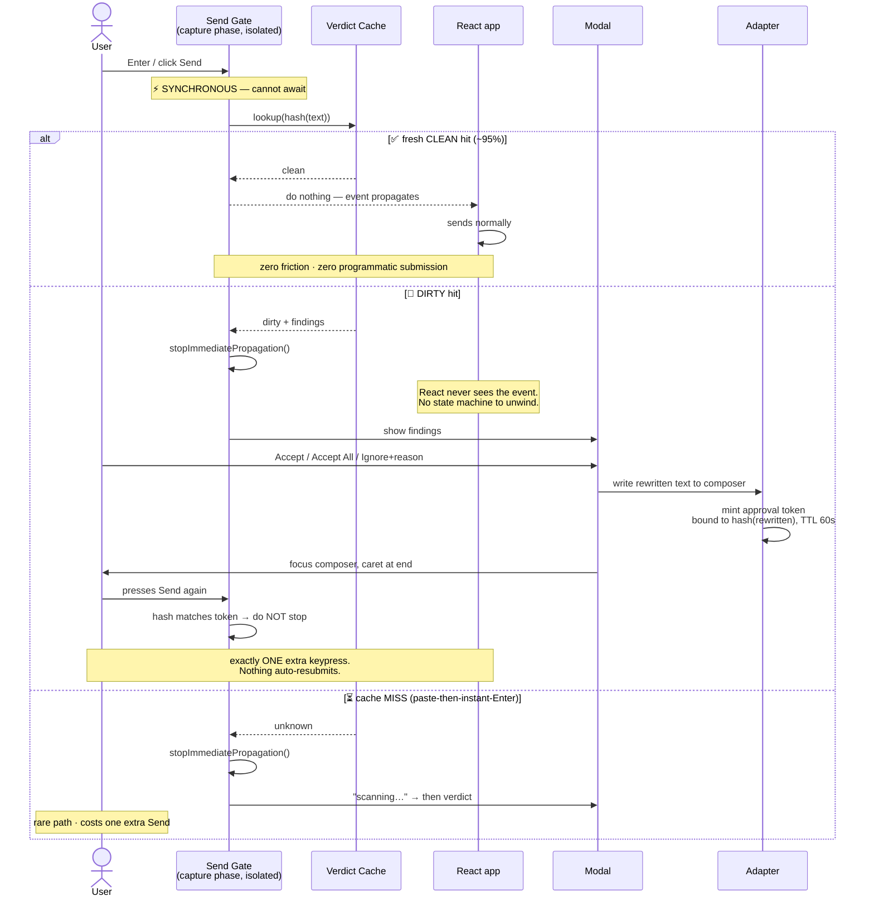
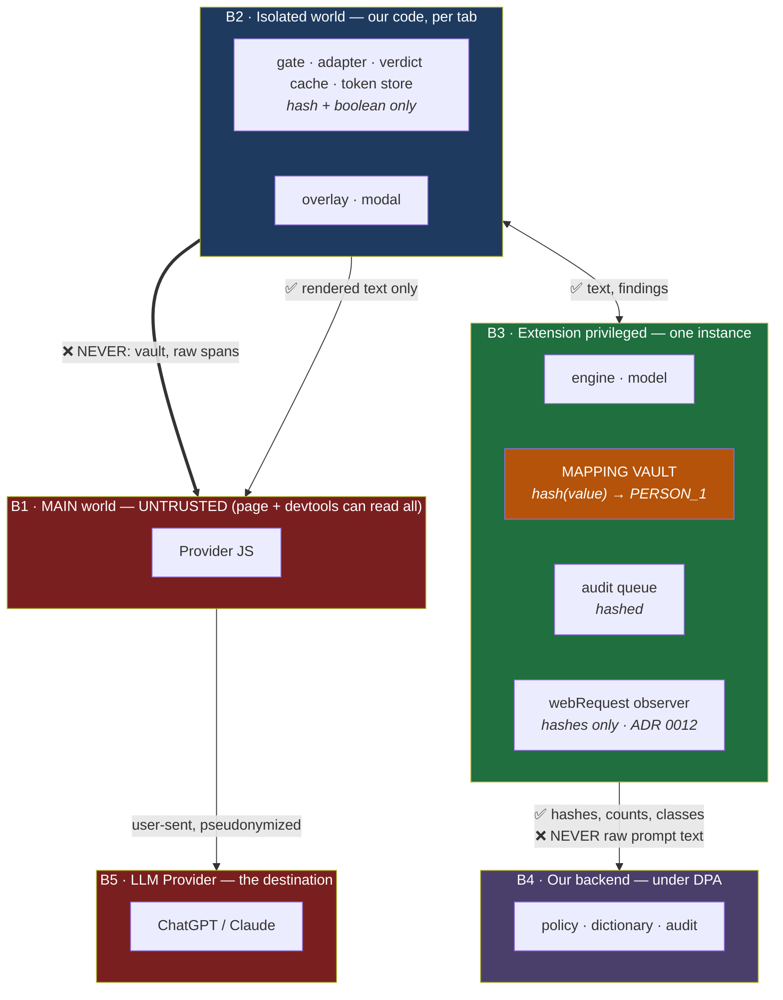

# 01 — High-Level Design

> **Scope:** Phase 0 architecture with Phase 1 seams marked. Assumptions resolve to
> [`ASSUMPTIONS.md`](../ASSUMPTIONS.md); positioning to [`00`](00-critique-and-positioning.md).
> Every `U`-tag is an unverified claim, not a fact.

---

## 0. The one architectural idea

Everything below follows from a single coupling that isn't obvious and that I got wrong in an
earlier draft:

> **The typing-time scan is not a UX feature. It is the send-gate's cache.**

The gate must decide *synchronously* — `stopImmediatePropagation()` cannot be awaited. Scanning is
async. The only way out is that **by the time the user presses Send, the answer is already known**,
because we've been scanning as they type. That is why detection must be **on-device** (decision #2):
a cloud round-trip could never make a synchronous decision, which would force stop-and-replay, and
replay *is* the auto-submit that decision #8 forbids.

**Decisions #2 and #8 are therefore one decision.** Neither can be revisited alone. If the U6
latency assumption (30–100 ms on-device inference) fails, the cache is too often cold and this whole
design degrades to "press Send twice, always."

---

## 1. System context

**Read the two humans.** The person using this and the person paying for it are different people with
opposed interests (ADR 0001). The console and the extension are **two products with two audiences**,
not one product with two views.

---

## 2. Component architecture

### Two component decisions worth explaining

**The gate lives in the ISOLATED world, not the MAIN world.** *(This corrects my own earlier
instinct.)* Content scripts and page scripts share one DOM event dispatch — they have separate JS
contexts, not separate event systems. A capture-phase listener registered on `document` from a
content script at `document_start` therefore fires **before** React's root-container delegation,
without any MAIN-world injection. And it matters enormously that it does: **the isolated world is
where the verdict cache lives**, so the gate can read it *synchronously*. A MAIN-world gate would
have to `postMessage` across the world boundary to reach the cache — which is async — which
reintroduces the exact stop-and-replay problem §0 exists to avoid. **In Phase 0 we do not inject into
the MAIN world at all** — see the correction note below. *(Rests on U12 — must be proven empirically
per surface, week 1. **Doc 05 §1 splits U12 into three sub-tests with three different blast radii; do
not test it as one claim.**)*

> **Corrected 2026-07-17 (doc 05 §4, [ADR 0012](adr/0012-observer-uses-webrequest.md)) — the diagrams
> above and in §5 have moved the observer, and this paragraph said the opposite.** It read: *"The MAIN
> world is used for one thing only: the log-only fetch observer, which genuinely needs to patch the
> page's own `fetch`."* **It does not genuinely need to.** That claim descends from **U11's
> inference** — *"dNR cannot see request bodies, therefore the observer must be a MAIN-world patch"* —
> which is **a non-sequitur.** U11's *claim* is true and cited; dNR is simply **not the only
> observational API.** `chrome.webRequest` survived MV3 for observation and still supplies
> `requestBody`. **Eliminating dNR never selected the MAIN world.**
>
> **And the skipped option is better on a principle the patch cannot satisfy: an independent check
> must fail independently.** A MAIN-world `fetch` patch dies from the same class of event that kills
> the DOM gate — the page doing something unanticipated in its own JS — so **the check shares a failure
> mode with the thing it checks, in the same untrusted world.** `webRequest` observes below the page's
> choice of API. **The observer therefore lives in the service worker (B3), not the MAIN world (B1),
> and §5's boundary diagram moves with it.**
>
> **Three further diagram defects fixed in the same pass, all of them the same shape — a correction
> that landed in the prose and not in the picture:**
> - **The vault node read `PERSON_1 → John Tan`**, which §5's **I2 row already corrected** to
>   `hash(value) → PERSON_1` on 2026-07-16. **The reverse map does not exist** (doc 04 §2.2). The
>   diagram was still describing the artifact the rehydration kill deleted.
> - **The storage node credited IndexedDB with `policy · dict · cache`**, contradicting **§6**, which
>   puts policy and dict in `chrome.storage.local` and the vault and scan cache in IndexedDB.
> - **The service worker's `~30s idle` is no longer approximate.** **U10 ✅ — exactly 30 seconds**,
>   cited (doc 05 §5.1).

**The detection engine lives in ONE offscreen document, not in the content script.** Content scripts
run **per tab**. The L2 model is ~135 MB *(U5, estimate)*. Five tabs open on ChatGPT would mean five
model instances and ~675 MB — instantly fatal on D2 hardware (8 GB). The offscreen document is a
single extension-global context, so **one model serves every tab**. The service worker can't host it
either: MV3 terminates it at ~30 s idle (U10), and reloading 135 MB on every wake is absurd. This is
the decisive constraint, and it's why the architecture has a component most extensions don't need.

---

## 3. Data flow — typing-time detection

The final note is the point. Everything the user perceives here — the underlines — is a **side
effect**. The actual product of this flow is a warm cache entry keyed to the exact content hash the
gate will look up milliseconds later.

**L1-before-L2 is not just ordering, it's a compounding win.** L1 masks what it finds before L2 sees
the text, which **shortens the sequence** *and* **removes the spans L2 handles worst** — digit runs,
which every modern tokenizer fragments into soup. L1 makes L2 cheaper **and** more accurate.

> **Corrected 2026-07-16 (doc 03 §3).** This paragraph previously read *"strips out precisely the
> digit-soup that an **English-first** tokenizer fragments worst,"* implying digit fragmentation is a
> deficiency a multilingual tokenizer fixes. **It isn't — multilingual tokenizers split digit runs
> too.** The masking win is real and tokenizer-independent; **the multilingual win is a separate thing
> and lives in the surrounding BM/ZH text**, not in the identifiers (doc 00 §5, doc 03 §3).
>
> **Note the irony the old clause was hiding:** by masking the IC at L1, **we guarantee the tokenizer
> never sees it** — which is exactly why doc 00's old tokenizer-based argument for the multilingual
> model was self-defeating. This sentence contained the refutation of the claim it was citing.

---

## 4. Data flow — the send-time gate

The important diagram in this document.

### Why this shape and not the obvious one

The naive design stops **every** send, scans, then replays if clean. That replay is programmatic
submission — unreliable across React/Lexical synthetic event systems, and grey-zone under provider
ToS with the downside landing on *the user's* account. Decision #8 forbids it. The warm cache is what
makes "don't stop the event at all" possible, and it's the only way to get zero friction on the clean
path **without** ever submitting on the user's behalf.

**The honest cost:** one extra keypress on a dirty prompt, zero on a clean one. That's the price of
#8 and I'd pay it every time.

**The honest risk:** if U6 is wrong and inference is ~500 ms, the cache is cold too often, the miss
path dominates, and the product becomes "press Send twice, always." **U6 is a week-1 spike, not a
doc-06 detail.**

---

## 5. Trust boundaries

> **Corrected 2026-07-17 ([ADR 0012](adr/0012-observer-uses-webrequest.md)) — the observer moved from
> B1 to B3, and the move is an upgrade rather than a relocation.** This diagram placed the observer in
> **B1** and restricted it to *"hashes only"* **because B1 is untrusted** — the restriction was
> compensating for a bad address. **In B3 it isn't compensation. We keep hashing anyway, because I3
> requires it** — audit events carry hashes, classes and counts, never values — **but now for the right
> reason.** §2's note carries the full reasoning; the short version is that the MAIN-world patch was
> selected by an inference that skipped an option, and **a check that shares a failure mode with the
> thing it checks is not a check.**
>
> **The vault node also lost its 🔑.** It was labelled *"🔑 MAPPING VAULT"* — but per the I2 note below
> and doc 04 §2.2 **there is no key**: the reverse map is not built, and the table is `hash(value) →
> PERSON_1`, forward-only. **It remains sensitive at rest** (doc 04 §2.3 — we hold the salt, and names
> are a small keyspace) and **I2 still binds**. The emoji was the last place in this document still
> asserting an artifact the rehydration kill deleted.

### The rules, stated as invariants

| # | Invariant | Why it exists | Violated by |
|---|---|---|---|
| **I1** | Raw prompt text **never** crosses B3 → B4 in Phase 0 | Decision #2. This is the entire security-questionnaire answer: *"your keystrokes never leave the machine."* | Any telemetry that logs content "for debugging" |
| **I2** | The **mapping table never crosses B2 → B1** | Holds `hash(value) → PERSON_1` — **forward-only, hash-keyed** (doc 04 §2.2). **Still sensitive at rest**: we hold the salt and names are a small keyspace, so hashes + placeholders are recoverable by a determined reader (doc 04 §2.3). **Not** a de-pseudonymization key — there is **no path** from `PERSON_1` back to a name. | A convenience `window.__vault` for debugging |
| **I3** | Audit events crossing B3 → B4 carry **hashes, classes, counts — never values** | Decision #5. Otherwise our audit DB becomes the most toxic PII store in the customer's org — we'd *be* the breach we sell against | "Just log the finding so support can reproduce it" |
| **I4** | The **org dictionary is sensitive at rest** on the device | A list of a company's unannounced codenames is a target in itself (ADR 0004). It inherits the on-device rule — synced encrypted, matched locally | Storing it in plain `chrome.storage.local` |
| **I5** | The verdict cache in B2 holds **hash + boolean**, never text | Keeps the smallest possible surface in the least-trusted of our own contexts | Caching findings alongside verdicts for the modal |

### The boundary that isn't clean — and the decision it forced

**De-pseudonymization writes plaintext into the DOM (B2 → B1). It does not ship.**

> 🔴 **Settled kill, closed by the founder 2026-07-16.** Rehydration is **not** in Phase 0, and it is
> not queued behind an assessment. This is a closed decision, not an open flag.

To rehydrate the model's answer — turning `PERSON_1` back into `John Tan` in the rendered response —
we must write the real name into the provider's page.

**State the reason precisely, because the imprecise version invites a reversal.** The defect is *not*
that rehydration violates **I1**. It doesn't. We send nothing to our backend; nothing crosses B3 → B4
either way. Anyone checking rehydration against the invariant table will find no violation and
conclude it's safe. **That check is the trap.** The actual defect:

1. The entire pipeline exists to stop `John Tan` reaching **the provider's server**.
2. Rehydration writes `John Tan` **back into the provider's page** — B2 → B1, the one boundary where
   we deliberately hand plaintext to an untrusted context.
3. The provider's app has **legitimate, non-malicious** reasons to re-serialize rendered DOM:
   edit-message, rich-text copy handlers, autosave, scroll/engagement analytics.
4. So rehydration can hand the provider's server **exactly the value the whole product spent its
   latency budget keeping away from it** — through a normal product feature, not an attack.

**It doesn't break I1; it defeats I1's purpose.** And it falsifies any blanket claim that the user's
sensitive data never reaches the provider — a claim that is load-bearing in doc 02's compliance story
and in the sales conversation. **A control that quietly undoes itself on the return path is worse than
no control, because the audit trail says it worked.**

**Why this is worse than the composer exposure** (doc 00 §6, the provider-client boundary): composer
text is transient and user-controlled — the user typed it and nothing we do put it there. Rehydrated
text is **injected by us**, into a **persisted, server-synced** conversation view.

**Scope of doc 04.** Doc 04 designs the rehydration mechanism and documents the implementation-level
implications of this kill — the design work is real and it is a genuine Phase 1+ question. **Doc 04
does not re-open the decision.**

> **Corrected 2026-07-16 (doc 04 §2.2) — the kill paid a dividend nobody costed.** The **I2** row above
> originally described the vault as `PERSON_1 → John Tan` and called it *"the de-pseudonymization
> key."* **It was specified while rehydration was still a feature, and rehydration was the reverse
> map's only consumer.** Pseudonymization only ever queries `value → placeholder`, which a salted hash
> answers — so **the artifact this section called "the de-pseudonymization key" is not built.**
>
> **Killing rehydration didn't just close the hole this section describes — it deleted the asset that
> made the hole worth exploiting.** The mapping table **remains sensitive at rest** (doc 04 §2.3: we
> hold the salt, and names are a small keyspace — hashing is blast-radius reduction, **not** a security
> boundary) and **I2 still binds**, now as defense-in-depth rather than as the thing standing between
> us and catastrophe.

---

## 6. Tech stack

Every row states what we rejected and why. Where a choice is close, the **decision rule** for
changing our minds is explicit — the point is to avoid re-litigating it in month three.

| Layer | Choice | Rejected | Why |
|---|---|---|---|
| **Extension framework** | **WXT** | Vite + CRXJS; raw MV3 | MV3 boilerplate, HMR, and cross-browser are solved problems and we have 2–3 engineers (A1). **Decision rule:** if WXT's abstractions fight the offscreen-document or MAIN-world injection work in week 1, eject to CRXJS immediately — those two are load-bearing and framework magic there is a liability, not a convenience. |
| **Extension language** | **TypeScript, strict** | JS | The adapter layer is where correctness matters most and where the DOM lies to you. |
| **In-page UI** | **Preact (~3 KB) in a shadow root** | React (bundle weight in a page we don't own); vanilla (the modal has real state) | Shadow DOM is non-negotiable: our styles must not leak into a page we don't own, and the page's must not leak into ours. |
| **Inference** | **ONNX Runtime Web** (WASM; WebGPU opportunistic, per D3) | `transformers.js` (wraps ORT, less control over quantization — and quantization is our entire memory budget); TF.js (weak for transformer NER); WebLLM (wrong shape — built for generative LLMs) | We need control over the exact quantization and vocab-trimmed artifact (doc 03). A wrapper that abstracts that away abstracts away the thing we're optimizing. |
| **L1 matching** | **Hand-rolled regex + Aho-Corasick** | A DLP library | L1 must be sub-millisecond and **auditable** — you show a compliance officer the rule (ADR 0004). A dependency's opaque ruleset is the opposite of that. |
| **Backend** | **Python + FastAPI + Pydantic** | Node/TS (unifies types with the extension); Go (fast, fights the ML ecosystem) | Phase 1's file pipeline and any cloud L3 are Python-native. At A1 headcount you cannot afford two backend languages — and picking TS now means adding Python by Phase 1 anyway. **The codegen tax is smaller than the two-language-ML tax.** |
| **Shared types** | **Pydantic → OpenAPI → generated TS client** | Hand-maintained duplicates (drift); tRPC (Node-only); protobuf (build complexity for no Phase 0 gain) | One source of truth, generated consumers. This is the price of the Python decision and it's worth paying. |
| **Client storage** | **IndexedDB** (vault, scan cache) + `chrome.storage.local` (policy, dict) | All in `chrome.storage.local` | **Structure and durability** — see the correction below. The **scan cache** is genuinely too big for the KV store; the **vault** is not, and belongs here for different reasons. |
| **Backend storage** | **Postgres** | Anything interesting | Boring is correct. Nothing here is a data-shape problem. |
| **Audit transport** | **Batched, hashed events via SW** | Real-time per-event | Fits the ephemeral SW lifecycle (U10) and I3. |

> **Corrected 2026-07-17 (doc 05 §5.3) — right decision, and one of its two reasons was wrong.** The
> client-storage row read: *"Quota and structure. **The vault and cache are too big and too structured
> for the KV store.**"* **"Too big" does not survive contact with doc 04 §2.4**, which says a
> per-conversation vault is *"a few hundred entries at worst"* and that **"memory is not the
> constraint."** Bundling the vault with the scan cache imported the cache's size argument onto an
> artifact that doesn't have a size problem. **The cache is too big. The vault never was.**
>
> **The vault belongs in IndexedDB for two reasons, and the second did not exist when this row was
> written:**
> 1. **Structure** — it is a keyed table, not a KV blob. That half of the original reason holds.
> 2. 🔴 **Durability, which is now a correctness requirement, not a preference.** Doc 05 §5.3 and
>    [ADR 0011](adr/0011-monotonic-placeholder-numbering.md): Chrome may reclaim the offscreen document
>    mid-thread (ADR 0006), and **an in-memory vault dies with it.** `chrome.storage.local` would
>    actually have satisfied durability — **so the original row reached the right answer for a reason
>    that could not have distinguished the two options.**
>
> **Worth keeping because it generalizes:** a justification that is true of a *bundle* is not
> automatically true of each *member*. Two artifacts were put in one row because they share a
> mechanism, and then inherited one another's arguments.

### The stack decision I'd defend hardest

**Python backend against a TypeScript extension**, accepting a codegen step, when unified types were
free. It looks wrong on day one and is right by month four: the moment file parsing (Tika,
unstructured, OCR) and cloud L3 arrive in Phase 1, a Node backend becomes a Node backend *plus* a
Python service *plus* the glue between them. Three engineers cannot carry that. **Pay the codegen tax
now; it's the cheaper of the two taxes and it's the one that doesn't compound.**

---

## 7. What is deliberately absent from Phase 0

Naming these here so no one has to infer them from silence:

| Absent | Why | Lands |
|---|---|---|
| **L3 semantic layer** | The genuinely hard one, and doc 00 §1.2 says it's the high-stakes layer. Not buildable on-device at A1 headcount in 4 weeks. **The org dictionary (ADR 0004) is the Phase 0 stand-in** — it catches the same high-stakes class deterministically. | Phase 1+ (cloud, for files) |
| **File scanning** | Decision #7. Six-month swamp (doc 00 §1.7). | Phase 1 |
| **De-pseudonymization** | **Killed, not deferred** (§5). Writes plaintext into the provider's persisted DOM — defeats the pipeline's purpose through their *legitimate* features, not an attack. Founder-closed 2026-07-16. | **Not scheduled.** Doc 04 designs it; absent a strong new reason to revisit, it does not land in any phase. |
| **Force-install** | Decision #6; gated on B3 primary research | Phase 1 |
| **The improvement loop** | E3. Feedback is *captured*, not trained on — and per doc 00 §1.6 its primary consumer is the admin console anyway | Phase 1+ |
| **Fail-closed** | A product decision, not an engineering one | Doc 06 argues it |

---

## 8. Open questions this document raises for later docs

1. **U6 (on-device inference 30–100 ms)** — §0's coupling and §4's whole gate design rest on it.
   Week-1 spike. → doc 03/06
2. **U12 (isolated-world capture listeners preempt React)** — the gate mechanism itself. Must be
   proven **per surface**, empirically, not reasoned about. Week-1 spike. → doc 05
3. **Content-script → offscreen routing and its hop cost** — every scan crosses contexts. → doc 05/06
4. ~~**Vault plaintext in the DOM (§5)**~~ — **closed, not open.** Rehydration is killed for Phase 0
   and unscheduled beyond it (§5, founder-closed 2026-07-16). Doc 04 documents the mechanism and this
   kill's implications; it does not re-decide. Listed here struck through rather than deleted so a
   reader of an earlier draft can see the question was answered, not dropped.
5. **Dictionary distribution while keeping I4** — encrypted sync of the customer's codenames. → doc 02

---

### ADRs from this document

- [`adr/0005-gate-in-isolated-world.md`](adr/0005-gate-in-isolated-world.md)
- [`adr/0006-offscreen-document-hosts-engine.md`](adr/0006-offscreen-document-hosts-engine.md)
- [`adr/0007-python-backend-with-codegen.md`](adr/0007-python-backend-with-codegen.md)
