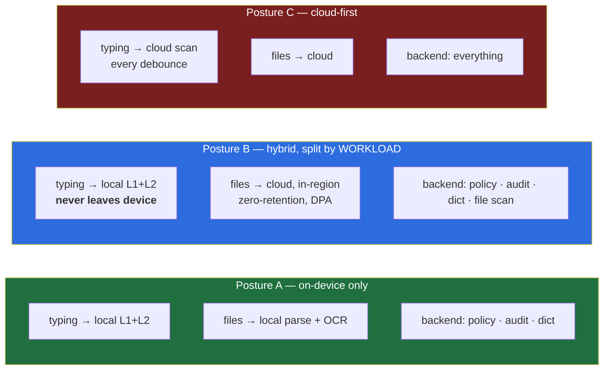

# 02 — Privacy Architecture

> **Scope:** the privacy posture and its defense. Assumptions resolve to
> [`ASSUMPTIONS.md`](../ASSUMPTIONS.md); positioning to [`00`](00-critique-and-positioning.md);
> architecture and invariants **I1–I5** to [`01`](01-hld.md) §5. Every `U`-tag is an unverified
> claim. Legal statements carry citations or are tagged `[verify]` — this document is not legal
> advice and assumption **A3** says we buy that expertise rather than build it.

---

## 0. The short version

1. **The paradox is a consumer paradox, and it mostly dissolves at our buyer.** *"To protect your
   data my server must see it"* only bites when the data subject and the customer are the same
   person. At an enterprise, the data is the **company's**, the company already has inspection
   rights over its employees' work product, and a DPA makes us a processor like every other DLP
   vendor. **The objection was never "you see our data." It was "where, who, how long, and is it in
   your training set."** That is a legal answer, not an architectural one.
2. **But it doesn't dissolve completely, and the residue is the interesting part.** A DPA binds a
   counterparty that continues to exist. We are pre-seed, and this category's demonstrated outcome
   is acquisition (doc 00 §2.2). **Data you never collected cannot be transferred to your acquirer,
   subpoenaed, or breached.** That is the one guarantee law cannot issue and architecture can — and
   it's the honest reason on-device is worth more than its compliance story suggests.
3. **All three postures are cheap. The cost column does not discriminate.** A, B, and C land within
   cents of each other per user/month *(estimates, §2.5)*. This comparison's conventional tiebreaker
   is uninformative here, and manufacturing a difference would be a fabrication. **Cloud-first does
   not die on cost. It dies on the tail latency and on becoming the most toxic database in the
   category.**
4. **Cloud-first's ceiling advantage is smaller than it looks, and doc 00 already explains why.**
   A bigger model buys accuracy on named entities and card numbers. The **career-ending class** —
   codenames, unreleased financials — is served by a **wordlist** (ADR 0004), which works identically
   in all three postures. **Posture C buys a bigger model for the detections that matter least.**
   That's doc 00 §1.2's inversion, applied to our own architecture.
5. **Decision: hybrid, split by workload** — prompt text on-device **always**, files cloud, in-region,
   zero-retention, under DPA ([ADR 0008](adr/0008-hybrid-split-by-workload.md)). **Not**
   confidence-based escalation, which is the thing usually meant by "hybrid" and is strictly worse
   than either pure posture (§2.6).
6. **The split is defensible because the boundary is drawn *before* we look at the data.** "Is this a
   file or is this typing?" is answerable a priori. "Is this span ambiguous?" is answerable only
   after inference — a boundary you can only draw after looking is not auditable, and it exfiltrates
   exactly the hardest cases.
7. **PDPA changed under us and the docs hadn't caught up.** Processors are **directly liable** under
   the Security Principle since 2025-04-01, and the s129 cross-border whitelist is **repealed**. Both
   cut in our favour (§6) — but they oblige us to appoint a DPO and notify breaches, which is a cost
   line A3 assumed we'd buy.
8. **U13 resolved, and it corrects F3.** AWS `ap-southeast-5` (Malaysia) has been GA since
   **2024-08-22**. Phase 1 files land **in-country for Malaysian tenants from day one** — not in
   Singapore with residency as a later upgrade. This deletes a Transfer Impact Assessment from every
   Malaysian deal.
9. **The best answer to a security questionnaire is not a control. It's an N/A.** The architecture's
   compliance value is measured in the number of questions it makes **inapplicable** (§6.4).

---

## 1. The core paradox — dissolve it, don't solve it

### 1.1 The paradox as usually stated

> *"You're a privacy product. To detect the sensitive data, something must read the prompt. So to
> protect my data, your server has to see it. You're the leak you're selling against."*

This is a real objection and it has killed real companies. It is also **the wrong objection for our
buyer**, and answering it on its own terms is how you end up spending pre-seed runway on
confidential computing.

### 1.2 Why it dissolves at the enterprise buyer

The paradox is load-bearing **only when the data subject and the paying customer are the same
person.** That's the consumer case. Ours isn't.

| | Consumer framing | Our actual buyer (ADR 0001) |
|---|---|---|
| Whose data is in the prompt? | **The user's own** | **The company's** — work product, customer records, source code |
| Who decides if a third party may read it? | The user. Any disclosure is a loss. | **The company.** It already decides this constantly. |
| Does the company already read this data? | — | **Yes.** Email DLP, endpoint agents, CASB, code scanning, MDM. It's their data on their equipment. |
| What is a vendor that reads it? | An adversary | **A data processor** — a category with a hundred incumbents and a standard contract |

The compliance officer buying this **already** runs three or four products that read employee content
more invasively than we ever will. Microsoft Purview reads their mail. Netskope reads their traffic.
Their EDR reads their filesystem. **Presenting "our server would see prompt text" as a novel violation
misreads the account entirely** — it's Tuesday.

Under GDPR Art. 28 and now expressly under the amended PDPA (§6.1), the vendor-reads-it problem has a
name and a form: **you become a processor, under a DPA, with defined purpose limitation, retention, and
sub-processors.** That is not a workaround. It is the mechanism the entire enterprise software
industry runs on.

### 1.3 What the objection actually is

When a security reviewer says *"I don't want your server seeing our prompts,"* they are almost never
making the philosophical claim. Decompose what they actually mean:

| The real question | The real answer's type |
|---|---|
| **Where** is it processed? Which jurisdiction, which region? | **Legal + config** — a region name |
| **Who** at your company can read it? | **Legal + access control** — a policy and an audit log |
| **How long** do you keep it? | **Legal** — a retention term in a contract |
| **Is it in your training set?** | **Legal** — one clause, and it's the clause they care about most |
| Who else do you send it to? | **Legal** — a sub-processor list |
| What happens when you're breached? | **Legal** — notification terms, and now a statute (§6.1) |

**Every row is a contract term.** Not one of them is answered by a TEE, an enclave, or an attestation
report. Spending runway on cryptographic answers to contractual questions is a **category error** —
you build an expensive thing that impresses engineers and answers no question on the form.

> **The paradox is a philosophy problem. The buyer has a procurement problem. Do not solve the wrong
> one.**

### 1.4 The residue — where the dissolution genuinely fails

Now the adversarial half, because a dissolution argument that claims to be total is a sales pitch.
**Three things survive it**, and they're the reason the architecture still matters:

**1. A DPA binds a counterparty that exists.**
This is the sharp one. Contractual privacy is a promise by a legal entity. We are a pre-seed startup
with A2 runway. Most of us die; the ones that don't get acquired — and doc 00 §2.2 establishes that
acquisition is *this category's demonstrated outcome*, with SentinelOne/Prompt Security closing
2025-09-05. On acquisition or insolvency, **the data asset moves.** The DPA nominally travels with
it, but the operational reality — who holds KMS keys, whether the retention job still runs, what the
new owner's data science team considers in-scope — becomes someone else's decision.

> **Data you never collected cannot be transferred to your acquirer, subpoenaed, breached, or
> quietly re-scoped by a new owner three years from now.**

That is the one guarantee legal cannot issue, and it is the honest reason on-device is worth more
than its compliance story alone suggests.

**2. A pre-seed vendor's assurances are worth less than an incumbent's.**
"Where, who, how long" answered by Microsoft is answered by a company with a SOC 2 Type II, a
breach-notification track record, and too much to lose. The same sentence from a 3-person startup is
a promise with no collateral behind it. **We cannot win a trust contest on institutional weight, so
we should not enter one.** Architecture lets us not enter it: *"we can't read it"* needs no
institutional trust, which is precisely why it's the answer available to a company that has none yet.

**3. The concentration problem.** See §2.4 — a central store of every prompt from every employee at
every customer is a more attractive target than any single customer we protect.

### 1.5 The nuance that matters, stated precisely

Here is the thing I want to be exact about, because the sloppy version is a claim we'd have to walk
back:

**Prompt text is on-device because the architecture forces it, not because the paradox forces it.**

Doc 01 §0: the send-gate must decide **synchronously**, `stopImmediatePropagation()` cannot be
awaited, so the verdict must already be in a local cache when the user presses Send. A cloud scan
cannot make a synchronous decision. That's decisions #2 and #8 as one coupled decision, and it is an
**engineering** constraint, not a privacy one.

The privacy benefit is **real and load-bearing and free** — but it is a *consequence*, not the
premise. This matters for two reasons:

1. **Honesty in diligence.** If we claim "we put it on-device for privacy," a sharp advisor asks
   *"then why not offer a cloud tier for customers who don't care?"* — and the true answer is *"the
   gate wouldn't work,"* which we'd then be discovering in the meeting.
2. **It tells you what's actually fragile.** If U6 fails (on-device inference is ~500 ms rather than
   30–100 ms), we lose the **gate**, not the **privacy posture**. The two failures have different
   blast radii and different fallbacks. Conflating them hides that.

> **We are not on-device because privacy demanded it. We are on-device because the gate demanded it,
> and privacy came along for free. That's a better story, not a worse one — it means the privacy
> property is structural rather than a policy we could be talked out of.**

---

## 2. Three postures, compared

### 2.1 What each posture is

**Note what is identical across all three:** the org dictionary (ADR 0004) **matches locally** in
every posture, because I4 says so and because a wordlist is sub-millisecond anywhere. Hold that
thought — it's §2.3's punchline.

> ⚠️ **Read "locally" precisely, and don't stop reading here.** *Matching* is local in every posture —
> that part is unqualified and posture-independent. **Custody of the term list is not.** In **Phase 0
> the admin types the codenames into our console, so we hold them and we can decrypt them** — I4 is
> satisfied in letter and not in spirit until the Phase 1 key-custody upgrade lands. **§5 is the full
> account and §7 records I4 as the one invariant posture B cannot claim in full.** A reader who stops
> at this section will otherwise leave with an overclaim, which is the specific failure this package
> keeps trying to avoid.

### 2.2 Architecture and latency

| | **A — on-device only** | **B — hybrid by workload** | **C — cloud-first** |
|---|---|---|---|
| **Prompt scan** | Offscreen doc, ONNX WASM, ~135 MB int8 *(U5)* | **Identical to A** | HTTPS per debounce burst |
| **File scan** | Local parse + Tesseract.js *(U7: 1–3 s/page)* | Cloud, in-region, ephemeral | Cloud |
| **Gate decides** | Sync, off warm cache | **Sync, off warm cache** | **Cannot decide synchronously** |
| **Prompt p50** | 30–100 ms *(U6, estimate, unmeasured)* | **Same as A** | ~80–150 ms *(estimate)*: RTT + TLS + queue + inference |
| **Prompt p99** | Model contention, one machine — **bounded** | **Same as A** | **Unbounded.** Corporate traffic hairpins through VPN/SWG concentrators; add 50–200 ms *(estimate)*. Hotel wifi, tethering, VPN reconnects. |
| **Offline** | ✅ Works | ✅ Prompts work, files queue | ❌ **Dead** |

**The latency row that decides this is p99, not p50, and that is not a detail.** The gate reads a
cache. A slow scan doesn't make the gate slow — it makes the cache **cold**, and a cold cache means
the gate stops the event and shows *"scanning…"* (doc 01 §4's miss path). So **every tail-latency
event converts directly into user-visible friction on a product whose entire UX thesis is that the
clean path has none.** Posture C's mean is survivable; its tail is the product.

And the tail is worst **precisely in our beachhead's conditions**: mid-market SEA enterprises
backhauling browser traffic through a VPN concentrator, which is the same infrastructure choice that
makes them buy DLP in the first place. **C is slowest at exactly the accounts most likely to buy.**

### 2.3 Detection quality ceiling

| | A | B | C |
|---|---|---|---|
| **Model size ceiling** | D2-bound: ~1–2 GB addressable, 4-core, no discrete GPU | **Same as A for prompts**; unbounded for files | **Unbounded** — 7B, 70B, frontier API |
| **L3 semantic on prompts** | ❌ Not buildable on-device at A1 in Phase 0 | ❌ (same) | ✅ Genuinely possible |
| **Org dictionary (ADR 0004)** | ✅ Local, exact-match, ~100% precision | ✅ **Identical** | ✅ **Identical** — still local, per I4 *(matching; custody is §5)* |

> **"Model size ceiling" is the hardware ceiling, not the shipped footprint.** The ~1–2 GB is what D2
> can address before the user notices (`ASSUMPTIONS.md` D2); the **deployed** artifact is the ~135 MB
> int8 vocab-trimmed model of §2.2 *(U5)* — comfortably under it. **The two numbers are not in
> tension**, and they answer different questions: §2.2 asks *what do we ship*, §2.3 asks *what could
> we ever ship here*. Doc 03 does the real budget.

**Give C its due: the ceiling difference is real.** A cloud posture could run a semantic model over
every prompt and catch things a 135 MB NER model never will. That is C's one genuine argument and it
should not be strawmanned.

**Now kill it, using doc 00's own finding.** Doc 00 §1.2 established that **detection quality is
inversely proportional to stakes**:

- The stuff a bigger model catches better — names, addresses, more entity classes, subtler PII — is
  the **bounded-harm** class. A fine, a disclosure, a bad afternoon.
- The **career-ending** class — *"Project Nightjar closes Thursday"*, unreleased earnings, the
  customer list — is sensitive because of **facts about the company**, not because of **form**. No
  model of any size knows that "Nightjar" matters at this company and nowhere else. ADR 0004 rejected
  L3-for-org-sensitivity on exactly this ground: it would be *"an expensive, imprecise, unauditable
  approximation of a lookup table."*
- That class is served by the **dictionary**, which is **local in every posture**.

> **Posture C spends its entire architectural advantage buying a bigger model for the detections that
> matter least — and gets nothing on the class that ends careers, because that class is answered by a
> wordlist that runs identically on-device.**

C's ceiling advantage is real, and it is aimed at the wrong half of the problem. That is the argument
that actually retires it, and it costs us nothing to make because doc 00 already did the work.

### 2.4 Compliance story and failure modes

| | A | B | C |
|---|---|---|---|
| **The sentence** | *"Your keystrokes never leave the machine."* | *"Your typing never leaves the machine. Files are processed in-region under our DPA, zero retention."* | *"We see every keystroke your staff types into ChatGPT. We promise to forget it."* |
| **Questionnaire effect** | Most data-handling rows → **N/A** | Prompt rows → **N/A**; file rows → answerable | **Every row live.** Nothing is N/A. |
| **I1 (doc 01 §5)** | ✅ Holds | ✅ Holds | ❌ **Dead.** I1 *is* the posture. |
| **Concentration risk** | None — no store exists | Transient file buffers only | **A central store of every prompt from every employee at every customer.** |
| **Failure mode — engine *slow*** | Cache cold → gate stops → *"scanning…"* → resolves. **Fails to friction, and it's loud.** | **Same as A** | **Network partition = product dead.** Every send stops. Our uptime becomes their typing latency. |
| **Failure mode — engine *dead*** | ⚠️ **Unresolved in the current design** — the miss never resolves. **Specified to doc 06** (§8): timeout → **advisory-only**, surfaced as *"protection degraded."* **Not** a silent fail-open. | **Same as A**, plus region outage → files unscannable → doc 06 owns fail-open/closed | Same — C has no local path to degrade *to*. |
| **Vendor-mortality exposure (§1.4)** | **Nil** | Files only, transient | **Total** |

**C's disqualifier, stated once:** it would make us **the most toxic database in the category** — the
complete prompt history of every employee at every customer, centralized, defended by a pre-seed
security budget, held by a company whose demonstrated exit is being acquired by someone else. We would
become a more attractive target than any single customer we protect, and we would be selling that
customer the idea that this reduces their risk.

**That is not a risk to mitigate. It is a business we should not be in.**

**A and B fail in a direction we can live with — but only for the failure this document originally
described, and the distinction matters enough to split the row above.**

- **Engine slow** (contention, a cold offscreen document, a long prompt): the cache is cold, the gate
  stops the event, the user sees *"scanning…"*, and **it resolves**. Friction — annoying, visible,
  **loud**, and self-clearing. Compare doc 00 §6's worst case: a control that fails **open and
  silently** while the dashboard still says it works. This path fails loud.
- **Engine dead** (offscreen document crashed, model failed to load, OOM on D2): **the miss never
  resolves.** *"Scanning…"* becomes a hang. **Nothing in the current design resolves it**, and
  claiming this path "fails to friction" would be an unverified extrapolation from the slow case.

**Naming the trap, because it's the one we'd walk into.** A hung modal generates support tickets
immediately, so the pressure will be to add a timeout that **lets the send through**. That is a
**silent fail-open** — it violates decision #8's spirit and lands precisely on doc 00 §6's worst
outcome for a compliance buyer: the control stops working while the audit trail says it worked.

**The resolution is a third state we already have precedent for.** Decision #3 defines **advisory
mode** for the solo tier — one engine, two policy modes. A dead engine should degrade to **exactly
that**, on a timeout, **logged and surfaced to the user and the admin as "protection degraded"** — not
swallowed as an internal error. It is honest (the user knows), it is auditable (the admin sees a
device with a broken engine), and it reuses a mode that must exist anyway.

**Specified, not decided here.** Per §8's handoff, **the timeout value, the degradation state machine,
and the fail-open/fail-closed call are doc 06's**, and the offscreen lifecycle is doc 05's (ADR 0006
already warns the SW must be able to recreate it). Doc 02's claim is narrower and is the only one it's
entitled to: **posture B's engine failure must not resolve to silence**, and there is a known-good mode
to resolve it to instead.

### 2.5 Cost per user/month — and why this column is a red herring

All figures **(estimate)**, at 1,000 seats, derived below rather than asserted. None is measured.

| | A | B | C |
|---|---|---|---|
| **Prompt inference** | $0 — user's CPU | **$0** | ~$0.005–0.05 |
| **File scan (Phase 1)** | $0 — user's CPU | ~$0.01 | ~$0.01 |
| **Fixed backend** | ~$0.10–0.15 | ~$0.20–0.35 *(second region)* | ~$0.15 |
| **Total /user/month** | **~$0.10–0.15** | **~$0.20–0.40** | **~$0.20–0.50** *(up to ~$3 with a frontier-model L3)* |

<b>Derivation — check the arithmetic, don't trust the number</b>

**C, prompt inference.** Typing-time scanning fires per ~200 ms debounce burst, so a single prompt
triggers many scans — call it ~20 *(estimate)*. At 20 prompts/user/day × 22 working days = 440
prompts/month → **~8,800 scans/user/month**. At ~50 ms CPU per scan *(U6-adjacent, unmeasured)* =
440 vCPU-seconds = 0.12 vCPU-hours. Fargate ≈ $0.04/vCPU-hour → **~$0.005/user/month**. Multiply by
10× for idle, autoscaling headroom, and request overhead → **~$0.05**. Even routing every scan to a
hosted 7B at ~$0.10/M input tokens: 8,800 × 300 tokens = 2.64M tokens → **~$0.26/user/month**.

**A, fixed backend.** No inference. Policy + dictionary CRUD + hashed audit ingest: small RDS (~$50/mo)
+ ECS (~$30/mo) + misc → ~$100–150/mo → **~$0.10–0.15/user/month**, and it *falls* with scale.

**B.** A's backend, plus Phase 1 files: ~5 files/user/month × 10 pages × ~2 s *(U7)* = 100
vCPU-seconds → **~$0.001**, negligible. The real delta is the **fixed cost of a second region**
(§6.2, `ap-southeast-5`) — ~$100–200/mo *regardless of user count* → **+$0.10–0.20/user/month at
1,000 seats**, falling with scale.

**Read the table honestly: it does not discriminate.** The postures differ by **cents**, against a
plausible price of $10–20/seat/month. The conventional tiebreaker in a posture comparison is cost,
and here cost is **noise**.

**This is worth saying out loud rather than hiding.** The temptation is to make the cost column look
decisive — cloud is expensive, on-device is free, QED. It isn't true. **Cloud-first is affordable.**
If the deck implies we chose on-device to save money, the first advisor to spend ten minutes with a
pricing calculator catches it, and per `ASSUMPTIONS.md`'s framing, *every other number in the package
then loses its credit.*

> **C dies on tail latency (§2.2), on the ceiling being aimed at the wrong class (§2.3), and on
> concentration (§2.4). It does not die on cost. Say so.**

### 2.6 The rejected fourth option — "hybrid" as everyone else means it

When a vendor says "hybrid," they almost always mean **confidence-based escalation**: run a small
model locally, and when it's *unsure*, send the ambiguous span to a bigger cloud model.

It sounds like the best of both. **It is strictly worse than either pure posture**, and the reasoning
generalizes, so it's worth stating carefully:

| Failure | Why |
|---|---|
| **It exfiltrates precisely the worst data** | The local model is unsure exactly when the span is **unusual** — a novel identifier format, an odd codename, a weird internal reference. **You have built a filter that forwards your most unusual sensitive data to the cloud and keeps the boring stuff home.** It is the exact inverse of the intended selection. |
| **It sends it stripped of context** | To limit exposure you'd send the span, not the prompt. But a semantic model's whole advantage **is** context. So you either send the surrounding prompt (and it's posture C with extra steps) or you send a naked span to a model that can't judge it without context. **There is no middle setting that works.** |
| **It breaks the gate anyway** | Escalation is a network call. The gate cannot await it. Doc 01 §0: any cloud dependency in the prompt path forces stop-and-replay, and replay is the auto-submit decision #8 forbids. **The coupling doesn't care that it's only *sometimes* a network call** — the gate must be synchronous *always*. |
| **The boundary is undrawable in advance** | You cannot tell a security reviewer *which* of their prompts leave the machine, because the answer is "the ones our model found confusing" — knowable only after inference, different next model version, unauditable by construction. |

**The last row is the general principle, and it's why B survives the same critique:**

> **A privacy boundary must be drawable *before* you look at the data.**
>
> *"Is this a file or is this typing?"* — answerable **a priori**, by anyone, identically, forever.
> Auditable. Explainable in one sentence. Stable across model versions.
>
> *"Is this span ambiguous?"* — answerable **only after inference**, only by us, differently after
> every retrain. Not auditable. Not explainable.

That distinction is the whole reason "split by workload" is honest and "split by confidence" is not,
and it is why B is not a compromise between A and C. **It's a different axis.**

---

## 3. Decision — hybrid, split by workload

**Decided: Posture B.** Prompt text on-device **always**. Files cloud, **in-region**,
**zero-retention**, under DPA. Recorded as [ADR 0008](adr/0008-hybrid-split-by-workload.md).

**The sentence for a security reviewer** — memorize this, it is the deliverable:

> **"Your typing never leaves the machine. Files are processed in-region under our DPA, zero
> retention."**

Two clauses. Both true. Both checkable — the first with devtools, the second with a contract. Neither
requires the reviewer to trust our good intentions.

### Why not A (on-device only), which is the purer answer

A is tempting: it's the *strongest* compliance story and it has zero vendor-mortality exposure. We
reject it because **on-device file processing is a worse product and a worse security posture** than
it looks:

- Parsing hostile file formats — PDF, DOCX, ZIP — **on the user's machine, in the browser** means
  shipping a parser attack surface to every endpoint, defended by a browser tab. Zip bombs and
  malformed-PDF exploits (doc 00 §1.7) are *better* handled in a sandboxed, ephemeral, revocable
  container we control than in 500 browsers we don't.
- Tesseract.js at 1–3 s/page *(U7)* on D2 hardware makes a 40-page scan a minute of a corporate
  laptop's life, single-threaded, in a tab.
- It buys nothing the buyer asked for. **The buyer never objected to files being scanned in a cloud
  they already send files to.** They objected to keystroke surveillance. A answers a question nobody
  asked, at real cost.

**A is the right answer if B3 research says the segment won't tolerate any cloud component.** That's
the decision rule; it's cheap to fall back to A because B's prompt path *is* A's prompt path.

### Why the split is stable

The seam holds because **workload type is a property of the input, not of our model's opinion of the
input.** It cannot drift with a retrain. It cannot be gamed by a prompt. It doesn't need a threshold.
A new engineer can implement it correctly without reading this document, and a reviewer can verify it
without trusting us — which is the only kind of boundary worth claiming.

---

## 4. Verdict on the seven techniques

| # | Technique | Verdict | One-line reason |
|---|---|---|---|
| 1 | **Client-side pseudonymization** | ✅ **KEEP** | It *is* the product (doc 00 §7, ADR 0002). |
| 2 | **TEE / confidential computing** | ❌ **REJECT** | Theater at pre-seed. Answers a question that isn't on the form. |
| 3 | **Ephemeral zero-retention** | ✅ **KEEP** | The central compliance promise (F4). |
| 3b | ↳ **…+ cryptographic attestation** | ❌ **REJECT** | The TEE half of a good idea. Split from 3 deliberately. |
| 4 | **Federated learning** | ❌ **REJECT** | Nothing to federate — and it federates over data we promised not to have. |
| 5 | **DP-SGD** | ❌ **REJECT for v1** | Protects training-set members. Our training set is **synthetic** (C3). It has no members. |
| 6 | **Local labeling** | ✅ **KEEP** | Cheap, honest, and the only ethical path to real-data quality. |
| 7 | **Synthetic data generation** | ✅ **KEEP** | Load-bearing (C3) and the beachhead has no alternative (U14). |

### 4.1 Client-side pseudonymization — KEEP

Not a privacy technique we adopted; **the mechanic the whole company is built on.** A proxy sees a
committed request and can only refuse or corrupt it (ADR 0002). Doing `John Tan → PERSON_1` in the
composer, before send, is the thing only an extension can do.

**Scope the claim exactly** (doc 00 §6, and this is binding):

> ❌ Never *"the provider never sees it."* The composer is **their** DOM. Their JS reads every
> keystroke as it's typed, before any redaction, unfixable by us.
> ✅ Always *"it never reaches their servers or their training set."*

**And rehydration does not ship** (doc 01 §5, founder-closed 2026-07-16). It writes plaintext back
into the provider's persisted DOM, where their *legitimate* features re-serialize it. It doesn't
break I1 — it defeats I1's purpose. Doc 04 designs it and documents this; it does not re-open it.

### 4.2 TEE / confidential computing — REJECT

The seductive answer to §1.1: *"our server processes it inside an enclave, so even we can't read
it."* It's technically real (Nitro Enclaves, SEV-SNP, TDX). It is **the wrong purchase at this stage**
for four reasons:

1. **It answers a question that isn't asked.** §1.3: every real question is a contract term. No
   security questionnaire has a row for "do you use memory encryption." *(If one does, the honest
   answer is "no, and here's why" — that answer has never lost a deal at this size.)*
2. **It's the wrong threat model.** A TEE defends against **the cloud operator and our own
   privileged staff**. The buyer's actual worry is our **retention** and our **training set** — both
   fully controlled by us **outside** the enclave, both answered contractually.
3. **The cost is architectural, not a line item.** Enclaves constrain your runtime, your deploy
   pipeline, your debugging, and your dependency tree. At A1 (2–3 engineers, no ML hire) it is a tax
   on every subsequent decision.
4. **We don't need it, because of B.** Prompt text never reaches a server at all. **An enclave
   protects data in a place our data isn't.** For Phase 1 files, an enclave protects transient buffers
   already covered by zero-retention.

> **The strongest form of "even we can't read it" is not an enclave. It's not having it.** Posture B
> gets the enclave's marketing benefit for prompt text, for free, without the enclave.

**Revisit if:** a specific regulated deal (a bank's InfoSec, a government tender) puts it in writing
as a gating requirement. Then it's a funded feature with a customer attached — not a pre-seed bet.

### 4.3 Ephemeral zero-retention — KEEP. Attestation — REJECT.

**Splitting these deliberately, because they're usually sold as one thing and only one is worth
buying.**

**Zero-retention: KEEP.** For Phase 1 files: content in memory or an encrypted transient buffer, no
persistence, no logs of content, destroyed on completion, retention window measured in the request's
lifetime. It's F4, and F4 is the central compliance promise.

**The honest fragility of F4 — this is the part to watch.** F4's blast radius is **HIGH** for a
reason that shows up during implementation, not during design:

- Async retry needs the payload to still exist.
- A dead-letter queue is *literally a persistence mechanism for the content that failed*.
- Debugging a customer's *"why didn't it flag this file"* is enormously easier with the file.
- An APM tool that captures request bodies by default persists content **and nobody notices for six
  months.**

Each is individually reasonable, and **each silently degrades "zero retention" to "short retention"**
— which is a materially worse questionnaire answer, and one we'd have already put in a contract.

> **Zero-retention is not an architecture decision you make once. It's a property you defend against
> your own future engineers' good ideas.** Doc 05 owns the mechanism; the invariant belongs on the
> same wall as I1–I5.

**Attestation: REJECT.** Cryptographic proof to the customer that the zero-retention code is what we
say — remote attestation, reproducible builds, signed enclave measurements. Rejected because:

- It's §4.2 wearing a different hat, with the same cost.
- **The customer cannot meaningfully verify it.** A mid-market IT generalist (B3) is not going to
  validate an attestation document. It is a proof addressed to a party with no capacity to check it,
  which makes it **decoration** — and the same money spent on a pen-test report answers a question
  they *do* ask.
- **A DPA is enforceable and an attestation isn't.** If we retain data in breach of contract, that's
  a claim, a regulator, and now (§6.1) a criminal exposure for us directly. That's a *stronger*
  deterrent than a proof nobody reads.

### 4.4 Federated learning — REJECT

Train on-device, ship gradients not data. Rejected on three independent grounds, any one sufficient:

1. **There is no user base to federate.** FL's value grows with participants. At zero customers it's
   an elaborate way to train on nothing. This is a Phase 3 technique being evaluated at Phase 0.
2. **It federates over data we promised never to have.** The training signal would come from **real
   prompts** — the exact artifact I1 exists to keep on the device. Gradients from a handful of
   tenants are not anonymous: gradient inversion against a small cohort is a live research area, and
   *"we don't send your prompts, only numbers derived from your prompts"* is a sentence that would
   detonate in a security review. **We'd be trading a clean, checkable claim for a subtle one.**
3. **Our data problem isn't shaped like this.** Doc 07's cold start is *"no labeled EN/BM/ZH
   code-switched corpus exists"* (U14/C2). FL doesn't produce labels. It's a solution to a
   distribution problem we don't have, applied to a labeling problem it can't touch.

**Revisit if:** at scale (thousands of tenants) with a live improvement loop (E3) and a real labeling
pipeline. Not before, and probably not then.

### 4.5 DP-SGD — REJECT for v1

Differentially-private training: bounded per-example gradient contribution, so the model provably
doesn't memorize any individual training example.

**The reason to reject is sharper than "too early," and it's worth getting right:**

> **DP-SGD's guarantee is about the members of your training set.** It bounds what an attacker can
> infer about *whether a given record was in the training data*. Per **C3**, our Phase 0 training data
> is **synthetic** — LLM-generated Malay and Chinese PII with a human audit loop. **Synthetic records
> have no data subjects.** There is nobody whose membership needs protecting.
>
> **DP-SGD on a synthetic corpus is a rigorous guarantee about nobody.** It costs accuracy — a real
> cost against a beachhead whose whole thesis is quality on low-resource languages — and it buys a
> privacy property with no referent.

That's a category error, not a scheduling decision. It would also be **actively harmful**: it would
degrade the multilingual accuracy that is the wedge (ADR 0003), to protect fictional people.

**Revisit — and this is a real trigger, not a formality:** the moment we train on **real customer
prompts**, DP-SGD stops being theater and becomes close to mandatory. Per **C1**, if a design partner
shares a corpus, we inherit *"a DPA obligation before we have a product to sell"* — `ASSUMPTIONS.md`
calls that **a real trap, not a gift**, and it's right. **The day the training set contains a real
person, re-open this section.**

### 4.6 Local labeling — KEEP

Labeling happens on-device or on the labeler's machine; raw prompts never centralize. Keep, because
it's what makes doc 07's improvement loop compatible with I1 — and because doc 00 §1.6 already
established that the Ignore+reason loop's primary consumer is **the admin console, not the training
pipeline**. Its output is a **compliance artifact**, not a label. Local labeling is what lets that
stay true.

**The honest limit:** local labeling produces *less* data and *noisier* data than centralizing would.
We are accepting a slower improvement loop as the price of I1. **That's a real cost and doc 07 should
state it rather than pretend the loop is as good either way.**

### 4.7 Synthetic data generation — KEEP, and it's load-bearing

Not a privacy technique we *chose* — **the only path available.** U14/C2: no usable public EN/BM/ZH
code-switched PII corpus. C1: no real prompts at t=0. So the beachhead's training data must be
generated.

**Its privacy properties are excellent** (no data subjects, no DPA, no residency question, shareable,
inspectable) — which is also exactly why §4.5's DP-SGD is pointless on it.

**Do not let the good privacy properties disguise the risk.** C3 — *"synthetic BM/ZH PII can be
generated at sufficient quality"* — is **Low confidence, HIGH blast radius**, and `ASSUMPTIONS.md`
calls it *"the load-bearing assumption of the whole beachhead."* An LLM generating Malay PII will
generate the **stereotypical** distribution, not the real one: too-regular NRIC formats, name
distributions skewed to whatever its training data over-represented, and code-switching patterns that
read like a textbook rather than like a WhatsApp message from a KL office. **Train on that and you
build a model that is excellent on synthetic Malay and mediocre on Malaysia.**

That is doc 07's problem to solve and doc 08's to rank. **Doc 02's only claim is the narrow one:
synthetic data is privacy-clean.** It says nothing about whether it's good, and this document must not
be cited as evidence that it is.

---

## 5. The org dictionary — sensitive at rest, and the hardest design problem in this doc

Doc 01 §8's open question 5, ADR 0004's constraint on this doc, and invariant **I4**.

### 5.1 Why this is hard, and why the obvious answer is wrong

The dictionary is the customer's unannounced project codenames, internal IDs, and M&A names. Per doc
00 §1.3 it's the **highest-value feature in the product**. Per ADR 0004 it is **itself a target**:

> A list of a company's unannounced codenames is **a more concentrated disclosure than most of the
> prompts we're protecting.** *"Nightjar, Halcyon, Kingfisher"* plus the customer's name is a
> tradeable fact about an M&A pipeline. **We would be building the single most sensitive artifact in
> the customer's org and syncing it to a pre-seed startup's database.**

**I4 says: synced encrypted, matched locally, never sent to our servers in the clear.**

Here's the problem the invariant's phrasing hides, and it's the same trap we just corrected in doc 01
§5 — **satisfying an invariant literally while defeating its purpose**:

> **The admin types the codenames into our web console.** At that instant the plaintext is in our
> server's memory, regardless of how encrypted the database is. Encryption-at-rest satisfies *"never
> sent in the clear"* on a **technicality** — TLS means it was never *in the clear* on the wire — while
> handing us exactly the thing I4 exists to keep from us.

**This is the rehydration failure mode wearing different clothes**, and I want it named explicitly
because the pattern is now twice in this package: *check the invariant's purpose, not its wording.*
Doc 01 §5's kill and this section are the same lesson.

### 5.2 Options

| | Approach | I4 in spirit? | Cost at A1 |
|---|---|---|---|
| 1 | **Plaintext at backend**, TLS + encryption-at-rest | ❌ No — we read it | Free |
| 2 | **Salted hashes only** — store `H(term)`, match by hashing candidate n-grams | ❌ **No — and it's fake** | Medium |
| 3 | **Envelope encryption**, tenant DEK wrapped by our KMS | ⚠️ **Partially** — we *could* decrypt | Low |
| 4 | **E2E: key never reaches us**, console encrypts in-browser, extension decrypts | ✅ Yes | **High** — key distribution |

**Option 2 deserves a specific kill, because it looks like the clever answer and it is worse than
useless.** Store only salted hashes; the extension hashes n-grams from the prompt and compares. No
plaintext ever reaches us. Elegant — and **it provides no security whatsoever for this keyspace**:

> Codenames are **words**. "Atlas", "Titan", "Phoenix", "Nightjar" — ADR 0004 names three of these as
> real ones. A salted hash of a term drawn from a dictionary of a few hundred thousand English words
> (plus mythology, birds, and constellations — the codename generator's actual distribution) is
> **brute-forced in milliseconds** per tenant. We hold the salt. The keyspace is tiny and guessable
> **by construction**, because a codename is *chosen to be memorable to humans*.

**Option 2 is security theater that would survive a diagram review and fail a first-year crypto
exercise.** Rejecting it here so nobody proposes it in month four. *(And note the shape of the error —
it's §4.2's error again: a cryptographic mechanism chosen for how it reads rather than what it
resists. Three instances now. It's the house failure mode.)*

### 5.3 Decision — and the honest Phase 0 compromise

**Phase 0: Option 3 (envelope encryption, DEK in our KMS) — with the limitation stated out loud, in
the DPA and on the security page.**
**Phase 1: Option 4, with the tenant key delivered by the same machine policy that force-installs the
extension.** Recorded as [ADR 0009](adr/0009-org-dictionary-key-custody.md).

```mermaid
graph TB
    subgraph P0["Phase 0 — self-install (decision #6). We CAN decrypt. We say so."]
        AD0["Admin types 'Nightjar'<br/>into console"]
        BE0["Backend<br/>envelope-encrypts<br/>DEK wrapped by KMS"]
        DB0["(Postgres<br/>ciphertext)"]
        EX0["Extension<br/>fetches + decrypts<br/>matches locally"]
        AD0 -->|"TLS — plaintext in our memory<br/><b>this is the gap</b>"| BE0
        BE0 --> DB0
        DB0 -->|"ciphertext + DEK"| EX0
    end
    subgraph P1["Phase 1 — force-install. We CANNOT decrypt."]
        AD1["Admin types 'Nightjar'<br/>into console"]
        BR1["Console browser<br/><b>encrypts before POST</b>"]
        BE1["Backend<br/>stores opaque blob<br/><i>no key, ever</i>"]
        POL["Machine policy<br/>HKLM / mobileconfig<br/><b>carries tenant key</b>"]
        EX1["Extension reads key from<br/>chrome.storage.managed<br/>decrypts locally"]
        AD1 --> BR1
        BR1 -->|"ciphertext only"| BE1
        BE1 -->|"opaque blob"| EX1
        POL -->|"key never touches our infra"| EX1
    end
    style P0 fill:#7a1f1f,color:#fff
    style P1 fill:#1f6f3f,color:#fff
    style BE1 fill:#1f6f3f,color:#fff
    style POL fill:#b45309,color:#fff
```

**Why Phase 1's design is good, and it's the nicest thing in this document:** the tenant key rides the
**same channel that already force-installs the extension** — `ExtensionInstallForcelist` via HKLM on
Windows, a signed `.mobileconfig` on macOS (B3, U16). The admin is *already* writing machine policy.
Adding a key to that policy payload costs them **nothing extra**, and the key **never touches our
infrastructure at any point in its life**. No escrow, no recovery flow, no KMS. `chrome.storage.managed`
is exactly the mechanism for admin-set config *(**U19 ✅ RESOLVED 2026-07-17** — read-only and
policy-populated as assumed; Chrome documents no quota for `managed`, but a **32-byte key** clears
the smallest documented neighbouring quota by **~256×**, so the size worry was never proportionate.
🔴 **The real finding: `storage.managed` is exposed to content scripts by default — the key lands in
B2, not B3, unless we call `setAccessLevel()`.** ADR 0009 and doc 05 §8.2 carry it)*.

**Why not just do Option 4 in Phase 0.** Because in Phase 0 there **is** no machine policy — decision
#6 is self-install. Without a policy channel, an E2E key needs escrow, recovery, and rotation for
customers who lose it — which is **a key-management product**, at A1 headcount, for a wordlist, before
we know whether anyone will deploy this at all (B3).

**And this document has to be consistent with itself.** §4.2 rejected TEEs as *cryptographic answers
to contractual questions.* **Building key-escrow infrastructure in Phase 0 would be the identical
error** — an expensive cryptographic apparatus answering a question that a DPA clause and a KMS
access log answer adequately until the policy channel exists for free.

> **Phase 0 says: "Your dictionary is encrypted, access is logged, our DPA forbids us reading it, and
> we hold the key — so this is a contractual control, not a mathematical one. In Phase 1 it becomes
> mathematical and we lose the ability entirely."**
>
> **That's a good answer. It is honest, it is checkable, and it has a date on it.** What would not be
> a good answer is Option 3 described as if it were Option 4 — which is exactly what "synced
> encrypted, never sent in the clear" invites if nobody reads the fine print.

**Decision rule for pulling Phase 1 forward:** if the first design partner's security review blocks on
key custody, Option 4 moves into Phase 0 and we build escrow. **Do not pre-build it against the
possibility.** One customer saying it is worth more than our entire estimate of whether they will.

**And the Phase 1 claim is dated by key destruction, not by deploy.** ADR 0009's *"The migration is not
the cutover"* section carries the rule: Phase 0-era ciphertext survives inside **immutable backups**
we cannot purge row-wise, so *"we cannot read your codenames"* stays false until the Phase 0 tenant
DEK is destroyed in KMS — which **cryptographically shreds** those backup copies. **Two consequences
land in Phase 0, today:** DEKs must be **per-tenant** (a global DEK makes staged migration impossible),
and the truthful date to publish is the **key-destruction** date, not the deploy date.

### 5.4 What this costs us, stated plainly

Phase 0, we can technically read any customer's codename list. **Mitigations are real but they are
all controls, not impossibilities:** KMS access is logged and alerted; the DPA forbids it; access is
scoped to a break-glass role. **A determined insider at our company defeats all three** — which is
precisely the shape of doc 00 §6's honesty about determined insiders at *theirs*, and we should hold
ourselves to the same standard we hold our threat model.

**This is the single weakest privacy claim in the package, and it is in the feature doc 00 calls the
most valuable.** It gets a date, a mechanism, and a decision rule. It does not get softened.

---

## 6. Compliance posture

**Ordered PDPA-first per F2.** Nothing here is legal advice; A3 assumes we buy this.

### 6.1 Malaysia PDPA — it changed under us, and mostly in our favour

The **Personal Data Protection (Amendment) Act 2024 (Act A1554)** phased in across 2025. Three
changes are load-bearing for us:

| Change | In force | What it means for us |
|---|---|---|
| **Processors directly liable under the Security Principle** | **2025-04-01** | **First time.** A processor must itself take practical steps to protect personal data — with penalties up to **RM 1,000,000 and/or 3 years' imprisonment**. Previously obligations bound only the data user/controller. |
| **Mandatory DPO** (controllers **and processors**) | **2025-06-01** | We must appoint one and notify the Commissioner. *(Threshold/qualification detail sits in supplementary guidelines — `[verify]`, and it's **U18**.)* |
| **Breach notification** | **2025-06-01** | Notify the Commissioner "as soon as practicable"; notify affected individuals "without unnecessary delay" where there's significant harm. |
| **s129 cross-border whitelist repealed** → risk-based framework | 2025 + CBPDT Guidelines | Transfers out of Malaysia now need one of five grounds; the "adequate protection" route needs a **Transfer Impact Assessment**, valid 3 years. |

**Why processor liability cuts *for* us, which is counterintuitive:** it makes §1.2's dissolution
argument **stronger, not weaker**. Before, *"we're just a processor under a DPA"* meant our promise
was purely contractual — the buyer's only remedy was suing a startup. Now:

> **We carry direct statutory exposure, criminal, in the buyer's own jurisdiction, enforced by their
> own regulator.**

That is a **materially better answer** than any attestation report (§4.3). *"Our founders face
personal criminal liability under Malaysian law if we mishandle this"* is a sentence a compliance
officer understands immediately, and it costs us nothing to say because it's simply true. **It is
also the sharpest available response to §1.4's vendor-mortality residue** — statutory duties don't
evaporate on a change of ownership the way a startup's good intentions do.

**The cost side, honestly:** DPO appointment and breach-notification readiness are **real work with a
date already past**. A3 assumed we buy compliance expertise; this is the first invoice. It belongs in
doc 08 as a cost line, not discovered during the first deal.

### 6.2 Data residency — U13 resolved, and F3 was wrong

**F3 assumed** Phase 1 file scanning lands in `ap-southeast-1` (Singapore), with in-Malaysia residency
as a later upgrade, and flagged cross-border transfer as real friction in a Malaysian enterprise sale.

**U13 is now resolved: AWS Asia Pacific (Malaysia), `ap-southeast-5`, has been generally available
since 2024-08-22**, with three Availability Zones. F3's premise is stale.

**This is not a minor config note. It deletes a workstream.** Under §6.1's repealed whitelist, sending
a Malaysian customer's files to Singapore requires a lawful ground — realistically a **Transfer Impact
Assessment** (3-year validity) or contractual clauses, per deal, defended in every security review, by
a company with no in-house counsel (A3).

**Land the data in Malaysia and the entire question is not answered — it is never asked.**

**Decision:** Phase 1 file scanning defaults to **`ap-southeast-5` for Malaysian tenants**. Residency
becomes a **per-tenant config**, not a global choice; `ap-southeast-1` remains for non-MY tenants.

**The honest costs**, since a second region isn't free:
- **Not every AWS service is in every region**, and `ap-southeast-5` is young — **U17**: per-service
  availability for our Phase 1 stack (ECS/Fargate, S3, KMS, RDS) must be verified **before doc 08
  sizes Phase 1.** Core services are near-certain; something in the pipeline may not be.
- Regional pricing differs; a new region is typically not the cheapest *(estimate)*.
- **Multi-region ops at A1 headcount is a real tax** — two deploy targets, two sets of alarms.

**Why we pay it anyway:** the fixed cost is ~$100–200/month and a deploy pipeline. The alternative is
a **legal artifact in every Malaysian deal, forever**, plus the sales friction of explaining
cross-border transfer to a buyer whose entire reason for calling us is data-boundary anxiety. **The
ops tax is bounded and shrinks with scale. The legal tax is per-deal and compounds.** Same shape as
ADR 0007's argument, and it resolves the same way.

*This corrects F3. Correction-log entry added to `ASSUMPTIONS.md` §5.*

### 6.3 GDPR — secondary, and mostly moot for prompts

Per F2, GDPR applies only where an EU data subject's data transits. Briefly:

| Article | Our position |
|---|---|
| **Art. 28** (processor) | Standard DPA. Same instrument as PDPA's processor terms — one contract, two regimes. |
| **Art. 32** (security) | Encryption in transit and at rest; **and the strongest Art. 32 argument available: prompt text is not processed by us at all.** |
| **Art. 44–49** (transfers) | **Largely moot for prompts** — nothing transfers. Phase 1 files: in-region per §6.2. |
| **Art. 35** (DPIA) | The customer's obligation, and posture B makes their DPIA *easier* — that's a sales asset, not just compliance. |

**The pattern worth noticing:** posture B doesn't make us *good at* GDPR. It makes most of GDPR **not
apply to the prompt path**. That's §6.4's whole thesis.

### 6.4 The enterprise security questionnaire — what day one actually looks like

**First, a correction to the brief.** The scope note asked for "SOC 2 / VPAT-style." **A VPAT is an
accessibility disclosure** (Section 508 / EN 301 549) — it is not a security artifact. It does appear
in procurement bundles, especially public sector, so it's not irrelevant; it just answers a completely
different question. **If it appears in the deck as a security control, that's a tell an experienced
reviewer will read instantly.** The real day-one bundle is: SOC 2 report, pen-test summary, DPA,
sub-processor list, and a **SIG Lite** or **CAIQ** questionnaire.

**Second, the uncomfortable part: we will not have SOC 2 Type II.** It requires an observation window
(typically 3–12 months) over controls that must already exist. At pre-seed, **the honest answer is
"no, and here is our timeline."** Bluffing this is unrecoverable — the auditor's report either exists
or it doesn't, and asking is free.

**What we have instead is better than it sounds**, and it's the payoff of the whole document:

| Typical question | Posture C's answer | **Our answer** |
|---|---|---|
| Where is customer data stored? | Region list, DPA, TIA | **"Prompt text is never transmitted. Files: in-country, `ap-southeast-5`."** |
| How long do you retain prompts? | "30 days, then purged" | **"We never receive them."** |
| Is our data used for training? | "No — see clause 7.3" | **"We never receive them."** |
| Who at your company can access it? | RBAC matrix, access logs | **"Nobody. There is nothing to access."** |
| What happens if you're breached? | IR plan, notification SLA | **"Your prompt text isn't in our systems to breach."** |
| Sub-processors? | Vendor list | **Short — nothing touches prompt text.** |
| Cross-border transfer mechanism? | SCCs, TIA, adequacy | **"None occurs."** (MY tenants, §6.2) |
| Encryption at rest for prompts? | KMS, key rotation | **N/A** |
| Do you use our data for product analytics? | "Aggregated only" | **N/A** |

> **Every "N/A" is a row the reviewer stops reading, a control we never build, an audit finding we
> can't get, and a breach we can't have.** Posture C answers nine questions well. **Posture B makes
> seven of them not apply** — and A3 says we're *buying* the expertise that answers questions, so
> every question that doesn't apply is money we don't spend, forever.

**The one honest caveat:** the questionnaire also asks about the **extension itself** — permissions,
update channel, supply chain. Those are live for us and posture-independent. Our `host_permissions`
on ChatGPT and Claude, and our auto-update channel, are a **remote code execution path into every
managed browser in the estate**, and a good reviewer will say so. **That is the question we can't
N/A**, and doc 05 owns it.

### 6.5 F1 holds — we are a control, not a certification

Sales will want *"helps you meet PDPA."* **F1 says no, and this section is why.** Claiming compliance
raises the bar to audited controls and a defensible mapping on day one. Doc 00's underclaiming
argument applies exactly: **"a control your PDPA program can point to"** is true, sufficient, and
free. *"PDPA compliant"* is a claim that has to be defended in an audit we cannot yet survive.

---

## 7. Invariant conformance

| # | Invariant (doc 01 §5) | How posture B honours it | Where it could break |
|---|---|---|---|
| **I1** | Raw prompt text never crosses B3 → B4 | **Structural** — no prompt path to the backend exists at all | An APM tool capturing request bodies (§4.3); a "debug mode" that ships the prompt with a bug report |
| **I2** | Mapping vault never crosses B2 → B1 | Vault stays in the offscreen doc; **rehydration killed** (§4.1) removes the only feature that wanted it in the page | A convenience `window.__vault` |
| **I3** | Audit events carry hashes, classes, counts — never values | Salted-hash reference per decision #5; §6.4's answers depend on this | "Just log the finding so support can reproduce it" |
| **I4** | Org dictionary sensitive at rest | §5 — **partially, in Phase 0, and we say so.** Full compliance at Phase 1 via managed-policy key custody | **Already the weakest link (§5.4).** Also: encryption-at-rest described as if it were E2E |
| **I5** | Verdict cache holds hash + boolean, never text | Unchanged by this doc | Caching findings alongside verdicts for the modal |

**I4 is the only one this document cannot claim in full**, and §5.3 gives it a mechanism and a date
rather than a euphemism.

---

## 8. What this document hands forward

**To doc 03:** the on-device budget is now **contractual, not preferential** — §6.4's questionnaire
answers *depend* on prompt text never leaving. If U6 fails, we lose the **gate** (doc 01 §0), **not**
the privacy posture; §1.5 explains why those are different failures with different fallbacks.

**To doc 05: ✅ BOTH DISCHARGED (doc 05, `05-lld.md`).** The Phase 1 dictionary key-custody mechanism
(ADR 0009) needed `chrome.storage.managed` verified — **U19 ✅ resolved**, and the finding was not the
one we were looking for: the key defaults to **B2**, not B3, absent a `setAccessLevel()` call (doc 05
§8.2). And §6.4's caveat — **extension permissions and the auto-update channel are the questionnaire
rows we cannot N/A** — is answered in **doc 05 §7**, and the answer is mostly **not ours**: MV3
structurally forbids remotely-hosted code, and `ExtensionSettings` lets the admin pin our version. **The
sentence is "you control when our code changes, not us"** — a platform property and a lever in the
buyer's own hand, which is exactly why it is believable from a pre-seed vendor. **What remains is our
build pipeline, and doc 05 §7.3 calls that a procedural control rather than dressing it up.**

**To doc 06 — two items, one of them a specification, not a hint:**

1. **Zero-retention is a property defended against our own future engineers** (§4.3) — retry queues,
   DLQs, and APM body capture are the named threats.
2. 🔴 **Dead-engine degradation — specify this, don't inherit it.** §2.4 splits *slow* from *dead*.
   Slow fails to friction and self-clears. **Dead does not resolve at all in the current design**, and
   the obvious patch — a timeout that lets the send through — is a **silent fail-open**: decision #8's
   spirit and doc 00 §6's worst case. Doc 06 must specify:
   - **The timeout** after which a non-responding engine is declared dead *(no number here — it is
     doc 06's to derive from the U6 measurement, and inventing one now would be exactly the
     fabrication `ASSUMPTIONS.md` forbids)*.
   - **Degrade to advisory-only**, reusing decision #3's existing mode — **one engine, two policy
     modes** already exists; this is a third *trigger* for a mode we ship anyway, not a new mode.
   - **Surfaced, not swallowed:** *"protection degraded"* to the **user** (they must know the gate
     isn't gating) **and** to the **admin** via the audit trail (a device with a dead engine is a
     compliance event — the same argument doc 00 §4 makes for uninstall paging someone).
   - **The recovery path**, coupled to doc 05's offscreen lifecycle (ADR 0006: the SW must be able to
     recreate the document, and the first scan after recreation pays the model-load cost).
   - **Fail-open vs. fail-closed for the Phase 1 file path** remains doc 06's call and is a separate
     question from this one.

   *Doc 02's claim is only that **engine failure must not resolve to silence**, and that advisory mode
   is the honest state to resolve it to. Everything numeric is doc 06's.*

**To doc 07:** DP-SGD's revisit trigger is **the first real prompt in the training set** (§4.5), not a
date. Local labeling costs us a slower, noisier loop (§4.6) — state it. And **§4.7 is not a claim that
synthetic data is good**, only that it's privacy-clean; C3 remains Low confidence / HIGH blast radius.

**To doc 08, as ranked cost and risk lines:**
- **PDPA DPO appointment + breach-notification readiness** — obligations whose in-force dates are
  **already past** (§6.1). First invoice against A3.
- **`ap-southeast-5` per-service availability (U17)** — verify **before** sizing Phase 1.
- **Multi-region ops at A1** (§6.2) — bounded, but real.
- **I4's Phase 0 gap** (§5.4) — the weakest privacy claim in the package, in the most valuable feature.
- **SOC 2 has a lead time nobody has started** (§6.4). It gates deals we can't yet see.

**New unverified claims** (added to `ASSUMPTIONS.md` §3): **U17** `ap-southeast-5` per-service
availability · **U18** PDPA DPO appointment threshold/qualifications · **U19**
`chrome.storage.managed` as a tenant-key channel *(**✅ resolved 2026-07-17** by doc 05 §8.2 — listed
here as the record of what this document raised, not as an open item)*.

**Resolved by this document:** **U13** ✅ — `ap-southeast-5` GA 2024-08-22. **Corrects F3.**

---

### ADRs from this document

- [`adr/0008-hybrid-split-by-workload.md`](adr/0008-hybrid-split-by-workload.md)
- [`adr/0009-org-dictionary-key-custody.md`](adr/0009-org-dictionary-key-custody.md)

### Sources

- [AWS — Now open: AWS Asia Pacific (Malaysia) Region](https://aws.amazon.com/blogs/aws/now-open-aws-asia-pacific-malaysia-region/) (GA 2024-08-22, `ap-southeast-5`, 3 AZs)
- [Personal Data Protection (Amendment) Act 2024 — PDP Malaysia](https://www.pdp.gov.my/ppdpv1/en/akta/personal-data-protection-amendment-act-2024/)
- [Mayer Brown — Key Amendments to Malaysia's PDPA and the Launch of Cross-Border Transfer Guidelines](https://www.mayerbrown.com/en/insights/publications/2025/07/from-legislative-reform-to-practical-guidance-key-amendments-to-malaysias-pdpa-and-the-launch-of-cross-border-transfer-guidelines) (s129 whitelist repealed; five transfer grounds; TIA 3-year validity; DPO and breach notification from June 2025)
- [Data Protection Report — Malaysia's Personal Data Protection (Amendment) Act 2024](https://www.dataprotectionreport.com/2025/01/new-horizons-in-data-protection-malaysias-personal-data-protection-amendment-act-2024/) (phased commencement)
- [Legal500 — Countdown to Compliance: PDP (Amendment) Act 2024 in force from 1 January 2025](https://www.legal500.com/developments/thought-leadership/countdown-to-compliance-personal-data-protection-amendment-act-2024-in-force-starting-1-january-2025/) (processor security-principle obligations 2025-04-01; penalties)
