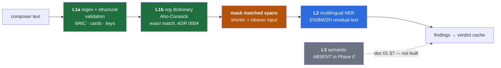

# 03 — AI/ML Architecture

> **Scope:** the detection stack and its budget. Assumptions resolve to
> [`ASSUMPTIONS.md`](../ASSUMPTIONS.md); the ordering and the offscreen constraint to
> [`01`](01-hld.md) §3 and ADR 0006; the posture to [`02`](02-privacy-architecture.md).
>
> **This is the document an investor's ML advisor reads first**, so it does arithmetic rather than
> argument. **Every number here is cited, derived in-place, or tagged `(estimate)` / `(unverified)`.**
> Where a claim was believed and turned out wrong, it says so.

---

## 0. The short version

1. **U4 ✅ resolved, and the estimate was more accurate than the "citation" that corrected it.**
   The card states **86M backbone** and **190M embedding** — **and no total.** From `config.json`
   (`vocab_size: 251000`, `hidden_size: 768`): **192.8M embedding + 86M = ~279M total** *(derived,
   §4.1)*. `ASSUMPTIONS.md` estimated **278M** — **0.28% off.** **~69% of the model is a lookup
   table**, so multilingual is paid for in **RAM and download size, not FLOPs**.
   > 🔴 **This section previously read "= 280M total," sourced to the model card. 86 + 190 = 276, and
   > the card states no total — the figure was neither the sum nor the citation it claimed to be.**
   > **Corrected 2026-07-17 (§4.1).** The 86M floor, the trim math and the thesis are all unaffected;
   > **the wrong number was within 0.5% of the right one, which is exactly why it survived.**
2. **U5 ✅ confirmed, and it exposes a floor nobody costed.** Vocab-trimming to ~70K tokens cuts
   embedding **192.8M → ~54M (−72%)**, total **~279M → ~140M**, ~140 MB int8. But **the 86M backbone is
   irreducible by trimming.** Everything below ~130 MB requires **distillation** — a step Phase 0
   never budgeted. → **doc 08 ranked risk**, per §6.2's instruction not to absorb it silently.
3. **U1 ✅ confirmed — with a trap.** No documented NRIC checksum, so validation is structural. But a
   hobbyist repo claims **ISO 7064 Mod 11,2** by trial and error. **Do not implement it.** A wrong
   checksum doesn't cost precision — it **silently rejects valid ICs**, converting L1 from
   deterministic to quietly lossy. §2.1 kills it.
4. **U2 ✅ confirmed, and structural validation is now real arithmetic**, not a slogan: valid date +
   a place-of-birth code from the assigned set. **Exactly 14 of 100 PB codes are unassigned** (00,
   17–20, 69, 70, 73, 80, 81, 94–97) *(founder-verified)*. Combined, ~**3.1%** of random 12-digit
   strings survive both filters *(derived, §2.2)*.
5. 🔴 **But structural validation collides with a real Malaysian identifier, and the collision is
   demonstrable.** **~86% of SSM company registration numbers** for entities incorporated **2001–2012**
   parse as **structurally valid NRICs** — `201201234567` passes the date check *and* the PB check and
   is a company number. **Two formats we must both detect, colliding by construction** (§2.3). Worse,
   the NRIC's day field lands on SSM's **entity-type code** (enumerated 01–06), **so the day filter —
   §2.2's strongest single screen — rejects nothing here.** Not hypothetical, not rare: twelve years
   of incorporations, minus the ~14% the PB table catches.
6. 🔴 **The fragmentation argument in doc 00 §5 is wrong as written, and doc 01 §3 already contained
   the reason without noticing.** `890101-14-5555` is shredded into digit soup by **multilingual
   tokenizers too** — nearly all modern tokenizers split digit runs. Worse: **L1 masks the IC before
   L2 ever sees it** (doc 01 §3), so the tokenizer's digit handling is **irrelevant to the example doc
   00 uses to argue for it.** The wedge is real but **it lives somewhere else** — in BM/ZH *text* NER
   — and §3 relocates it.
7. **U6 remains unmeasured and this document does not launder it.** No tokens/sec appears here. It is
   the highest-priority number in the package and it is still an estimate with nothing behind it.

---

## 1. The stack

**L1-before-L2 is a compounding win, not just an ordering** (doc 01 §3): L1 masks what it finds, which
**shortens the sequence** L2 must process *and* **removes the spans L2 handles worst**. L1 makes L2
cheaper **and** more accurate.

**L3 is absent in Phase 0** and doc 01 §7 already gave the reason: it's the genuinely hard layer, it
isn't buildable on-device at A1 headcount, and **the org dictionary is the Phase 0 stand-in** — it
catches the same high-stakes class deterministically (ADR 0004).

---

## 2. L1 — Malaysian identifiers, resolved individually

**Per the standing instruction, every format below is marked verified or unverified individually,
never as a block.** The confidence varies enormously and averaging it would hide exactly the formats
we'd get wrong.

### 2.1 NRIC / MyKad — U1 ✅ and U2 ✅

**Format** `YYMMDD-PB-###G` — 12 digits in three blocks, introduced 1990.
[Verified](https://en.wikipedia.org/wiki/Malaysian_identity_card).

| Block | Meaning | Validation lever |
|---|---|---|
| `YYMMDD` | Date of birth, ISO 8601:2000 | **Date must be real.** The strong filter. |
| `PB` | Place of birth, from the birth certificate | **Must be an assigned code.** 86 of 100 are. |
| `###` | NRD-generated serial *(commonly 5–7 for pre-1999 births, 0–3 for 2000+ — **unverified**, do not gate on it)* | None |
| `G` | Gender digit | ⚠️ **The odd/even rule is NOT confirmed** by the authoritative source. Widely repeated. **Unverified — do not gate on it.** |

**Place-of-birth codes** *(verified; founder-verified independently)* — 01–16 states, 21–59 state
overflow, 60–68 + 71–79 named foreign countries, 82–93 regions, 98 stateless, 99 refugees/unspecified.

> **Exactly 14 of the 100 two-digit codes are unassigned: `00`, `17`–`20`, `69`, `70`, `73`, `80`,
> `81`, `94`–`97`.** *(founder-verified)*

#### 🔴 The checksum kill — U1's trap

**There is no publicly documented checksum**, unlike the Singaporean NRIC. Validation is therefore
**structural, not arithmetic** — which is exactly what `ASSUMPTIONS.md` U1 claimed, and it is
confirmed.

**But the research turned up something U1 didn't anticipate**, and it needs killing in writing:

> A GitHub project claims the Malaysian IC number *may* implement **ISO 7064 Mod 11,2**, discovered
> **"through trial and error."** *(Single hobbyist source. No NRD documentation. **Unverified, and
> structurally unverifiable** — you cannot confirm a checksum by fitting it to samples without the
> issuing authority's spec.)*

**Do not implement it.** The reason is worth stating precisely, because the shallow version ("it might
be wrong") understates it:

1. A checksum in L1 acts as a **filter**: candidates failing it are discarded.
2. If the checksum is **not real**, valid ICs fail it **at whatever rate the fitted formula
   mispredicts** — plausibly most of them.
3. So we would **silently discard real ICs.** That is not a false-positive cost. It is a **recall
   collapse in the one layer whose entire value is being deterministic and near-100%** (ADR 0004,
   doc 00 §1.2).
4. And it fails **silently and invisibly** — the finding simply never appears. **Doc 00 §6's worst
   case: the control stops working while the audit trail says it worked.**

**A checksum that might not exist is strictly worse than no checksum.** No checksum costs precision,
which L1 recovers structurally (§2.2) and which the modal surfaces to a human. A phantom checksum
costs **recall**, silently, in the layer that is supposed to never miss.

**Revisit only if** NRD publishes a spec, or a customer's HR system provides a large corpus of known-valid
ICs against which the hypothesis could actually be tested. **Trial-and-error fitting is not that test.**

### 2.2 Structural validation — the arithmetic

**How much precision does structure actually buy?** Against a random 12-digit string:

| Filter | Passes | Derivation |
|---|---|---|
| Valid month (`MM` ∈ 01–12) | **12%** | 12 of 100 two-digit values |
| Valid day for that month | **~30%** | ~30.4 of 100 average across months *(ignoring leap-year edges)* |
| **Valid date combined** | **~3.6%** | 0.12 × 0.30 |
| Assigned PB code | **86%** | 86 of 100 *(founder-verified)* |
| **Both** | **~3.1%** | 0.036 × 0.86 |

> **Structural validation rejects ~96.9% of random 12-digit strings** *(derived — arithmetic is sound,
> the model of "random" is not the real threat)*. **The date is doing nearly all the work; the PB table
> contributes only a 14% shave.**

**Now the honest part, which matters more than the number.** Our false positives are **not random
digits.** They are *other structured* 12-digit numbers — timestamps, order IDs, account numbers,
invoice references — and **anything whose first six digits happen to look like a date passes the filter
that does ~96% of the work.** The derivation above is an upper bound on a threat model we don't face.

**§2.3 is that abstraction made concrete, and it's worse than the general worry.**

### 2.3 🔴 The collision: SSM company numbers parse as valid NRICs

**SSM's 12-digit business registration format** *(verified — see sources)* is `YYYY` + `XX` (entity
type) + `NNNNNN` (sequence), **introduced 11 October 2019** and applied retroactively to existing
entities.

**Both formats are 12 digits. Both are Malaysian identifiers we must detect. They collide.**

Take a company incorporated in **2012**, entity type `01`, sequence `234567` → **`201201234567`**.
Parse it as an NRIC:

| | Value | Source in the SSM number | Structural check |
|---|---|---|---|
| `YY` | `20` | Year, digits 1–2 | No constraint |
| `MM` | `12` | **Year, digits 3–4** | ✅ Valid month — **iff the year ends 01–12** |
| `DD` | `01` | **The entity-type code** | ✅ **Always valid — see below** |
| `PB` | `23` | Sequence, digits 1–2 | ✅ Assigned (Johor overflow, 21–24) |
| `###G` | `4567` | Sequence, digits 3–6 | ✅ No constraint |

**It passes every structural check we have, and it is a company registration number.**

**Now the part that makes this worse than a coincidence — and note the alignment is what does the
damage.** The NRIC's `DD` field lands exactly on SSM's **entity-type code**, and those codes are
enumerated **01–06** (local company, foreign company, business, local LLP, foreign LLP, professional
LLP). **Every one of them is a valid day of the month, in every month.**

> **The day-of-month filter — which §2.2 credits with rejecting ~70% of random strings — screens out
> nothing at all here. It cannot. The field it inspects is a six-value enumeration whose every value
> is a valid day.**

**So within the collision window, only one filter survives: the PB check** on the sequence prefix,
which passes **86%** of the time by §2.2's own arithmetic.

**The window is precisely characterizable, which is the only good news:** an SSM number parses as a
valid NRIC date iff digits 3–4 of the incorporation **year** form a valid month — i.e. **years ending
01–12**. In the modern era: **2001–2012 inclusive, twelve consecutive years of Malaysian
incorporations.** A company registered in 1985 → MM=85 → rejected. In 2015 → MM=15 → rejected.

> **The precise claim: ~86% of SSM numbers for entities incorporated 2001–2012 parse as structurally
> valid NRICs** *(derived — 86% is the PB pass rate from §2.2, assuming a uniform sequence prefix,
> which is **unverified**; the remaining ~14% are rejected only by landing on one of the 14 unassigned
> PB codes)*. **Not "any" — ~86% of them. The distinction is the same rigor this document applies
> everywhere else, and rounding it up to "any" would be exactly the overclaim §2.1 kills.**

**Why this matters beyond the bug:**

- It is **not** the "random digits" threat §2.2 modelled. It's a **structured collision between two
  formats in our own beachhead's detection scope.**
- Per ADR 0001, **every false positive is a ticket the admin eats**, and the precision target is
  **quasi-contractual**. This is a systematic FP source, not a tail event.
- The naive fix — **add the checksum** — is exactly the §2.1 trap. **The collision is the pressure that
  would make someone reach for the phantom checksum.** Naming both in one document is deliberate.

**The real disambiguators, and none is free:**

1. **Context tokens.** SSM numbers appear as *"Company No. 201201234567"*, *"(201201234567-A)"*,
   *"Reg. No."*. NRICs appear as *"IC"*, *"NRIC"*, *"No. KP"*, *"MyKad"*. **A context window around the
   match is the highest-value L1 rule in the product** and it costs nothing at runtime.
2. **The trailing entity-type letter.** SSM numbers are often written with a suffix (`-A`, `-K`,
   `-X`) — **unverified whether this is consistent enough to gate on.**
3. **Hyphenation.** NRICs are conventionally written `890101-14-5555`. SSM numbers are conventionally
   unhyphenated. **A hyphenated 12-digit string is far more likely an NRIC** — but this is a
   *convention*, not a rule, and the unhyphenated NRIC is exactly the database-dump case we most want
   to catch.

**Decision:** L1 emits **NRIC** and **SSM** as *distinct finding classes*, disambiguated by **context
tokens (1)** with hyphenation **(3)** as a tiebreak. **When both fail, emit the finding as ambiguous.**
Doc 07 owns the precision target; **this section owns the admission that a 12-digit Malaysian number is
not always decidable from the digits alone.**

> 🔴 **Corrected 2026-07-16 — the resolution moved to [doc 04 §5.2](04-redaction-and-context-preservation.md).
> The finding above is unchanged: the collision is real, the day filter is defeated by construction,
> ~86% still holds.**
>
> **This section originally proposed:** *"let the modal ask the human — a modal that says 'is this an IC
> or a company number?' is honest friction on a genuinely ambiguous string."* **Designing the modal
> (doc 04) shows that's wrong, and wrong in a way doc 00 had already named.**
>
> 1. **It asks the wrong person.** Per doc 00 §4 the user is not the buyer, pays the tool's entire cost,
>    and wants the popup gone. It hands **the hardest classification in the product** to the person with
>    the least incentive to get it right — and then treats their click as ground truth.
> 2. **It is doc 00 §1.6's "active poisoning" in a new costume** — user adjudication of exactly the
>    cases the system found hardest, from the population with the strongest incentive to lie. **The
>    error came from solving the classifier's problem instead of the human's.**
> 3. **The question is usually irrelevant, which is what actually resolves it:** the class only matters
>    **if tenant policy treats the two differently.** If both are sensitive — the common case — the
>    answer is *mask it* either way.
>
> **→ Ambiguity is a policy question, not a user question.** Default to the more restrictive class
> (NRIC), let the **admin** configure whether company numbers are sensitive, and leave the user the
> escape hatch that already exists: **Ignore + reason**, which lands in the compliance log where an
> override belongs. **doc 04 §5.2 carries the full reasoning.**

### 2.4 U3 — every other format, individually

**None of these is asserted as a block.** Confidence differs by an order of magnitude across the table
and the differences are the point.

| Format | Shape | Status | L1 viability |
|---|---|---|---|
| **NRIC (current)** | `YYMMDD-PB-###G` | ✅ **Verified** (§2.1) | **Strong** — structural, with the §2.3 caveat |
| **SSM 12-digit** | `YYYY` + `XX` + `NNNNNN` | ✅ **Verified** | **Moderate** — collides with NRIC (§2.3) |
| **LHDN tax (TIN)** | **`IG` + 9–11 digits.** Legacy `SG` (non-business) / `OG` (business) **unified to `IG` on 2023-01-01**; numeric part unchanged. e.g. `IG845462070` | ✅ **Verified** — multiple sources incl. an OECD TIN sheet | **Strong** — the alpha prefix is a near-unique anchor. ⚠️ **Variable length (9–11) is unverified in its bounds** — do not hard-gate on length. **Legacy `SG`/`OG` must still match**: documents predating 2023 are exactly what people paste. |
| **Passport** | Letter + 8 digits, e.g. `A12345678` | ⚠️ **Medium** — consistent across sources; Microsoft Purview ships an entity definition for it, which is corroboration, not proof | **Moderate** — `[A-Z]\d{8}` is a *very* loose pattern. Will collide with other alphanumeric refs. **Needs context tokens.** |
| **Old-format IC** (pre-1990) | Believed **7 digits + state-ish suffix**, non-uniform | ❌ **UNVERIFIED — and I could not confirm a stable format.** | **Do not ship in Phase 0.** A pattern this loose in the layer whose value is precision is a net negative. **Gap, not fabrication.** |
| **EPF / KWSP** | **8 bare digits** | ⚠️ **Low-Medium** — sources agree but none authoritative | ❌ **Not L1-detectable, and this is a finding, not a gap.** See below. |

#### EPF/KWSP — the format that defeats the layer

**8 bare digits with no structure, no checksum, and no prefix.** There is nothing to validate. `\d{8}`
matches order numbers, timestamps, phone fragments, amounts in cents, and roughly everything else.

> **Shipping an 8-bare-digit detector would generate false positives at a rate that, per ADR 0001,
> lands as tickets on the admin — the exact person whose goodwill the product depends on.** Doc 00
> §1.2's inversion again: **it is a real identifier we structurally cannot detect well**, and pretending
> otherwise damages the layer that works.

**Decision: EPF is context-only or not at all.** Detect `KWSP`/`EPF` + proximate 8-digit run, or don't
claim it. **Do not put "EPF" on a coverage slide** without that qualifier — a coverage table that lists
EPF beside NRIC implies a parity that does not exist, and an advisor who tests it finds out in one
prompt.

---

## 3. The fragmentation argument — and a correction to doc 00 §5

**Doc 00 §5 forward-references this document for the fragmentation argument. As written there, it is
wrong.** Doc 00 says:

> *"an English-first tokenizer shreds `890101-14-5555` into digit soup, destroying the identifier's
> schema before the model ever sees it. That's a real engineering advantage."*

**Two independent things are wrong with it, and doc 01 §3 already contained the second one.**

### 3.1 Multilingual tokenizers shred digits too

**Nearly every modern subword tokenizer splits digit runs** — deliberately. This is not an
English-first pathology; it is standard practice across BPE and SentencePiece vocabularies, including
the multilingual ones we'd be switching *to*. **A multilingual tokenizer produces digit soup for
`890101-14-5555` as well.** *(Directionally certain; the exact per-tokenizer segmentation is
**unverified** and is a trivial thing to measure in the U6 spike — measure it rather than argue.)*

**So the IC number is the one example where the multilingual advantage does not apply.**

### 3.2 L2 never sees the IC number anyway — doc 01 §3 says so

This is the sharper problem, and it's self-inflicted:

> **L1 masks matched spans before L2 runs** (doc 01 §3, §1 above). The NRIC is caught by regex +
> structural validation at L1 with ~100% precision. **By the time the tokenizer runs, `890101-14-5555`
> has already been replaced by a mask token.**

**The tokenizer's handling of the IC number is irrelevant, because the tokenizer never receives the
IC number.** Doc 01 §3 states this correctly — *"L1 masks spans → shorter, cleaner input"* — and then
in the same breath repeats doc 00's framing about digit soup, without noticing that the first clause
disposes of the second.

**Doc 00 §5 argues for the multilingual tokenizer using the single example that the architecture routes
around.** An ML advisor finds this quickly, and the cost is not the example — it's that the wedge
looks unexamined.

### 3.3 Where the wedge actually lives — and it's a better argument

**The multilingual advantage is real. It is about text, not identifiers.**

| | English-first tokenizer | Multilingual (mDeBERTa/XLM-R class) |
|---|---|---|
| **Malay** — agglutinative: `kewarganegaraan`, `mempertanggungjawabkan` | Fragments into many subwords; morphology destroyed | Trained on CC100 Malay — coherent subwords |
| **Chinese** — no whitespace | Falls back to bytes/individual chars; **sequence length explodes** | Proper CJK vocabulary coverage |
| **Code-switched** — *"IC saya 890101-14-5555, boleh check tak?"* | The **context** is Malay. Fragmented context = degraded NER on the surrounding entities | Context intact |
| **Digits** | Shredded | **Also shredded — no advantage** |

**The correct statement of the wedge:**

> **L1 catches the identifiers, in any language, with a regex — nobody needs a model for that. L2 earns
> its 190M-parameter embedding on the *text around* the identifiers: the Malay and Chinese names,
> addresses, and organisations that regex cannot see and that an English-first NER model is genuinely
> bad at. That is where EN/BM/ZH code-switching is a moat-shaped wedge, and it is a stronger claim than
> the tokenizer story, because it survives contact with the architecture.**

**And ADR 0003's honesty still binds, unchanged:** this is a **head start, not a moat.** Google
replicates it with a vocabulary swap and better base models. The correction relocates the wedge; it does
not upgrade it.

### 3.4 ✅ Corrected upstream, in this commit

**Founder-approved 2026-07-16, on the reasoning that fixing it now is cheaper than after docs 02/03
cite the old framing elsewhere** — the same call as the doc 01 §5 rehydration gap.

- **`docs/00` §5** — the tokenizer/digit-soup argument is replaced by the text-NER argument, with the
  old version quoted and its refutation stated. **ADR 0003 is unaffected**: the wedge relocates, and
  *"head start, not moat"* was never a claim about tokenizers.
- **`docs/01` §3** — the *"English-first"* attribution is removed from the masking win, which is real
  but tokenizer-independent. The correction note records that **this sentence contained the refutation
  of the claim it was citing.**

**Neither doc is silently patched.** Both carry a dated correction note, per the package's practice
that *"a package that quietly edits its own claims is worth less than one that shows where it was
wrong"* (ADR 0003).

---

## 4. L2 — the model budget, re-derived

### 4.1 U4 ✅ — and the total is **derived**, because the card does not state one

| | Value | Source |
|---|---|---|
| Layers | 12 | [Model card](https://huggingface.co/microsoft/mdeberta-v3-base) |
| Hidden size | **768** | Model card · [`config.json`](https://huggingface.co/microsoft/mdeberta-v3-base/raw/main/config.json) |
| **Backbone params** | **86M** *(rounded)* | Model card |
| Vocabulary | **250K** *(card, rounded)* · **251,000** *(exact)* | Model card · `config.json` |
| **Embedding params** | **190M** *(card, rounded)* · **192.8M** *(exact)* | Model card · **derived:** 251,000 × 768 |
| **Total** | **~279M** | 🔴 **DERIVED — not the card. The card states no total.** |
| Max sequence length | **512** | `config.json` (`max_position_embeddings`) |

**The card's exact words are the whole of what it claims:**

> *"The mDeBERTa V3 base model comes with 12 layers and a hidden size of 768. It has 86M backbone
> parameters with a vocabulary containing 250K tokens which introduces 190M parameters in the
> Embedding layer."*

**Read what is not there: a total.** So the total is **ours to derive and ours to own**, and the only
honest derivation runs off `config.json`'s exact figures rather than the card's rounded prose:
**251,000 × 768 = 192.8M embedding + 86M backbone = 278.8M ≈ ~279M** *(derived)*.

> 🔴 **Corrected 2026-07-17 — this section previously asserted `Total | 280M | Model card`, and the
> prose read: *"The card says 86M + 190M = 280M."* Both halves are wrong, and the second is worse
> than the first.**
>
> 1. **86 + 190 = 276, not 280.** A sum that does not add, in the document whose opening line is that
>    it *"does arithmetic rather than argument."*
> 2. 🔴 **The card says no such thing. It states no total at all** — so the Source column read *"Model
>    card"* beside a number the model card does not contain. **That is not an arithmetic slip. It is
>    an attribution to a source that does not carry the claim** — the same defect this package keeps
>    finding in its *internal* references, committed for the first time against an *external* one.
>    `ASSUMPTIONS.md`'s own framing is the indictment: *"If an investor's ML advisor finds a
>    confidently-stated number that turns out invented, every other number in the package loses its
>    credit."*
> 3. **The irony worth recording: our estimate was better than the "citation" that corrected it.**
>    U4 estimated **278M** from arithmetic. The derived truth is **278.8M** — **0.28% off**, not the
>    *"~1% off"* this section claimed. **The estimate was nearly exact and got marked down against a
>    number that was invented.**
> 4. **What survives: everything that mattered.** The 86M backbone floor (§4.3), the trim math
>    (§4.2 — every trimmed row recomputes correctly), and the lookup-table thesis all stand. **~279M
>    is also within 0.5% of the fabricated 280M**, which is precisely why nobody caught it: **the
>    wrong number was close enough to look right, and the reasoning attached to it was checkable in
>    one second and never checked.**
>
> **Two gaps closed while fixing this:** the *"precise token count is unverified"* hedge is retired —
> `config.json` says **251,000** — and **`max_position_embeddings` is 512**, which doc 03 never
> recorded and which **doc 06 cannot budget the paste path without** (a long paste must be chunked, so
> its latency is `ceil(tokens/512) × per-chunk`, not one forward pass).

> **~69% of mDeBERTa-v3-base is a lookup table.** 192.8M of ~279M parameters are embedding — never
> multiplied, only indexed *(derived: 192.8 / 278.8 = 69.1%; the card's rounded figures give 190 / 276
> = 68.8%. **Either consistent method gives ~69%. The old "68%" came from mixing the card's rounded
> 190M over the invented 280M** — a third number produced by the same error)*. **This is the
> multilingual-cost thesis, and it is now honestly sourced: multilingual is paid for in download size
> and RAM, not FLOPs** — the two resources a browser extension can least afford, and the two D2
> constrains hardest.

### 4.2 U5 ✅ — vocabulary trimming, with real numbers

Embedding params scale linearly with vocabulary: `vocab × 768`.

| Vocab | Embedding | + 86M backbone | **int8 weights** | vs. untrimmed |
|---|---|---|---|---|
| **251K** (stock, exact) | 192.8M | **~279M** | **~279 MB** | — |
| **80K** | 61.4M | **147M** | **~147 MB** | **−47%** |
| **70K** | 53.8M | **140M** | **~140 MB** | **−50%** |
| **60K** | 46.1M | **132M** | **~132 MB** | **−53%** |
| *30K (EN-only, illustrative)* | *23.0M* | *109M* | *~109 MB* | *−61%* |

*(Stock row corrected 2026-07-17 — see §4.1. **Every other row recomputes exactly as published**, and
so does every percentage: against the true ~278.8M the cuts are **−47.1%, −49.9%, −52.6%, −60.9%**.
**The trimmed rows were always right, because they were computed rather than cited** — they use
`vocab × 768 + 86M` directly. **Only the row that leaned on the card was wrong**, which is the whole
lesson in one table.)*

**U5 is confirmed on both axes.** It predicted "~70% embedding cut → ~278M → ~135M, ~135 MB int8." At
70K: embedding falls **192.8M → 53.8M = −72%**, total **~279M → ~140M**, **~140 MB int8.** **Direction
and magnitude both hold** — the estimate was good. *(And U5's starting point, ~278M, was the accurate
one all along — see §4.1's correction.)*

**What is *not* settled is whether 60–80K tokens is enough for EN+BM+ZH.** That number came from
judgement, not measurement, and **trimming has a failure mode that a size table cannot show**:

> **Trim too aggressively and out-of-vocabulary text falls back to byte-level or `<unk>` — and
> *fertility* (tokens per word) explodes on exactly the low-resource text the wedge exists to serve.**
> You would shrink the model by making it slower and worse **on Malay and Chinese specifically** — the
> two languages the entire beachhead is built on. **A smaller model that is worse at Malay is not a
> win; it is the product's thesis being deleted to save 40 MB.**

**The spike, and it is cheap:** take a representative EN/BM/ZH code-switched corpus → token frequency →
keep tokens covering ~99.9% of occurrences → **measure fertility before and after.** **Size is the easy
metric and the wrong one to optimize alone.** *(The corpus problem is U14/C2 — doc 07 owns it, and
**this spike is blocked on it**, which is worth noticing: we cannot pick a vocabulary without the
corpus we don't have.)*

### 4.3 🔴 The 86M floor — where the distillation risk actually comes from

**Read the table's second column again.** Every row carries **86M of backbone**. Vocabulary trimming
cannot touch it — it is the transformer itself.

> **~86 MB int8 is the floor for this architecture, and the practical floor is ~130–147 MB** once a
> workable EN/BM/ZH vocabulary is included. **Vocabulary trimming buys you exactly one halving, and
> then it is exhausted.**

**Therefore: if ~140 MB does not fit the budget, there is no second vocabulary trick. The only
remaining lever is cutting the backbone — fewer layers, smaller hidden size — i.e. distillation.** And
distillation needs: a teacher, a corpus (U14/C2 again), a training pipeline, and time. **Phase 0 never
budgeted any of it, and at A1 (2–3 engineers, no ML hire) it is not a sprint task.**

**Per §6.2's standing instruction, this surfaces as a consequence, not a silent line item:**

> **→ doc 08, ranked risk: "Vocabulary trimming may be insufficient, forcing an unbudgeted distillation
> step."** Its trigger is measurable and it is not far away: **if the D2 memory budget (doc 06) lands
> below ~140 MB of weights, distillation moves from a risk to a Phase 0 requirement.**

**And note the dependency chain, because it's the uncomfortable part:** distillation needs a corpus →
the corpus is U14/C2 → C3 says the corpus is **synthetic** and is **Low confidence, HIGH blast radius**.
**The fallback for a model that doesn't fit depends on the assumption the package is least sure of.**

### 4.4 Weights on disk ≠ memory at runtime

**~140 MB is the artifact.** The runtime footprint is larger and doc 06 owns the real number:

- ONNX Runtime Web's WASM heap, arena allocator, and activation buffers.
- Dequantization workspace, depending on the int8 execution path.
- Attention/intermediate tensors, which scale with sequence length.

**A ~1.5–2× multiple over weight size is the usual rule of thumb** *(estimate — this is exactly the kind
of number this document refuses to assert, and doc 06 must measure it)*. Against D2's ~1–2 GB
realistically addressable, ~200–300 MB is affordable — **and it is affordable only because ADR 0006 puts
one engine in one offscreen document.** Per-tab, five ChatGPT tabs would be five copies. **ADR 0006 is
what makes this budget survivable**, and this section is the arithmetic behind that claim.

---

## 5. Runtime

| Choice | Why | Status |
|---|---|---|
| **ONNX Runtime Web**, WASM baseline | doc 01 §6 rejected `transformers.js` because **quantization control *is* the memory budget** — §4.2/§4.3 are precisely the thing a wrapper abstracts away | Locked |
| **int8 quantization** | §4.2's table assumes it. **Which int8 path (dynamic vs. static, per-channel vs. per-tensor) is an open accuracy/latency trade — and it lands on BM/ZH accuracy first** | **Open → doc 06** |
| **WebGPU: opportunistic** | **D3.** Assume CPU/WASM baseline; **never a requirement** | Locked |

**The WebGPU correction still stands and is easy to lose** (§6.3): **an offscreen document is a Window
context, so WebGPU is available there.** ADR 0006's choice **preserves** GPU access rather than trading
it away — a fresh reader could plausibly infer the opposite. **U15** (WebGPU under enterprise Chrome
policy) remains open and is doc 06's: enterprise policy may disable it **on exactly the managed fleet we
are targeting**, which is the pessimistic case that matters.

---

## 6. U6 — the number this document does not have

**U6: on-device L2 inference on a few hundred tokens = 30–100 ms on D2 hardware.**

> **This remains an estimate with no measurement behind it, and this document deliberately adds
> nothing to it.** No tokens/sec figure appears above. **Producing one from the parameter counts would
> be the exact fabrication `ASSUMPTIONS.md` exists to prevent** — FLOPs are not latency on a 4-core
> laptop running WASM in a browser under an unknown thread budget, alongside the provider's own
> React app.

**What §4 does contribute is the shape of the answer:** ~69% of the model is embedding — **lookup, not
compute.** So **latency is dominated by the 86M backbone, while memory is dominated by the 190M
embedding.** They are governed by different halves of the model, which has a useful consequence:

> **Vocabulary trimming should cut memory ~50% and latency **barely at all**.** *(Derived from the
> parameter split — **unverified**, and it is a **prediction the spike can falsify**, which is what
> makes it worth writing down.)*

**Why this matters beyond the budget** — doc 02 §1.5 and ADR 0008, restated because it is easy to lose:

> **If U6 fails, we lose the GATE (doc 01 §0), not the privacy posture.** The gate needs a warm cache;
> a warm cache needs fast inference. **The posture is forced by the gate's synchronous requirement, not
> by privacy** — so a bad latency result is a **product-mechanics** failure, not a compliance one, and
> **ADR 0008 explicitly does not reopen the posture on a U6 failure.** Do not let a latency measurement
> be read as a privacy result.

**The measurement, per doc 01 §8 and ADR 0006:** must include the **content-script → offscreen hop**
(`chrome.runtime` messaging + structured cloning). **That hop is inside the U6 budget, not beside it**,
and the worst case — a **cold offscreen document during a send-gate cache miss** — is the product's
worst latency path.

---

## 7. What this document hands forward

**To doc 06:**
- **The real memory budget** — §4.4's 1.5–2× runtime multiple is a rule of thumb this document refuses
  to assert. **Measure it.** If the budget lands **below ~140 MB of weights, §4.3's distillation risk
  becomes a Phase 0 requirement.**
- **The int8 path** (dynamic vs. static, per-channel vs. per-tensor) is an open accuracy/latency trade
  that **lands on BM/ZH accuracy first** — the wedge is the thing quantization degrades.
- **U15** (WebGPU under enterprise policy) — and §5's reminder that the offscreen document *preserves*
  WebGPU.
- **U6 measurement must include the offscreen hop**, and §6's falsifiable prediction: **trimming cuts
  memory ~50%, latency barely at all.**

**To doc 07:**
- **The vocabulary-trim spike is blocked on the corpus (U14/C2)** — we cannot choose a vocabulary
  without the corpus we don't have. **So is §4.3's distillation fallback.** Both depend on **C3**, the
  package's least-confident assumption.
- **Fertility, not size, is the trim metric.** A smaller model that is worse at Malay deletes the
  thesis.
- **§2.3's ambiguous-finding class** (NRIC vs. SSM) needs a precision target for a case that is
  **genuinely undecidable from the digits alone.**

**To doc 08, as ranked risks:**
- 🔴 **Vocabulary trimming may be insufficient → unbudgeted distillation** (§4.3). Trigger:
  doc 06's budget lands below ~140 MB. **Depends on C3.**
- 🟠 **§2.3's NRIC/SSM collision** — a systematic FP source hitting **~86% of entities incorporated
  2001–2012**, in a layer whose precision is quasi-contractual (ADR 0001). **Structure cannot fix it:
  the day filter is defeated by construction**, so the fix is context tokens or an ambiguous class.
- 🟠 **Old-format IC is unverified and not shipping** (§2.4). A coverage gap to state, not hide.

**Corrected upstream in this commit (§3.4), founder-approved:**
- ✅ **doc 00 §5** — fragmentation argument replaced: the wedge relocates from identifiers to **BM/ZH
  text NER**, which is the stronger claim because it survives contact with the architecture.
- ✅ **doc 01 §3** — the *"English-first"* attribution removed from the masking win.
- **ADR 0003 unaffected** — *"head start, not moat"* was never a tokenizer claim.

**Resolved by this document:** **U1** ✅ (no checksum — and a phantom one killed) · **U2** ✅ (format +
PB table; **gender digit still unverified**) · **U3** ✅ *individually* (LHDN verified · SSM verified ·
passport medium · **old-format IC unverified, not shipping** · **EPF not L1-detectable**) · **U4** ✅
(86M backbone + 190M embedding **cited**; **~279M total derived, not cited — the card states none**,
§4.1) · **U5** ✅ (trim math confirmed; **86M floor exposed**).

**Still open:** **U6** (unmeasured, highest priority) · **U15** (doc 06) · **U14/C2** (doc 07 — and it
blocks §4.2's spike).

---

### Sources

- [microsoft/mdeberta-v3-base — Hugging Face model card](https://huggingface.co/microsoft/mdeberta-v3-base) — 12 layers, hidden 768, **86M backbone**, 250K vocab → **190M embedding**. ⚠️ **The card states NO total** — see §4.1's correction. Verbatim: *"It has 86M backbone parameters with a vocabulary containing 250K tokens which introduces 190M parameters in the Embedding layer."*
- [microsoft/mdeberta-v3-base — `config.json`](https://huggingface.co/microsoft/mdeberta-v3-base/raw/main/config.json) — `vocab_size: 251000`, `hidden_size: 768`, `num_hidden_layers: 12`, **`max_position_embeddings: 512`**. **The exact figures the card rounds**, and the source of §4.1's derived **~279M** total. **The 512 window is doc 06's chunking constraint.**
- [Malaysian identity card — Wikipedia](https://en.wikipedia.org/wiki/Malaysian_identity_card) — `YYMMDD-PB-###G`; full place-of-birth code table; no checksum documented
- [Malaysia TIN guide — LookupTax](https://lookuptax.com/docs/tax-identification-number/malaysia-tax-id-guide) and [OECD — Malaysia TIN information](https://www.oecd.org/content/dam/oecd/en/topics/policy-issue-focus/aeoi/malaysia-tin.pdf) — `IG` prefix, legacy `SG`/`OG`
- [LHDN new prefix for individual taxpayers — RinggitPlus](https://ringgitplus.com/en/blog/income-tax/lhdn-enables-e-daftar-for-more-categories-introduces-new-prefix-for-individual-taxpayers.html) — `SG`/`OG` → `IG` unification, 2023-01-01
- [SSM — new 12-digit registration number format](https://www.ssm.com.my/Lists/Announcement/AnnouncementDetails.aspx?ID=134) and [MyData-SSM announcement](https://www.mydata-ssm.com.my/announcement?id=2) — `YYYY` + entity-type + sequence
- [Malaysia passport number entity definition — Microsoft Purview](https://learn.microsoft.com/en-us/purview/sit-defn-malaysia-passport-number) — corroboration for letter + 8 digits
