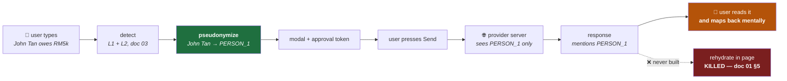
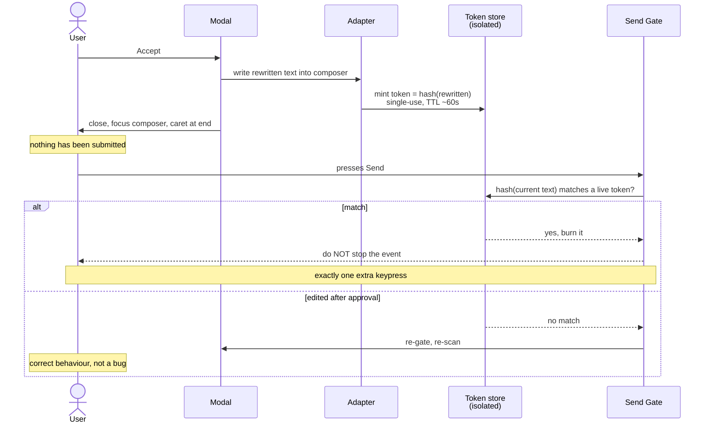

# 04 — Redaction and Context Preservation

> **Scope:** the **outbound** path — how a detected value becomes a placeholder, stays consistent, and
> reaches the provider. Assumptions resolve to [`ASSUMPTIONS.md`](../ASSUMPTIONS.md); invariants to
> [`01`](01-hld.md) §5; the detection stack to [`03`](03-ai-ml-architecture.md).
>
> 🔴 **Rehydration is a SETTLED KILL** — founder-closed 2026-07-16, recorded in doc 01 §5. **This
> document designs the mechanism and documents the kill's implementation-level implications. It does
> not re-decide, and it does not soften the kill to "deferred."** §1 states what the kill did and did
> not remove.

---

## 0. The short version

1. **The kill removed the return path, not the outbound one.** Pseudonymization still ships — it *is*
   the product (doc 00 §7, ADR 0002). This document owns everything up to the provider's network
   request, and nothing after it.
2. 🔴 **The biggest finding: with rehydration dead, the mapping vault does not need to exist as
   specified.** Doc 01 §5's **I2** describes it as holding `PERSON_1 → John Tan` — **a reverse map,
   which is the de-pseudonymization key.** Rehydration was its **only** consumer. Pseudonymization
   needs the **forward** direction only, and that can be keyed by a **salted hash of the value**. §2.2.
3. **But do not overclaim the hash** — this package killed exactly that reasoning in ADR 0009. A salted
   hash of `John Tan` is **brute-forceable against a name list**, and we hold the salt. **The vault
   gets less catastrophic, not safe.** It stays sensitive at rest. §2.3.
4. **Cross-conversation consistency: rejected.** It buys **zero** utility — the model has no memory
   across conversations, so a placeholder's meaning doesn't survive one either — and it costs a
   **persistent local index of every sensitive value the user has ever typed.** Per-conversation only.
   §2.4.
5. **The kill changes the placeholder design, and this only becomes visible when you design the
   outbound path.** Without rehydration, **the user does the mapping back, in their head.** So the
   placeholder must be **unmistakably artificial**. That makes **surrogate substitution**
   (`John Tan → Ahmad Bin Ali`) **actively dangerous** rather than merely inelegant. §3.
6. **The beachhead language makes the hard problem easier, which is a first for this package.** The
   main cost of `PERSON_1` is losing **gender** for pronoun agreement — and **Malay's third-person
   pronoun (`dia`) is gender-neutral.** The loss is smallest exactly where we sell. And per doc 03
   §2.1 the **NRIC gender digit is unverified**, so we couldn't derive gender safely anyway. **Two
   independent reasons to encode no gender.** §4.2.
7. 🟠 **Malaysian honorifics are a re-identification vector**, and this is a genuinely local finding:
   `Dato' Seri PERSON_1` leaks membership in a **small, enumerable set**. Mask the honorific with the
   span; accept the register loss. §4.3.
8. 🔴 **This document corrects doc 03 §2.3.** Doc 03 proposed the modal **ask the user** whether an
   ambiguous 12-digit number is an NRIC or an SSM number. **Designing the modal shows that's wrong:**
   the ambiguity only matters **if policy differs between the two classes**, and asking the user hands
   the hardest classification in the product to the person with the least incentive to get it right
   (doc 00 §4). **Default to the more restrictive class and ask nothing.** §5.2.

---

## 1. What the kill removed, and what it didn't

**Say this precisely, because "rehydration is dead" is easy to over-read into "pseudonymization is
dead."**

| | Status | Owner |
|---|---|---|
| Detect the value | ✅ Ships | doc 03 |
| **Replace it with a placeholder before send** | ✅ **Ships — this document** | **doc 04** |
| Keep placeholders consistent within a conversation | ✅ Ships | §2.4 |
| Show the user what changed, get approval | ✅ Ships | §5 |
| **Turn `PERSON_1` back into `John Tan` in the response** | 🔴 **KILLED** | doc 01 §5 |

**The kill's reasoning, restated once so nobody has to go looking** *(and note it is **not** an I1
violation — that's the imprecise version that invites a reversal)*: rehydration writes plaintext back
into the **provider's persisted, server-synced DOM** (B2 → B1), where their **legitimate** features —
edit-message, rich-text copy handlers, autosave, analytics — can re-serialize it to their server. **It
doesn't break I1; it defeats I1's purpose.**

**The orange box is the whole cost of the kill:** the user reads `PERSON_1` in the answer and maps it
back themselves. **§3 is where that stops being a cosmetic detail and starts dictating design.**

---

## 2. The mapping vault

### 2.1 What doc 01 §5 actually says — and why it says something we no longer need

Re-reading the invariant rather than my memory of it *(per the standing rule, and it changed this
section)*:

> **I2** — *"The **mapping vault never crosses B2 → B1**. The vault holds `PERSON_1 → John Tan`.
> Putting it in the MAIN world hands the page **the de-pseudonymization key** — building an
> exfiltration channel into the thing we're protecting."*

**Read the direction of that arrow.** `PERSON_1 → John Tan` is a **reverse** map: placeholder to
plaintext. I2 calls it *"the de-pseudonymization key"* — and it is exactly that, **because it was
specified when de-pseudonymization was still a feature.**

**Rehydration was the only thing that ever needed to go that direction.**

### 2.2 🔴 Pseudonymization only needs the forward map

Walk the outbound path and see what direction it actually queries:

1. L1/L2 detect a span: `John Tan`.
2. **Have we seen this value before in this conversation?** → look up **by value**.
3. If yes → reuse its placeholder. If no → mint `PERSON_{n+1}` and record it.
4. Rewrite the text.

**Every step queries `value → placeholder`. Nothing on this path ever asks "what was `PERSON_1`?"**
That question has exactly one caller — rehydration — and it is dead.

> **And a forward-only map does not need the plaintext.** To answer *"have I seen this value?"* you
> need only a **stable key** for the value, not the value itself. **`salted_hash(John Tan) →
> PERSON_1`** answers it perfectly.

**So the artifact doc 01 §5 calls "the de-pseudonymization key" doesn't need to exist.** What ships is
a per-conversation table of **hashes to placeholders**, which is not a de-pseudonymization key in any
direction, because **there is no path from `PERSON_1` back to a name.** Not a hard path. **No path.**

**Consequences worth banking:**
- **I2 gets dramatically easier to hold.** It was a rule against leaking a decryption key into a
  hostile context. The key no longer exists. **I2 survives as defense-in-depth, not as the thing
  standing between us and catastrophe.**
- **The kill paid a dividend nobody costed.** Doc 01 §5 recorded rehydration as *"the one place our
  architecture deliberately hands plaintext to an untrusted context."* Killing it didn't just close
  that hole — **it deleted the asset that made the hole worth exploiting.**
- **✅ Doc 01 §5's I2 row corrected in this commit** (founder-approved). It now reads `hash(value) →
  PERSON_1` — **forward-only, hash-keyed, not a key, still sensitive, same boundary** — with a dated
  note recording that the old text described an artifact specified while rehydration was alive.

### 2.3 ⚠️ Do not overclaim the hash — this package already killed this reasoning

**The tempting next sentence is "and because it's hashed, the vault is safe."** That sentence is wrong,
and **ADR 0009 killed the identical argument three commits ago:**

> Codenames are memorable words, so a salted hash of one is brute-forced in milliseconds. **The same is
> true of names — more so.** `John Tan` is drawn from a keyspace of common given names × common
> surnames: a few million combinations at the outside, and **we hold the salt.** Any attacker who can
> read the vault can read the salt beside it.

**So state the benefit exactly:**

| Claim | True? |
|---|---|
| The vault no longer contains plaintext names | ✅ **Yes** |
| Plaintext can no longer leak via a crash dump, a log line, a debugging convenience, or an errant `JSON.stringify` | ✅ **Yes — and this is a real, common leak class** |
| There is no `PERSON_1 → John Tan` direction to exfiltrate | ✅ **Yes — structurally** |
| **The vault is therefore not sensitive** | ❌ **NO.** Hashes + placeholders + a salt = names, for a determined reader. |

> **The vault gets less catastrophic. It does not get safe.** It stays sensitive at rest, stays in the
> offscreen document (B3), and **I2 still binds.** Hashing here buys **blast-radius reduction and
> defense in depth** — genuinely worth having — **not a security boundary.**

**This is the third time this package has reached for a cryptographic mechanism because of how it
reads.** CLAUDE.md §6.5 names it as a recurring error; **it recurred while writing this section**, and
the only reason it didn't ship is that the previous instance was written down.

### 2.4 Lifetime — per-conversation, and cross-conversation consistency is rejected

**The decision that matters.** Options:

| Lifetime | Consistency | Privacy cost | Verdict |
|---|---|---|---|
| **Per-prompt** | ❌ Same person → different placeholder each turn. **The model's answer is incoherent.** | Minimal | ❌ Breaks the product |
| **Per-conversation** | ✅ Coherent within the thread — which is the only scope the model can use | A short-lived table, evicted with the thread | ✅ **DECIDED** |
| **Per-session** | Same as above, plus cross-thread | A growing table for as long as the browser lives | ❌ Buys nothing (below) |
| **Persistent** | `John Tan` is `PERSON_1` forever | 🔴 **A permanent local index of every sensitive value the user has ever typed** | ❌ **Reject hard** |

**Why cross-conversation consistency is rejected, and it's a one-line argument:**

> **The model has no memory across conversations.** A new thread starts with no context, so `PERSON_1`
> in Tuesday's thread means nothing in Wednesday's — **the model has never seen it.** Cross-conversation
> consistency makes placeholders stable **for an audience that cannot perceive the stability.**
>
> **It buys zero utility and costs a persistent index of sensitive values. That's not a trade-off; it's
> a straight loss.**

*(The one counter-argument — that **the user** benefits from stable placeholders — fails on inspection:
the user never sees the vault, and per doc 00 §4 they experience placeholders as friction, not as a
feature they'd like more of.)*

**Eviction rule:** the vault entry dies with the conversation — whichever comes first of **the tab
closing**, **navigation away from the thread**, or a **TTL** *(no number here — it interacts with the
offscreen document's lifecycle under ADR 0006, which doc 05 owns)*. **Memory is not the constraint** —
a per-conversation table is a few hundred entries at worst, against doc 03 §4.4's ~140 MB model. The
constraint is **exposure duration**, and it should be as short as coherence allows.

---

## 3. Placeholder design — and why the kill decides it

### 3.1 The three schemes

| Scheme | Example | Preserves coreference | Preserves naturalness | Obviously artificial |
|---|---|---|---|---|
| **Redaction** | `[REDACTED]` | ❌ Two different people become the same token | ❌ | ✅ |
| **Placeholder** | `PERSON_1` | ✅ | ⚠️ Reads as a variable | ✅ **Unmistakably** |
| **Surrogate** | `John Tan` → `Ahmad Bin Ali` | ✅ | ✅ **Best** | ❌ **Not at all** |

**Redaction is out immediately:** the differentiated product is *"don't block — pseudonymize and
preserve context"* (**ADR 0002**, echoed in doc 00 §3 — *not* §7, which states the positioning as
*"lead with typing-time, context-preserving pseudonymization"*), and `[REDACTED]` collapses distinct
entities into one token. *"[REDACTED] owes [REDACTED] money"* is not a
prompt anyone can answer. **It destroys the exact thing the product claims to preserve.**

### 3.2 🔴 The kill makes surrogates dangerous — not just inelegant

**Surrogate substitution is the sophisticated-looking choice.** The model gets natural text, agreement
and register survive, and the output reads properly. **On a system with rehydration, it's arguably
right:** swap `John Tan → Ahmad Bin Ali` outbound, swap back inbound, and the user never sees the seam.

**The seam is the entire point, and the kill removed the thing that hid it.**

> **Without rehydration, the user reads the model's raw answer.** If it says *"Ahmad should file by
> Tuesday,"* the user is reading a **plausible Malaysian name that is not the person they asked
> about** — with **nothing in the text marking it as substituted.**
>
> Two failure modes, and the second is worse:
> 1. **The user acts on the wrong name** — pastes it into an email, a ticket, a document.
> 2. **The user does not realise redaction happened at all.** The output looks like a normal answer
>    about a normal person. **They conclude the tool did nothing** — and per doc 00 §4, a user who
>    believes the control is inert is a user who stops thinking about it.

**`PERSON_1` cannot be mistaken for a name.** It is ugly, and the ugliness is **load-bearing**: it is a
**visible marker that the system acted**, on every line where it acted. **The kill turns the
placeholder from a data-representation choice into a user-comprehension one.**

> **Decision: numbered typed placeholders — `PERSON_1`, `IC_1`, `ORG_1`, `CODENAME_1`.** Typed (so the
> model knows what kind of thing it is), numbered (so coreference survives), and **unmistakably not
> data**.

**This is the clearest example so far of a kill's second-order consequence.** The rehydration decision
was argued entirely on a **leak vector** (doc 01 §5). It turns out to also **settle the placeholder
scheme** — a question nobody connected to it — and it settles it *against* the option that would have
looked best in a demo. **Note the direction: the kill made the product more honest and less
impressive, which is the trade doc 00 §7 says to take every time.**

### 3.3 Numbering

Assigned **in order of first appearance**, per type, per conversation. Deterministic, so the same
prompt yields the same rewrite — which the approval token (§6) depends on, since it binds to
`hash(rewritten)`.

---

## 4. Context preservation in EN/BM/ZH

**This is where the wedge shows up in the redaction layer**, and per doc 03 §3 the wedge lives **in the
text**, not the identifiers.

### 4.1 What a placeholder costs the model

`John Tan` → `PERSON_1` deletes: **gender**, **cultural/ethnic register**, **formality**, and
**number**. The question is which of those the model needs to stay useful.

### 4.2 Gender — and the beachhead makes this easy, for once

**The main cost of `PERSON_1` is gender**, because the model needs it for pronoun agreement.

| Language | Third-person pronoun | Gendered? | Cost of `PERSON_1` |
|---|---|---|---|
| **Malay** | `dia` (also `beliau`, respectful) | ❌ **No — gender-neutral** | **Near zero** |
| **English** | he / she | ✅ Yes | Real but modest — the model hedges or uses *they* |
| **Chinese** | 他 / 她 | ⚠️ **In writing only** — both are *tā* | Modest, and invisible in speech |

> **Malay's third-person pronoun does not inflect for gender.** The single biggest context loss from
> placeholder substitution **is smallest in the beachhead's primary language.** After three documents
> of the multilingual wedge being a cost — 190M embedding params, download size, RAM (doc 03 §4) —
> **this is the first place it's a discount.**

**And a second, independent reason to encode no gender:** we usually **don't know it**. NER gives a
name, not a gender. The one structural source would be the **NRIC's gender digit** — and **doc 03 §2.1
records that rule as unverified and says explicitly: do not gate on it.** *(Re-read before citing, per
the standing rule. It says what I say it says.)*

> **Decision: no gender encoding in Phase 0.** No `PERSON_1_M`. We frequently don't know it; deriving
> it from the NRIC would build on an unverified rule; and **the language we care most about doesn't
> need it.** Encoding it would also **leak an attribute we just spent the pipeline removing** — a
> smaller leak than a name, but a leak whose only justification is convenience.

### 4.3 🟠 Honorifics — a Malaysian re-identification vector

**Malaysian honorifics form a small, enumerable, hierarchical set:** *Tun*, *Tan Sri*, *Dato' Seri*,
*Dato'*, *Datuk*, *Datin*. They are **conferred titles**, not courtesy forms like *Mr*.

**Consider `Dato' Seri John Tan` → `Dato' Seri PERSON_1`.** The name is gone. But:

> **The honorific survives, and it is itself identifying.** The set of *Dato' Seri* holders in Malaysia
> is **small and largely a matter of public record.** Combine *"Dato' Seri"* with the employer (which
> the provider knows from the account) and the topic, and **the placeholder is re-identifiable from the
> text around it.** We would have masked the name and left the pointer.

**This is not the generic honorific problem** — *"Mr PERSON_1"* narrows nothing. It is specific to the
beachhead, and it is the kind of thing a Malaysian compliance officer notices and an English-first
competitor doesn't.

> **Decision: the honorific is part of the detected span and is masked with it.** `Dato' Seri John Tan`
> → `PERSON_1`.

**The honest cost:** register. Malay business writing is **register-sensitive**, and a model that
doesn't know it's addressing a *Dato' Seri* will draft something too casual. **That is a real quality
loss in the beachhead's primary language, and I'm accepting it** because re-identification is a
**compliance** failure while register is a **cosmetic** one the user fixes by editing — and per doc 00
§4, we optimize for the buyer's risk, not the user's convenience.

**Decision rule for revisiting:** if a design partner reports the register loss as a **workflow**
problem rather than an annoyance, add a **register hint that carries no identity** — e.g. a
`FORMAL_HIGH` tone marker decoupled from the entity. **Do not solve it by restoring the honorific.**

### 4.4 Coreference and pronouns

**Pronouns are not PII and are not masked.** *"John Tan called. He said it's urgent."* → *"PERSON_1
called. He said it's urgent."* The pronoun still binds — the model resolves it to `PERSON_1` — and
masking pronouns would destroy the sentence for zero privacy gain.

*(Note the small inconsistency this creates with §4.2: we decline to **encode** gender, but an English
pronoun already in the user's text **reveals** it. That's fine and worth stating plainly: **we are not
trying to make the entity anonymous — we are keeping the identifier off the provider's servers.** Doc
00 §6's claim-scoping rule again: the claim is never *"they can't tell anything about this person."*)*

---

## 5. The modal — what the user is actually asked

### 5.1 The flow

Per doc 01 §4: **Accept** / **Accept All** / **Ignore + reason**. And per doc 00 §1.6 and doc 02 §4.6:
**the Ignore reason is a compliance artifact, not a label.** Its consumer is the admin console. **It is
not designed as training data and must not be shaped like one** — no dropdown of ML-friendly
categories, no "help us improve" framing. It's a justification field, and its audience is the person
who will read it in a monthly report.

### 5.2 🔴 The ambiguous NRIC/SSM finding — correcting doc 03 §2.3

**Doc 03 §2.3 established the collision** (~86% of SSM numbers for entities incorporated 2001–2012
parse as structurally valid NRICs; the day filter is defeated by construction). Its stated resolution:

> *"When both fail, emit the finding as ambiguous and **let the modal ask the human** — a modal that
> says 'is this an IC or a company number?' is honest friction on a genuinely ambiguous string."*

**Designing the modal shows that resolution is wrong.** I wrote it two commits ago and it does not
survive contact with doc 00 §4.

**Three problems, escalating:**

1. **It asks the wrong person.** Per doc 00 §4, the user is **not the buyer**, pays the entire cost of
   the tool, and wants the popup gone. **We would be handing the hardest classification in the product
   to the person with the least incentive to get it right.** They will click whichever button dismisses
   it fastest, and we would then treat that click as ground truth.
2. **It's the Ignore-reason mistake in a new costume.** Doc 00 §1.6 established that user-supplied
   adjudication of hard cases is *"active poisoning"* — labels from the population with the strongest
   incentive to lie, about the cases the system already found hardest. **An "IC or company number?"
   prompt is precisely that**, and I reintroduced it while thinking about the classifier instead of the
   human.
3. **The question is usually irrelevant, which is the part that actually resolves it.** **The class
   only matters if the two classes have different policy outcomes.** If the tenant's policy treats
   both NRIC and company numbers as sensitive — **the common case** — then the answer is *mask it*
   either way. **We would be interrupting the user to resolve an ambiguity with no consequence.**

> **The ambiguity is a policy question, not a user question.**

**Decision:**
- **If both classes are sensitive under tenant policy → mask, don't ask.** No modal question. The
  finding is logged with class `NRIC_OR_SSM_AMBIGUOUS` for the admin, **not** surfaced as a choice.
- **If policy differs → default to the more restrictive class (NRIC).** Fail toward protection, which
  is the correct default for a control (doc 02 §2.4: **fail to friction, never to silence**).
- **The user's escape hatch is the one that already exists: Ignore + reason.** It costs a keypress,
  it's already built, and it lands in **the compliance log where an override belongs** (doc 00 §1.6) —
  instead of in a training set where it would rot.
- **The admin configures whether company registration numbers are sensitive**, in the console, once —
  **the buyer answering a policy question, which is exactly the participation ADR 0004 wants.**

**✅ Doc 03 §2.3 corrected in this commit** (founder-approved), carrying a dated note pointing here —
the same practice as its own §3.4 fragmentation correction. **The finding stands unchanged** — the
collision is real, the day filter is still defeated, ~86% still holds. **Only the proposed UI
resolution moves**, because doc 04 owns the modal and doc 03 was speculating about it.

---

## 6. The approval token

**Per doc 01 §4's post-modal flow, and it exists to honour decision #8: the user always presses Send.**

| Property | Value | Why |
|---|---|---|
| **Bound to** | `hash(rewritten text)` | Any edit changes the hash → token dead. **Including pasting *more* sensitive data after approving** — the case that would otherwise be a clean bypass. |
| **TTL** | ~60 s *(estimate — doc 05 tunes it)* | Walk away and come back → re-scan. Cheap, and the alternative is a stale approval. |
| **Uses** | **Single.** Burned on match. | A token that survives its send is a replay primitive. |
| **Lives in** | Isolated world (B2), beside the verdict cache | Page JS can't reach it. **I5-shaped**: hash + boolean, **never text.** |
| **Auto-submits** | 🔴 **Never** | Decision #8. The token makes the gate **not stop** an event the **user** generated. **It never generates one.** |

**The distinction in that last row is the entire design** and it's worth stating explicitly because it
looks like a technicality and isn't: **the token does not send anything. It withholds an
interruption.** The user's keypress does the sending, exactly as it would with no extension installed.
That is what keeps us out of the auto-submit grey zone (doc 01 §4 — unreliable across React/Lexical
synthetic events, and grey under provider ToS **with the downside landing on the user's account, not
ours**).

---

## 7. Invariant conformance

| # | Invariant | Status under this design |
|---|---|---|
| **I1** | Raw prompt text never crosses B3 → B4 | ✅ Untouched — nothing here talks to the backend |
| **I2** | Mapping table never crosses B2 → B1 | ✅ **Holds, and is now much easier** — §2.2 deletes the reverse map, so there is no de-pseudonymization key to leak. **Invariant text corrected in this commit** to `hash(value) → PERSON_1`. **Still sensitive at rest (§2.3); I2 still binds — as defense-in-depth, not as the last line.** |
| **I3** | Audit events carry hashes, classes, counts — never values | ✅ §5.2's ambiguous class is a **class**, not a value |
| **I4** | Org dictionary sensitive at rest | ✅ Unaffected — but note `CODENAME_1` placeholders mean **dictionary hits flow through this same path** |
| **I5** | Verdict cache holds hash + boolean, never text | ✅ The approval token (§6) is deliberately the same shape |

---

## 8. What this document hands forward

**✅ Corrected upstream in this commit (founder-approved):**
- **doc 01 §5's I2 row** → `hash(value) → PERSON_1`, forward-only and hash-keyed. **Not a key, still
  sensitive, same boundary.** Dated note records why the old text existed.
- **doc 03 §2.3's UI resolution** → superseded by §5.2. **Finding unchanged**; only the resolution
  moves. Dated note points here, matching doc 03 §3.4's practice.
- **Neither silently patched**, per ADR 0003's standard: *a package that quietly edits its own claims
  is worth less than one that shows where it was wrong.*

**To doc 05:**
- **Vault eviction** interacts with the offscreen document's lifecycle (ADR 0006 — Chrome may reclaim
  it, the SW must recreate it). **What happens to a live conversation's vault when the offscreen doc is
  reclaimed mid-thread?** If it's lost, placeholder numbering restarts and **the model sees `PERSON_1`
  meaning two different people in one thread.** Doc 05 owns the state machine; **this is a correctness
  bug, not a performance one.**
- **The approval token's TTL** (~60 s is an estimate) and its store.
- **Deterministic rewrite** is load-bearing: the token binds to `hash(rewritten)`, so **the same input
  must always produce the same output**, or the token never matches.

> 🔴 **Corrected 2026-07-17 (doc 05 §5.3, §6.2) — both handoffs above are narrower than stated, and
> doc 05 found it by building them. That is the same shape as this document correcting doc 03 §2.3:
> the doc that designs the thing sees what the doc that specified it could not.**
>
> **1. The token requirement is not determinism — it is idempotency, and this section never names it.**
> The token cannot mismatch: the modal computes `rewritten`, the adapter writes **that exact string**,
> and we mint `hash(`**that same string**`)`. **We hash the string we wrote**, so the match is
> guaranteed by construction and no property of the rewrite function is doing any work. Determinism
> only enters if the rewrite is computed **twice** — once for the preview, once at write time — so
> **"compute once and carry the string" retires the requirement entirely.**
>
> **What is actually load-bearing is `rewrite(rewrite(x)) == rewrite(x)`, and it bites hard.** We write
> `PERSON_1 owes RM5k` into the composer. That is an input event, so **the typing-time scanner fires on
> our own output** — and **L2 is a NER model, for which `PERSON_1` is precisely the shape of a person.**
> A finding on our own placeholder → dirty verdict → the modal offers to rewrite `PERSON_1` to
> `PERSON_2`. **The pipeline eats its own tail. And the token hides it for the length of its TTL, so
> testing misses it.** Fix: an L1 placeholder-grammar mask, using the L1-masks-before-L2 ordering this
> architecture already has (doc 01 §3, doc 03 §1). **One rule — but a detection requirement, so doc 07
> inherits it.**
>
> **2. The vault bug is real, and its failure modes are asymmetric — this section named only one of
> them.** *"Numbering restarts"* is the dangerous case because it makes `PERSON_1` mean **two people**:
> **the model conflates them and migrates facts between named individuals.** But a **monotonic
> counter** produces the other failure — one person becomes `PERSON_1` **and** `PERSON_5`, so **the
> model splits them.** **Conflation is wrong output. Splitting is merely degraded output.** The counter
> is an integer — no value, no hash, no salt, **no exposure duration at all** — so keeping it costs
> nothing on the axis §2.4 cares about **and converts the dangerous failure into the benign one.**
>
> **The dividend: §2.4's aggressive eviction and doc 05's durability requirement stop competing.**
> Evict the **mappings** on the tightest schedule coherence tolerates, per §2.4. Keep the
> **counter**, which was never sensitive. → [ADR 0011](adr/0011-monotonic-placeholder-numbering.md).

**To doc 06:**
- Vault lookup is on the **typing-time hot path** (a hash per detected span per debounce). Small
  against doc 03's model, but it is **inside the U6 budget, not beside it** — the same accounting error
  ADR 0006 warns about for the offscreen hop.

**To doc 07:**
- **Placeholder quality is a detection-quality problem in disguise.** A missed entity isn't just
  unmasked — it **breaks coreference** for the entities we did catch, because the model sees a
  half-anonymized text. **Recall failures degrade the output more than the precision framing implies**,
  and doc 07's asymmetry discussion should say so.
- **§4.3's register loss** and **§4.2's gender loss** are measurable output-quality costs. **If doc 07
  builds an eval, these belong in it** — they are the wedge's quality story, in the wedge's languages.

**To doc 08:**
- 🟠 **§4.3's honorific/register loss** — accepted, with a decision rule, in the beachhead's primary
  language. **A design partner may report it as a workflow problem.** Cheap to carry as a known cost;
  expensive to discover in a pilot.

---

### ADRs from this document

*None.* **Every decision here follows from decisions already recorded** — the rehydration kill (doc 01
§5), decision #8, ADR 0001's buyer, ADR 0009's hash-is-not-security lesson. **A package that mints an
ADR per section devalues the ones that record real forks.** §2.2 and §5.2 are the two that came closest;
both are **consequences** of the kill and of ADR 0001 respectively, and belong in this document's body
rather than in a decision record of their own.
