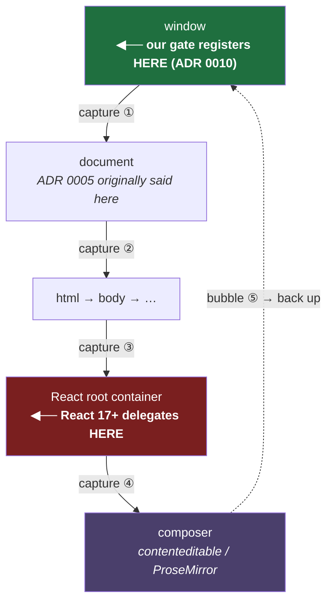
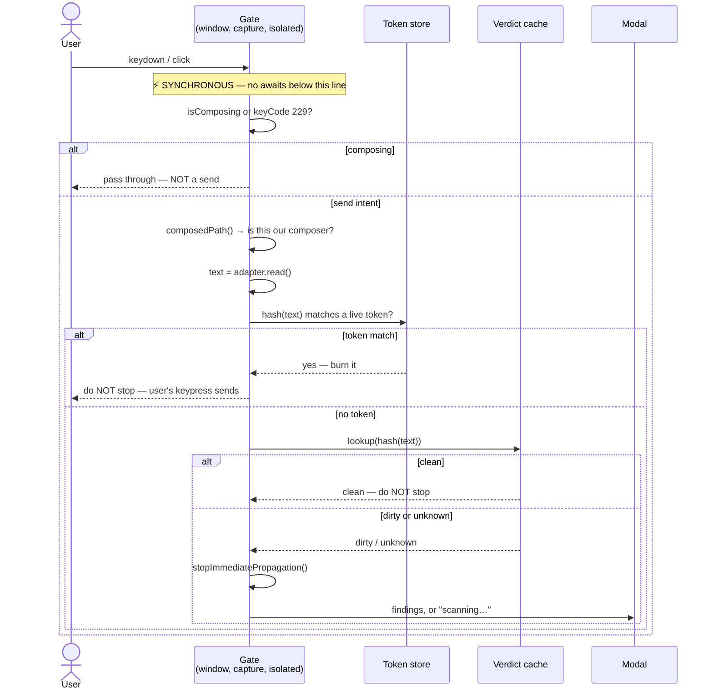
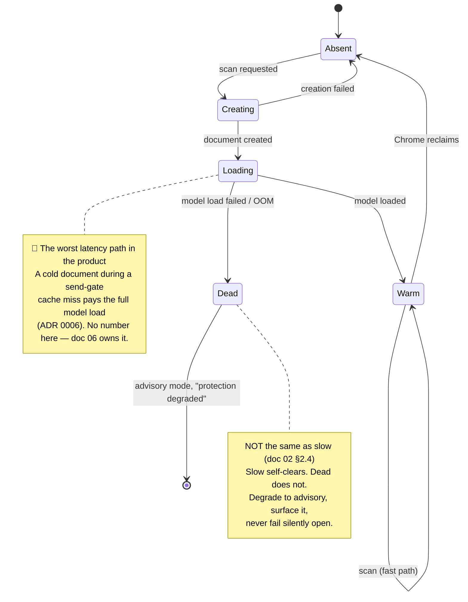

# 05 — Low-Level Design

> **Scope:** the Phase 0 mechanism. Assumptions resolve to [`ASSUMPTIONS.md`](../ASSUMPTIONS.md);
> invariants **I1–I5** and the trust boundaries **B1–B5** to [`01`](01-hld.md) §5; the gate's world to
> [ADR 0005](adr/0005-gate-in-isolated-world.md); the engine's host to
> [ADR 0006](adr/0006-offscreen-document-hosts-engine.md).
>
> **Docs 00–04 can be argued. This one gets falsified by Chrome.** Every claim below is therefore
> either **cited to Chrome's documentation**, **derived in place**, or **tagged and left open**. Where
> the package's prior reasoning does not survive the citation, the section says so.

---

## 0. The short version

1. 🔴 **U12 is not one claim and must not be tested as one.** It is three sub-tests with **three
   different blast radii and three different fallbacks** (§1). **U12-a failing forces rework. U12-c
   failing routes to a mitigation this document designs. U12-b failing breaks Chinese input — the
   wedge's own language.** Treating U12 as a single binary gate hides that, and a single pass/fail
   result would tell us almost nothing about what to do next.
2. **U12-c's mitigation is free, and it should be the default rather than the fallback: register the
   gate at `window`, not `document`** ([ADR 0010](adr/0010-gate-registers-at-window.md)). `window` sits
   **above** `document` on the capture path, so the bypass class U12-c is testing for **stops existing**
   rather than being detected. This refines ADR 0005, which specified `document`.
3. **U11 ✅ RESOLVED — TRUE, and its conclusion is wrong.** `declarativeNetRequest` genuinely cannot
   inspect request bodies *(cited, §4.1)*. But `ASSUMPTIONS.md` records this as *dispositive* — *"the
   observer **must** be a MAIN-world patch."* **That does not follow. dNR is not the only observational
   API.** `chrome.webRequest` survived MV3 for observation and still supplies `requestBody` *(cited)*.
   **The plan's mechanism was chosen by eliminating one option and not looking for a second.**
4. 🔴 **And the skipped option is better, on two grounds** (§4.3,
   [ADR 0012](adr/0012-observer-uses-webrequest.md)). **(a) Enumeration is where silent misses come
   from.** A MAIN-world patch sees only the transports we thought to enumerate — `fetch`, XHR,
   `sendBeacon`, `WebSocket`, **and `fetch` inside a Web Worker, which a `window.fetch` patch never
   touches because a worker has its own global.** Its blind-spot set is **unbounded and silent.**
   `webRequest` enumerates nothing over HTTP; its blind-spot set is **exactly one** (WS frames —
   **U20**), **known, and testable in week 1.** **The observer exists to catch silent misses — its
   mechanism must not have an open-ended set of its own.** **(b) It cannot break the provider's app.**
   A monkey-patch on a third-party SPA's network layer, force-installed estate-wide, that must never
   throw — *"your DLP tool broke ChatGPT for 150 people"* is a company-ending event at pre-seed.
   **This reverses a plan assumption and changes two diagrams in doc 01 — flagged, not absorbed.**
5. **U10 ✅ RESOLVED — TRUE, 30 seconds** *(cited, §5.1)*, with a detail ADR 0006 would have wanted:
   **messages from an offscreen document reset the service worker's idle timer.** The two components
   ADR 0006 treats as separate lifecycle problems are **coupled** — a busy engine keeps the SW alive
   for free.
6. 🔴 **Doc 04 §8's vault bug is real, and the cheap fix is not the one it implies** (§5.3,
   [ADR 0011](adr/0011-monotonic-placeholder-numbering.md)). Persisting the vault buys coherence and
   costs exposure duration. **But the failure modes are asymmetric and nobody noticed:** a lost vault
   that **restarts** numbering makes `PERSON_1` mean two people — **the model conflates them.** A lost
   vault with a **monotonic counter** makes one person `PERSON_1` and `PERSON_5` — **the model splits
   them.** Splitting is degraded. **Conflating is wrong.** The counter is an integer, costs no
   exposure, and converts the dangerous failure into the benign one.
7. **Doc 04 §8 overstates what the approval token needs** (§6.2). It requires *"deterministic
   rewrite — the same input must always produce the same output, or the token never matches."*
   **Designing the token store shows the token cannot mismatch: we hash the string we wrote.** The
   property actually load-bearing is **idempotency** — `rewrite(rewrite(x)) == rewrite(x)` — and doc 04
   never names it. **Same shape as doc 04 correcting doc 03 §2.3: the doc that builds the thing finds
   what the doc that specified it could not.**
8. **U19 ✅ on mechanism; its size worry was never proportionate** (§8.2). `storage.managed` is
   read-only and policy-populated exactly as ADR 0009 assumed. **Chrome documents no quota for it** —
   but the payload is a **~32-byte key**, and the smallest documented quota on the neighbouring
   namespaces (`sync`'s 8 KB per item) clears that by **~256×** *(derived, §8.2)*. **The real finding
   is different and ADR 0009
   should have it: `storage.managed` is exposed to content scripts by default**, which would put the
   tenant key in **B2** rather than **B3**.
9. **The security questionnaire's un-N/A-able row has a good answer and it is not ours** (§7). **MV3
   structurally forbids remotely-hosted code**, and **`ExtensionSettings` lets the admin pin our
   version.** The honest sentence is *"you control when our code changes, not us"* — a **platform
   property and an admin control**, not a promise from a pre-seed vendor.

---

## 1. 🔴 U12 — the gate mechanism, as three tests

**This is the architecture's single point of failure** (ADR 0005). It is also the thing this document
**cannot resolve**, and does not pretend to: U12 is discharged by an unpacked extension in Chrome
against real ChatGPT and Claude, not by prose. **What this section owes is a protocol precise enough
that the result is unambiguous, and a statement of what each failure costs.**

**Doc 03 §6 held the identical line on U6 and produced no tokens/sec figure. This section produces no
verdict.**

### 1.1 Why "does U12 pass?" is the wrong question

`ASSUMPTIONS.md` states U12 as one claim. It is three, and **they are not the same kind of claim**:

| | Sub-test | What kind of claim | If it fails |
|---|---|---|---|
| **U12-a** | An isolated-world capture listener preempts React, and `stopImmediatePropagation()` crosses the world boundary | **A browser behaviour.** Either Chrome does this or it doesn't. Not tunable. | 🔴 **Rework.** No mitigation exists in this design. |
| **U12-b** | The gate distinguishes a composition-commit `Enter` from a send-intent `Enter` | **A per-IME, per-platform behaviour.** Ours to get right in our own handler. | 🟠 **The wedge breaks.** Fixable, but the naive version ships broken. |
| **U12-c** | No page listener above us on the propagation path silently suppresses the event | **A property of two specific websites**, which changes when they deploy. | 🟡 **Mitigated by design (§2.1).** |

> **The blast radii are not comparable, so a combined verdict is meaningless.** "U12 passes" would be
> a sentence with no information in it: it could mean the architecture is sound, or it could mean two
> of three passed and the one that forces rework was the one that didn't. **Report the three
> separately, always.**

**Read the failure column top to bottom — it is a ranking, and it inverts the effort you'd naively
spend.** U12-a is the one that can kill the design and it is the **cheapest and fastest to test**: one
listener, one `console.log`, five minutes per surface. U12-b is the most likely to fail and the most
embarrassing if it ships. U12-c has a designed mitigation and is therefore the least urgent, despite
being the most alarming to read.

### 1.2 U12-a — the base claim

**The claim, stated so it can fail.** A capture-phase listener registered from a **content script**
(isolated world) at `document_start` on an ancestor of the composer:
1. **fires before** the provider's React handler, and
2. **`stopImmediatePropagation()` from it prevents the page's handler from running at all.**

**Why it should hold** (ADR 0005, restated because the reasoning is what the test falsifies):
content scripts and page scripts have **separate JS contexts but one DOM event dispatch.** They are
not separate event systems. So our listener and React's are in the same dispatch, ordered by the DOM's
own rules — and **capture-on-an-ancestor precedes anything on a descendant, regardless of registration
order.** React 17+ delegates at its **root container**, which is a descendant of `document`. We are
above it. *(React's root-container delegation from v17 onward is **[unverified]** for the specific
bundles ChatGPT and Claude ship — they may pin, patch, or bundle differently, and this is exactly the
kind of thing to observe rather than assume.)*

**Read the arrows.** Everything the gate depends on is the claim that ① happens before ③. **That is
the whole architecture, and it is one arrow.**

**Protocol — per surface, against the real site, not a test page:**

| Step | Action | Pass |
|---|---|---|
| 1 | Load an unpacked extension with a `document_start` content script registering a capture listener for `keydown` on `window` **and** on `document`. Log `event.eventPhase`, `event.target`, `performance.now()`. | Both fire, before any page handler logs. |
| 2 | Type into the composer, press `Enter`. Observe ordering against a MAIN-world listener registered at the root container as a React stand-in. | Ours logs first. |
| 3 | Call `stopImmediatePropagation()` from the isolated-world listener. | **The message is not sent. No React error, no stuck spinner, no state corruption.** |
| 4 | Repeat for the **Send button** (`click`), `Ctrl/Cmd+Enter`, and **paste-then-immediate-Enter**. | Same. |

**Step 3's pass criterion is the real one**, and it is stricter than "the event stopped." ADR 0005's
whole reason for preferring capture over `fetch`-layer aborts is that **the app never enters its send
state machine, so there is nothing to unwind.** A test that shows the send suppressed but leaves a
spinner turning has **falsified the actual claim** while appearing to pass.

> 🔴 **If U12-a fails, no part of this document survives.** There is no fallback. The gate would have
> to move to the MAIN world, which ADR 0005 shows destroys the synchronous cache read — which is doc
> 01 §0's coupling — which is decisions #2 and #8. **This is a rework trigger, not a tuning knob**, and
> it is the reason U12-a is tested in week 1 before anything is built on top of it.

### 1.3 🔴 U12-b — IME and composition. The highest-irony risk in the project.

**The problem in one sentence:** when composing Chinese through an IME, **`Enter` commits the
composition — it does not mean "send."**

> **A gate that intercepts every `keydown: Enter` breaks Chinese text input entirely.** Our
> differentiator is EN/BM/ZH (decision #4). **The naive gate breaks exactly the language we
> differentiate on, for exactly the users we are selling to** — and it does it on the first keystroke
> of the first demo.

**The signals, and their status:**

| Signal | What it means | Status |
|---|---|---|
| `event.isComposing` | Spec'd: the event fires while an IME composition is active | **The correct signal.** Behaviour on the boundary event is what U12-b measures. |
| `event.keyCode === 229` | Chrome's legacy "IME is processing this" sentinel | **Corroborating, not authoritative.** Legacy, and `keyCode` is deprecated. |
| `compositionstart` / `compositionupdate` / `compositionend` | The composition lifecycle | **The ordering against `keydown` is the whole test.** |

**The failure this test exists to find is an ordering question, not a capability question.** The
signals above are all available. The defect is that **the order of `compositionend` relative to the
committing `keydown` is IME- and platform-dependent**, and the two orders are not distinguishable
after the fact:

- If `keydown` (with `isComposing === true`) fires **before** `compositionend` → we can read
  `isComposing` and correctly pass the event through. **Gate works.**
- If `compositionend` fires **first**, the committing `keydown` arrives with **`isComposing === false`**
  → **it is indistinguishable from a send-intent `Enter`** → we stop it → **the user's composition is
  swallowed and the gate fires on text they never meant to send.**

*(Both orderings are reported in the wild across browsers and IMEs. **Which one Chrome produces, for
which IME, on which platform, is [unverified] and is precisely what U12-b measures.** Do not resolve
this by reading a blog post — the answer is per-IME and it has moved.)*

**The test matrix, weighted by the beachhead rather than by symmetry:**

| Input method | Platform | Why this one | Priority |
|---|---|---|---|
| **Microsoft Pinyin** | Windows | The default Simplified Chinese IME on the D2 corporate laptop. **This is the beachhead's Chinese user.** | 🔴 **Highest** |
| Microsoft Bopomofo / Cangjie | Windows | Traditional-script users in the region | 🟠 Medium |
| Google Pinyin / third-party | Windows | Common enough to matter | 🟠 Medium |
| macOS Pinyin | macOS | Secondary platform (U16's platform) | 🟡 Low |
| **Malay / English** | Any | **Latin script — no IME.** Check platform predictive-text and autocorrect interaction only. | 🟡 **Low, and say so** |

> **The honest asymmetry, and it is worth stating rather than performing even-handedness: CJK is where
> the risk lives. Malay is a Latin-script language and will almost certainly be fine.** Spending equal
> time on both would be a way of looking rigorous while testing the wrong thing.

**Decision — the gate's composition rule, and it resolves rather than deferring:**

> **The gate passes through any `Enter` where `event.isComposing` is true, and any `Enter` whose
> `keyCode` is 229. If U12-b shows a surface/IME where the committing `Enter` arrives with
> `isComposing === false`, the gate additionally suppresses itself for `Enter` events arriving within a
> measured window after `compositionend`.**
>
> 🔴 **No window value appears here. It is derived from the U12-b measurement or it does not exist.**
> Inventing "50 ms" now would be exactly the fabrication `ASSUMPTIONS.md` §3 exists to prevent, and it
> would be a number that silently decides whether Chinese input works.

**Why this rule fails in the safe direction, which is not obvious.** Passing a composition `Enter`
through means a send-intent `Enter` misread as a composition commit **gets through ungated** — a
**silent miss**, doc 00 §6's worst case. That looks like the wrong trade. It isn't, for two reasons:

1. **The miss is bounded to the instant after a composition commits** — a window of milliseconds, on
   one keystroke, not a standing hole.
2. **§4's observer catches it.** An ungated send that reaches the network is exactly what the observer
   reconciles and reports as a **bypass**. **The failure lands in the audit trail rather than in
   silence** — which is the whole reason the observer is in Phase 0.

**The alternative — stopping ambiguous `Enter`s — fails to friction rather than to silence, which doc
02 §2.4 says to prefer.** We are declining it here anyway, and the reason is a product judgement
rather than a security one: **"fail to friction" costs a keypress when the friction is occasional. This
friction would land on every committed composition — i.e. on every few words of Chinese typing.** That
is not friction. That is a broken text box, and a broken text box in the beachhead's language gets the
extension uninstalled, at which point it detects nothing at all — **and in Phase 0 that is one click**
(`ASSUMPTIONS.md` §4 lists *"that the extension can't be removed"* as a deliberate non-assumption).
**Per doc 00 §4, every false positive is already a ticket the admin eats. A gate that eats Chinese
input is not a false-positive rate — it is a reason to remove the control.**

### 1.4 🟡 U12-c — a listener above us

**The claim.** `window` is above `document` on the capture path. **A page listener registered at
`window`, capture phase, fires before ours on `document` — and if it calls `stopPropagation()`, our
gate never runs and is silently bypassed.** Fail-open, invisible, dashboard still green: doc 00 §6's
worst case.

**This is why §2.1 moves the gate to `window`, and why U12-c is the least urgent of the three despite
reading as the most alarming.** Once we are **at** `window` at `document_start`, a page listener can
only beat us by registering at the same node, same phase, **earlier** — and a page script structurally
cannot run before a `document_start` content script *([unverified] as an absolute guarantee — it is
Chrome's documented intent, and it is what step 2 below measures)*.

**Protocol:**

| Step | Action | Pass |
|---|---|---|
| 1 | From a MAIN-world `document_start` script, patch `EventTarget.prototype.addEventListener` and log every registration on `window` and `document` with its `capture` flag. | An inventory of what each surface actually registers. **This is data, not a pass/fail.** |
| 2 | Register our gate at `window` capture at `document_start`. Verify it fires before every listener the inventory found. | Ours fires first. |
| 3 | Have the page's listener call `stopPropagation()`. Verify ours already ran. | Ours ran. |

**If step 2 fails** — a page listener genuinely preempts us at `window` — **we are out of DOM
mechanisms, and the fallback is not another listener.** It is that **§4's observer becomes the only
signal for that surface**, and per ADR 0005's own revisit clause, **fail-open becomes structural
there.** That is a per-surface product decision (drop the surface, or ship it advisory-only and say
so), **not an engineering fix**, and it is doc 06's call under the same degradation machinery as a
dead engine.

---

## 2. The gate

### 2.1 Register at `window`, not `document` — ADR 0010

**ADR 0005 specified `document`.** It is not wrong; it is one node lower than it needs to be, and the
node above is free.

| | `document` (ADR 0005) | **`window`** (this document) |
|---|---|---|
| Position on capture path | Second | **First** |
| Beaten by a page listener at `window` capture | ✅ **Yes — U12-c's entire bypass class** | ❌ Nothing is above it |
| Beaten by registration order | No (React is on a descendant) | Only by a script running before `document_start` |
| Cost of moving | — | **Zero.** One argument. |

> **Decision: the gate registers on `window`, capture phase, at `document_start`.** Recorded as
> [ADR 0010](adr/0010-gate-registers-at-window.md). **U12-c changes from a bypass we detect into a
> bypass that cannot be constructed** — which is worth more than a mitigation, and costs a word.

**The reasoning worth keeping** (it generalizes past this decision): ADR 0005 chose `document` because
it was reasoning about **beating React**, and `document` beats React. It was not reasoning about
**what could beat us**, and the answer to that question is one node higher. **Both questions have the
same answer shape and only one of them was asked.**

### 2.2 `composedPath()`, not `event.target` — non-negotiable

**ADR 0005 already requires this and it is worth one paragraph because getting it wrong is silent.**
Both target surfaces are component frameworks and either may put the composer inside a shadow root.
**Shadow DOM retargets events**: from outside the tree, `event.target` reports the *host*, not the
element the user typed into. A gate that keys off `event.target` will fail to recognize its own
composer, conclude the event is unrelated, and **pass it through** — a silent fail-open that looks
exactly like "no findings."

> **The gate resolves the composer via `event.composedPath()`, always.** The adapter's
> `isComposer(node)` is applied across the path, not to `event.target`.

### 2.3 Every send path, and the ones that are not keystrokes

ADR 0005: *"the gate must cover every send path. A miss fails open, silently."* Enumerated:

| Path | Event | Note |
|---|---|---|
| **Enter** | `keydown` | §1.3 owns the composition case |
| **Ctrl/Cmd+Enter** | `keydown` | Some surfaces invert this — a per-adapter fact, not a global one |
| **Send button** | `click` | Also `keydown: Enter`/`Space` when focused — **a button is activated by keyboard too**, and a click-only gate misses it |
| **Paste-and-send** | `paste` then `keydown` | 🔴 **The cache-miss path.** §6.3 |
| **Voice / dictation** | ⚠️ **[unverified] per surface** | May submit without any keystroke reaching us at all |
| **Form submit** | `submit` | Cheap to cover, may not exist on either surface |

> 🔴 **Voice is the honest gap and it is stated rather than implied.** If a surface's voice mode
> submits programmatically from its own JS, **no DOM gate sees it**, because there is no user event to
> intercept. That is not a bug to fix — it is the fail-open class §4's observer exists to **report**.
> **We do not currently know whether either surface does this.** It is a U12 spike observation, and if
> the answer is yes, the honest response is to say so in the threat model *(doc 00 §6 style)*, not to
> claim coverage we don't have.

### 2.4 What the gate does, in order

**Note what is absent below the synchronous line: every branch is a hash lookup against an in-memory
map in the same world.** No `await`, no `postMessage`, no `chrome.runtime` call. **That is doc 01 §0's
coupling expressed as a call graph**, and it is why the gate can live in the isolated world and nowhere
else.

---

## 3. The site adapter layer

### 3.1 🔴 This document ships no selectors, deliberately

**The temptation is to write `#prompt-textarea` here.** Refusing, on two grounds:

1. **Any selector written today is `(unverified)`** — I have not opened either surface, and asserting
   one from memory is exactly the fabrication the engagement rules forbid. **Doc 03 §2.4 refused to
   ship the old-format IC on the same principle: a gap over a fabrication.**
2. **D4 says provider DOM churns weekly** *(low confidence — "folklore, not measured")*. **A selector in
   a design document is stale before the document is reviewed.** Worse, it would *look* authoritative,
   and someone would trust it over the running site.

> **The adapter's selectors are code, not design. What this document owes is the contract they satisfy
> and the test that tells us when they've broken.**

### 3.2 The contract

Each surface implements exactly this, and nothing else knows the surface exists:

| Member | Responsibility | Failure is |
|---|---|---|
| `match(location)` | Is this adapter for this page? | Cheap, unambiguous |
| `isComposer(node)` | Is this node the composer? **Applied across `composedPath()`** | **Silent** — §2.2 |
| `readText()` | Extract the composer's current text | **Silent** — returns `""`, everything looks clean |
| `writeText(s)` | Replace composer content with `s`, caret at end | **Loud** — the user sees it fail |
| `isSendIntent(event)` | Does this event mean send **on this surface**? | **Silent** |
| `selfTest()` | §3.3 | — |

**Three of six fail silently, and that is the design problem this layer has.** A broken `readText()`
does not throw; it returns empty, the scan finds nothing, the verdict is clean, and **the gate waves
every prompt through while the dashboard reports zero findings.** Per doc 00 §6 that is the worst
outcome available to us: **the control stops working and the audit trail says it worked.**

### 3.3 The self-test — and it must fail loud

> **Decision: every adapter runs a self-test at injection and on a debounced DOM-mutation trigger. A
> failure is an audit event and a user-visible state, never a caught exception.**

| Check | Method | Detects |
|---|---|---|
| Composer resolves | `isComposer` finds exactly one node | The rename that breaks everything |
| **Read round-trips** | `writeText(nonce)` → `readText() === nonce` → restore | 🔴 **The silent one.** A `readText()` that returns `""` |
| Send control resolves | `isSendIntent` recognizes the button | Missed send path |
| Ambiguity | Exactly one composer, not zero, not three | A layout change that added a second editor |

**The round-trip check is the one that earns its keep**, because it is the only one that catches
`readText()` lying. *(It writes into the user's composer. It runs on an **empty** composer only, and
restores. If the composer is non-empty, the check defers — a self-test that eats someone's draft is a
worse bug than the one it detects.)*

**On failure: degrade to advisory, surface "protection degraded" to the user and to the admin's audit
trail.** This is not a new mode — **it is doc 02 §2.4's dead-engine degradation, reached by a different
road**, reusing decision #3's advisory mode. **One degradation state, three triggers** (dead engine,
broken adapter, unresolvable surface). **Whether admin-enforced mode should instead fail *closed* is
doc 06's call, not this document's** — doc 01 §7 assigns it there, and it is a product decision.

### 3.4 The tax, stated honestly

D4 sizes this layer and D4 is **Low confidence — folklore, not measured**. So:

> **The adapter self-test is also the D4 instrument.** Every self-test failure is a timestamped
> record of a provider breaking us. **After one quarter of Phase 0 we will have replaced an assumption
> with a measurement**, for free, from a mechanism we had to build anyway. **That is the cheapest open
> item in the package to close, and doc 08 should say so.**

---

## 4. The log-only observer

### 4.1 U11 ✅ RESOLVED — TRUE, and the conclusion drawn from it is wrong

**U11:** *"`declarativeNetRequest` cannot inspect request bodies."* **Confirmed.** Chrome's
documentation lists what a dNR rule may match on — `urlFilter`, `regexFilter`, `resourceTypes`,
`requestMethods`, `initiatorDomains`, `tabIds`, response headers — and **request bodies appear
nowhere.** This is not an omission; it is the API's stated purpose:

> *"extensions modify network requests without intercepting them and viewing their content"* —
> [Chrome dNR documentation](https://developer.chrome.com/docs/extensions/reference/api/declarativeNetRequest)

**So U11 is true. Now read what `ASSUMPTIONS.md` says follows from it:**

> *"Believed true — and if so it's **dispositive**: the log-only fetch observer **must** be a
> MAIN-world patch, since dNR structurally cannot see prompt content."*

🔴 **That is a non-sequitur, and it has been driving the design.** The inference is *"dNR cannot see
bodies, therefore no extension API can, therefore we must patch the page."* **The middle step is
false. `chrome.webRequest` is a different API and it survived MV3 for exactly this purpose:**

> *"Aside from `"webRequestBlocking"`, the webRequest API is unchanged and available for normal use."*
> — [Chrome webRequest documentation](https://developer.chrome.com/docs/extensions/reference/api/webRequest)

and `onBeforeRequest` still supplies **`requestBody`** via `opt_extraInfoSpec`. **The observational
half of `webRequest` was never removed. Only the blocking half was restricted** — and that restriction
is *"only available to policy installed extensions"*, which is B3/force-install, i.e. **us at Phase 1.**

> **U11 is true and it eliminates dNR. It does not select MAIN-world. It never did.** The plan reached
> a mechanism by ruling out one option and not looking for a second — **and note what made this
> findable: not research, but reading the claim's inference instead of its verdict.** The register
> records U11's **verdict**, the design inherited its **inference**, and only the verdict was ever
> checked. **An entry in our own register is a cross-reference like any other.**

*(New: **U20** — that a surface's prompt submission is an **HTTP** request rather than a WebSocket
frame. `webRequest` sees the WS handshake, never the frames. §4.4.)*

### 4.2 The two mechanisms

| | **MAIN-world `fetch` patch** | **Observational `webRequest`** |
|---|---|---|
| World | **B1 — untrusted.** Page can read, unpatch, or feed it lies | **B3 — extension privileged.** Page cannot reach it |
| Sees | What the app passed to `fetch` | **The actual wire bytes** |
| Coverage | Only the transports we patch — `fetch`, XHR, `sendBeacon`, WebSocket… | **Every HTTP request to the host, regardless of the API used** |
| WebSocket frames | ✅ Possible (patch `WebSocket.send`) | ❌ **Blind — handshake only** |
| Can break the provider's page | 🔴 **Yes.** A throwing patch breaks their send for every user | ❌ **No.** Passive observer |
| New permission | None | **`webRequest`** |
| Lifecycle | Page's | SW — wakes on the event. **Log-only, so latency is irrelevant** |

**Kill the permission argument first, because it is the obvious objection and it does not survive.**
`webRequest` looks like the expensive option against doc 02 §6.4's un-N/A-able row. But **we already
hold `host_permissions` on those exact origins** — which lets us *inject arbitrary code into the page*.
**Reading a page's network traffic is strictly less power than running code in it.** The marginal
disclosure is near zero, and a reviewer sharp enough to object to `webRequest` is sharp enough to
notice we could already do worse. *(Whether `webRequest` adds a distinct install-time warning string
beyond the host warning is **[unverified]** and worth checking before the store listing — it is a
listing question, not an architecture one.)*

### 4.3 🔴 Decision — `webRequest`. Enumeration is where silent misses come from.

> **Decision: the observer is an observational `chrome.webRequest.onBeforeRequest` listener with
> `requestBody`, in the service worker. Not a MAIN-world patch.** Recorded as
> [ADR 0012](adr/0012-observer-uses-webrequest.md). **It never blocks.**

**The decisive argument is not in the table, and it is about what the observer is *for*.**

The observer's entire purpose is to catch the send paths the DOM gate missed (§2.3 — voice, an
unpatched surface, U12-b's boundary case, a selector break). **It is a check on the gate.**

> ⚠️ **Amended 2026-07-17 — this section first argued that a MAIN-world patch *"is defeated by the same
> class of event that defeats the DOM gate"* and called it *"a second opinion from the same doctor."*
> The founder pressed it and it does not hold as stated.** Checked concretely, the failure sets barely
> overlap: **the gate fails on DOM changes** (a selector rename, a preempting listener, a non-event
> send path), **the patch fails on transport changes.** A selector break blinds the gate and not the
> patch. A `fetch` → XHR switch blinds the patch and not the gate. **They coincide only in a narrow
> corner** — a voice submission issued from a Web Worker. **Right instinct, wrong argument.** The
> durable version is narrower, and it survives.

**The argument that holds: a MAIN-world patch only ever sees the transports we thought to enumerate.**
`fetch`, XHR, `sendBeacon`, `WebSocket` — **and `fetch` inside a Web Worker, which a `window.fetch`
patch never touches, because a worker has its own global scope.** Every transport we fail to enumerate
is a **silent** miss.

**`webRequest` enumerates nothing over HTTP.** It watches the network, not the JS, so the page cannot
route around it by changing which API it calls.

| | Blind spots | Knowable in advance? |
|---|---|---|
| **MAIN-world patch** | **Unbounded** — every transport not enumerated, worker scopes included, plus whatever ships next quarter | ❌ **No, and each fails silently** |
| **`webRequest`** | **Exactly one** — WebSocket frames | ✅ **U20 — one look at the Network tab, week 1** |

> **The observer exists to catch silent misses. Its own mechanism must not have an open-ended set of
> them.** We trade an **unbounded, silent, unknowable** blind-spot set for **one, known, and testable
> before we build.** **That is not a close trade.**

**The second argument is about the customer rather than the architecture, and it may be the bigger
one:**

> **A MAIN-world patch can break the provider's app.** We would be monkey-patching a third-party SPA's
> network layer, force-installed into every browser in the estate, and it must never throw on any
> path — including paths that ship next Tuesday. **If it throws, their send fails.** For a compliance
> vendor at pre-seed, *"your DLP tool broke ChatGPT for 150 people"* is not a bug — **it is the end of
> the account and probably the company.** `webRequest` is passive and **structurally cannot do it.**
>
> **This is doc 00 §4's argument applied to the network layer:** we optimize for **non-defection**, and
> there is no faster route to defection than breaking the tool the user is trying to use.

**A third consequence, free:**
- **It sits in B3, not B1.** doc 01 §5's diagram puts the observer in B1 and restricts it to *"hashes
  only"* **precisely because B1 is untrusted.** In B3 that constraint is no longer a compensation for
  a bad location. **We keep hashing anyway** — I3 says audit events carry hashes, classes and counts,
  never values, and that is unchanged — but we are now hashing **because the audit invariant says so**,
  not because we parked the component somewhere unsafe.

**🔴 This changes doc 01 and the change is not cosmetic.** Doc 01 §2's component diagram puts the
observer in the MAIN-world box; doc 01 §5's boundary diagram puts it inside **B1**. **Both are now
wrong.** Per the engagement rule on decisions that are expensive to reverse once written into multiple
docs, **this is flagged for the founder before doc 01 is touched.** It is recorded here so the
inconsistency cannot go quiet.

**Revisit if:** **U20** shows a surface submits over a WebSocket frame — `webRequest` is structurally
blind to those, and that surface needs a MAIN-world `WebSocket.send` patch **in addition**, accepting
every cost in §4.2's table for that surface alone.

### 4.4 Reconciliation, and why it needs the body

**The mechanism:** the gate records `hash(text)` for every send it authorized (a clean pass or a burned
token, §6). The observer extracts the prompt from the request body, hashes it with the same salt, and
asks whether that hash was authorized. **No match → a bypass event.**

**A cheaper design suggests itself and it is wrong:** reconcile on **timing** — "a POST to the send
endpoint with no authorized send nearby." It needs no body, so U11 wouldn't matter and dNR would almost
do. **It fails on precision.** A user sending twice in a second, a retry, a regeneration, a background
poll to the same endpoint — each produces a **false bypass report**, and per ADR 0001 **every false
positive is a ticket the admin eats.** A bypass alarm is the highest-severity thing we can put in front
of a compliance officer. **Crying wolf there is worse than not having the feature** — it is ADR 0001's
quasi-contractual precision commitment, aimed at **the buyer** instead of the user, where it costs the
one relationship the product depends on.

> **The body is what makes the reconciliation exact rather than statistical. That is why U11 mattered
> — and why getting its conclusion wrong would have cost us the better mechanism.**

**The honest cost:** extracting the prompt from `requestBody.raw` means **parsing the provider's
request schema — a second adapter, churning on the same D4 clock as the DOM one.** **Both adapters
break independently, and the self-test (§3.3) covers only one of them.** Recorded for doc 08 as a
maintenance line, not hidden in a diagram.

> ⚠️ **Corrected 2026-07-17 — this paragraph ended "the observer does not escape the adapter tax; it
> doubles it," positioned under the `webRequest` decision as though the doubling were a cost of §4.3.
> It is not, and the misattribution was load-bearing enough to argue against the decision it sat
> under.** **A MAIN-world patch pays this tax identically.** It intercepts `fetch(url, init)` where
> `init.body` is **already a serialized string**, so it must dig the prompt out of **the same provider
> schema**. Hashing the whole body is not an escape either: the gate hashed the **composer text**, and
> the body also carries `conversation_id`, `model`, and everything else.
>
> **The request-schema adapter is the price of content-based reconciliation — which the paragraphs
> above justify on precision grounds. Both mechanisms pay it in full. It does not discriminate between
> them**, and presenting it here made `webRequest` look worse than it is in a like-for-like
> comparison. **The cost is real and stays. It is simply not a reason to prefer either mechanism.**

---

## 5. Offscreen lifecycle and the vault

### 5.1 U10 ✅ RESOLVED — TRUE, 30 seconds, plus a detail ADR 0006 wanted

**U10:** *"MV3 service workers terminate after ~30 s idle."* **Confirmed:**

> *"After 30 seconds of inactivity. Receiving an event or calling an extension API resets this
> timer."* — [Chrome service worker lifecycle](https://developer.chrome.com/docs/extensions/develop/concepts/service-workers/lifecycle)

**Three further facts, all cited from the same page, and the third is the useful one:**

| Fact | Consequence for us |
|---|---|
| A single event or API call taking **> 5 minutes** kills the SW | Irrelevant — nothing we do in the SW is long |
| A `fetch()` response taking **> 30 s** kills the SW | The audit batch upload needs a timeout below this |
| 🔑 **Messages from an offscreen document reset the timer** (Chrome 109+) | **ADR 0006's two lifecycle problems are one problem** |

> **ADR 0006 treats the offscreen document and the service worker as separate lifecycle concerns.
> They are coupled, and in our favour: an offscreen document that is scanning is messaging the SW, and
> messaging the SW keeps it alive.** So the SW is awake exactly when there is work — which is when we
> need it — and idles out when there isn't, which is what MV3 wants. **The lifecycle we were worried
> about is load-bearing in the direction we wanted.**

**This does not rescue ADR 0006's decision, and it is worth being precise about why.** ADR 0006
rejected the **SW as the engine's host** on *"~30 s idle termination + reloading 135 MB on most
scans."* **That reasoning is untouched** — the 30 s number is now cited rather than believed, which
makes the ADR stronger, not different. What the new fact changes is the **coordination** story between
two components we were going to build anyway.

### 5.2 The state machine

**Chrome may reclaim the offscreen document.** ADR 0006 assigns the recreation state machine here.

**Only one offscreen document is permitted per extension**, so ADR 0006's warning that it is a
**contended resource** binds from day one: Phase 1's file parsing must **share** this document, not
request a second one. **Built as a multiplexed host now; retrofitting it later means rewriting the
lifecycle above rather than adding to it.**

### 5.3 🔴 The vault — doc 04 §8's correctness bug, and an asymmetry nobody costed

**Doc 04 §8 hands this document a specific bug:**

> *"What happens to a live conversation's vault when the offscreen doc is reclaimed mid-thread? If it's
> lost, placeholder numbering restarts and **the model sees `PERSON_1` meaning two different people in
> one thread.** Doc 05 owns the state machine; **this is a correctness bug, not a performance one.**"*

**It is real. Trace it:** turns 1–4 establish `John Tan → PERSON_1`, `Mary Lim → PERSON_2`. Offscreen
reclaimed. Turn 5 mentions Mary first → she is minted `PERSON_1`. **The conversation now contains
`PERSON_1` meaning two people, and the model cannot tell.** It will attribute turn 1–4's facts about
John to Mary. **That is not degraded output. That is wrong output, generated confidently, about
identifiable people.**

**The obvious fix — persist the vault — works, and it is not free.** Doc 01 §6 already routes the vault
to **IndexedDB**, which is extension-origin and survives offscreen reclamation, so the mechanism exists.
But doc 04 §2.4 is explicit that **exposure duration should be as short as coherence allows**, and
persistence extends it. And per doc 04 §2.3 the vault at rest is **hashes + placeholders + the salt we
hold** — *"less catastrophic, not safe."*

> **Re-reading doc 01 §6 rather than citing it, per the standing rule — and it does not say what I
> expected.** It justifies IndexedDB for *"the vault and cache"* on the grounds that both are *"too big
> and too structured for the KV store."* **For the vault alone, "too big" is contradicted by doc 04
> §2.4**, which says a per-conversation table is *"a few hundred entries at worst"* and that *"memory is
> not the constraint."* **The decision is right and one of its two reasons is wrong.** The vault belongs
> in IndexedDB because it is **structured** and because **§5.3 now requires it to be durable** — a
> requirement that did not exist when doc 01 §6 was written. **Flagged for a dated note; not silently
> patched.**

**Now the part doc 04 did not see, and it changes the design.** The two failure modes are **not
symmetric**:

| Vault is lost and… | Result | Severity |
|---|---|---|
| **numbering restarts at 1** | `PERSON_1` = John **and** Mary. **The model conflates two people.** | 🔴 **Wrong output about real people** |
| **numbering continues monotonically** | John = `PERSON_1` **and** `PERSON_5`. **The model splits one person into two.** | 🟠 **Degraded output.** The model hedges or treats them separately |

> **Conflation is a correctness failure. Splitting is a quality failure. They are not the same bug and
> doc 04 §8 named only the first.**
>
> **The counter is an integer.** It is not sensitive, it costs no exposure duration, and keeping it
> alive after the mappings are gone **converts the dangerous failure into the benign one.**

**Decision** — [ADR 0011](adr/0011-monotonic-placeholder-numbering.md):

> **The per-conversation placeholder counter is monotonic and outlives the mappings. The mappings are
> evictable on doc 04 §2.4's rule** (tab close, navigation away, TTL) **and their loss degrades
> coherence, never correctness.**

**This is the rare case where the privacy-preferring choice and the correctness-preferring choice stop
competing.** Doc 04 §2.4 wanted the mappings evicted aggressively; §5.3 wanted them durable for
correctness. **Splitting the counter from the mappings gives both**: evict the sensitive half on the
tightest schedule coherence allows, keep the non-sensitive half, and the worst outcome is a model that
thinks John Tan is two people — **which is a bad answer, not a false one.**

*(TTL: **no value here.** It interacts with doc 06's measured budget and with §6.1's token TTL, and
inventing one would be a number that silently decides how long sensitive material sits on disk.)*

---

## 6. The approval token

### 6.1 Shape

Per doc 04 §6, unchanged in substance:

| Property | Value | Why |
|---|---|---|
| Bound to | `hash(rewritten text)` | Any edit kills it — **including pasting more sensitive data after approving** |
| Uses | **Single. Burned on match.** | A token that survives its send is a replay primitive |
| Lives in | **Isolated world (B2)**, beside the verdict cache | **I5-shaped: hash + boolean, never text.** Page JS cannot reach it |
| TTL | *(estimate — doc 04 says ~60 s)* | §6.4 |
| Auto-submits | 🔴 **Never** | **The token withholds an interruption. It does not send.** Decision #8 |

### 6.2 🔴 Doc 04 §8 asks for the wrong property

**Doc 04 §8 hands this document a requirement:**

> *"**Deterministic rewrite** is load-bearing: the token binds to `hash(rewritten)`, so **the same
> input must always produce the same output**, or the token never matches."*

**Designing the token store shows the token cannot mismatch, and determinism is not what protects it.**
Trace the actual sequence: the modal computes `rewritten` → the adapter **writes that exact string**
into the composer → we mint `token = hash(`**that same string**`)`. **We hash the string we wrote.**
The gate later hashes the composer's contents and compares. **The match is guaranteed by construction,
not by any property of the rewrite function.**

**The only way determinism enters is if the rewrite is computed twice** — once for the modal's preview,
once at write time — and the two calls disagree because the vault moved between them. **So the
requirement is satisfiable by a discipline rather than a property:**

> **Decision: compute the rewrite exactly once, carry the string, mint the token from the string
> actually written.** Determinism is then not required, because nothing is recomputed.

**But there is a real property doc 04 §8 needed and did not name, and it is the one that bites:**

> 🔴 **Idempotency.** `rewrite(rewrite(x)) == rewrite(x)`.

**Why it bites.** We write `"PERSON_1 owes RM5k"` into the composer. That is an input event. **The
typing-time scanner fires on our own output.** L2 is a NER model, and **`PERSON_1` is exactly the shape
of a thing a NER model tags as a person.** So: a finding on `PERSON_1` → dirty verdict → underlines on
our own placeholder → the modal offers to rewrite `PERSON_1` to `PERSON_2`. **The pipeline eats its own
tail.**

**The token masks this and that is what makes it dangerous.** For the next 60 seconds the gate matches
the token and does not stop the send, so the loop never becomes visible in testing. **After the TTL, or
on the next conversation turn, it does.**

**Fix, and it costs nothing because the machinery exists:** L1 runs before L2 and **masks what it
matches** (doc 01 §3, doc 03 §1). Add a placeholder-grammar rule to L1 — `^(PERSON|IC|ORG|CODENAME|…)_\d+$` —
so placeholders are recognized and masked as **already handled**, and **L2 never sees them.** The
architecture's own L1-masks-before-L2 ordering is what makes idempotency a one-line rule instead of a
special case. *(A user who genuinely types `PERSON_1` gets it masked. Harmless.)*

### 6.3 The cache-miss path is the paste path

Doc 01 §4's gate diagram labels the cache-miss branch `paste-then-instant-Enter` and annotates it
*"rare path · costs one extra Send."* **Worth stating why it is the one that matters:** every other path has been debounce-scanned as the user types, so the cache is warm by
construction. **Paste is the only way to put a few hundred characters into the composer in one event**
— and it is, per doc 00 §6, **the dominant real-world leak case** *("someone dumps a spreadsheet row or
a customer record into a prompt")*.

> **So the cache-miss path is not a rare edge. It is the modal path for the modal threat.** Doc 01 §4's
> *"~95% clean hit"* is an estimate about **all** sends. **On the sends that matter most, the cache is
> cold by definition.**
>
> **This raises U6's stakes rather than changing this design** — the miss path costs one extra Send if
> inference is fast and becomes the product if it isn't. **Doc 06 should size the budget against the
> paste case, not the typing case.**

### 6.4 TTL

**No number.** Doc 04 §6 says ~60 s and tags it an estimate; **this document does not upgrade an
estimate by restating it.** The constraint is stated instead, so doc 06 can derive it:

> **The TTL's floor is the time for a user to read the modal, decide, and press Send.** Its ceiling is
> **how long a stale approval may sit on a composer the user walked away from.** Both are measurable
> with the first design partner and neither is knowable now.

---

## 7. Permissions and the update channel — doc 02 §6.4's un-N/A-able row

**Doc 02 §6.4 ends by handing this document the one question the architecture cannot make
inapplicable:**

> *"Our `host_permissions` on ChatGPT and Claude, and our auto-update channel, are a **remote code
> execution path into every managed browser in the estate**, and a good reviewer will say so. **That is
> the question we can't N/A**, and doc 05 owns it."*

**It is true. We are asking a compliance officer to force-install, into every browser in the estate,
code that auto-updates from a channel we control. That is, precisely, an RCE path.** Doc 02's whole
achievement is a questionnaire full of N/A. **This row does not get one, and pretending otherwise here
would undo the credibility the N/As buy.**

### 7.1 What we ask for, and what we refuse

| Permission | Why | The refusal that makes this credible |
|---|---|---|
| `host_permissions` on **exactly** the LLM surfaces | Content scripts, adapters, gate | 🔴 **Never `<all_urls>`.** The moment we ask for it the answer to *"what can you read?"* becomes *"everything"* |
| `offscreen` | ADR 0006 | — |
| `storage` | Policy, dictionary, vault | — |
| `webRequest` (**observational only**) | §4.3 | **Never `webRequestBlocking`** — see §7.2 |
| ❌ `tabs`, `cookies`, `history`, `<all_urls>`, `scripting` on arbitrary hosts | — | **Not requested. The list we decline is the answer, and it is checkable in one click.** |

### 7.2 The blocking permission we will be able to take and won't

**`webRequestBlocking` is restricted to policy-installed extensions** *(cited, §4.1)*. **At Phase 1 we
are policy-installed.** So the capability we cannot have today arrives, unrequested, the moment B3
lands.

> **We still don't take it, and the reason is already written down.** ADR 0005 rejected fetch-layer
> gating because **aborting inside a committed request throws into a React state machine never designed
> for it** — error toasts, stuck spinners, corrupted conversation state. **Force-install changes our
> permissions. It does not change React.** Recording this here because *"we can block at the network
> layer now"* is exactly the kind of capability that gets used because it became available, and the
> argument against it will have been three ADRs ago by then.

### 7.3 The answer to the RCE question

**Three parts, and only the third is a promise:**

**1. We structurally cannot ship code at runtime — and this is the platform's guarantee, not ours.**
**MV3 forbids remotely-hosted code**: all executable code ships inside the signed package, and the
extension CSP forbids `eval` and remote script *`[verify: cite the specific MV3 remote-code policy
before this goes in a security pack]`*. So the honest shape of the risk is narrow: **we cannot push
code to a browser at all. We can only publish a new signed version.**

**2. The admin controls when a new version lands — and this is the answer that actually closes the
row.** `ExtensionSettings` policy pins versions and controls the update URL, on the **same machine
policy channel that force-installs us** *`[verify: exact policy keys and their current semantics]`*.

> **"You control when our code changes, not us."**
>
> That sentence is worth more than any assurance we could offer, because **it isn't an assurance.** It
> is a control **the buyer operates**, on infrastructure **they already run** for B3, verifiable
> without trusting us. Doc 02 §4.3 rejected attestation as *"a proof addressed to a party with no
> capacity to check it."* **This is the opposite: a lever, in their hand, that they already know how to
> pull.**

**3. Supply chain — and this is the part that is only a promise.** Pinned lockfiles, CI-built
artifacts, no post-install scripts, a published dependency list. **These are controls, not
impossibilities.** A compromised dependency in a CI-signed build reaches the estate on the next update
the admin allows. **Per ADR 0009's standard for the org dictionary — the same honesty we applied to
ourselves there applies here: this is a contractual and procedural control, not a mathematical one.**

**The full answer, given unprompted, in the shape ADR 0009 established:**

> *"Yes — a force-installed extension is an RCE path, and we won't pretend otherwise. Three things
> bound it. We cannot execute code that isn't in the signed package, because MV3 forbids it. You pin
> our version through the same policy that installs us, so no update reaches your estate until you
> allow it. And our host permissions are two domains, not `<all_urls>` — check the manifest. What
> remains is our build pipeline, which is a procedural control, and we'll show you the pipeline."*

**Underclaiming again** (doc 00 §6): the row stays live, gets a bounded answer, and **the bound is
mostly held by the platform and the admin rather than by us — which is exactly why it's believable
from a pre-seed vendor.**

---

## 8. The remaining register entries this document owns

### 8.1 U16 — macOS force-install. Unresolved, and deliberately not researched here.

**U16 is about a `.mobileconfig`'s signing requirements.** It stays open, and it is worth saying why it
is **not** a doc 05 blocker: `ASSUMPTIONS.md` marks **Windows (HKLM) High confidence and unaffected**,
and B2 puts the beachhead on Windows corporate laptops. **U16 touches the secondary platform only.**

> **Resolving U16 now would be effort spent on the platform the beachhead doesn't run, before B3 tells
> us whether anyone deploys the primary one.** It resolves when a design partner has Macs. **Stated as
> a scoped gap rather than carried as an unranked risk.**

### 8.2 U19 ✅ — resolved on mechanism, and the real finding is somewhere else

**U19:** *"`chrome.storage.managed` can carry a tenant key of the size and shape ADR 0009's Phase 1
design needs."* **ADR 0009's entire Phase 1 key-custody upgrade rests on it** — it is what turns I4
from a contractual control into a mathematical one.

**The mechanism is confirmed** ([Chrome storage documentation](https://developer.chrome.com/docs/extensions/reference/api/storage)):

| ADR 0009 assumed | Chrome says | |
|---|---|---|
| Admin-populated, not user-writable | *"Managed storage is read-only… trying to modify this namespace results in an error"* | ✅ |
| Delivered by enterprise policy | *"managed by system administrators, using a developer-defined schema and enterprise policies"* | ✅ |
| Carries our payload | **No quota is documented for `managed`** — while `local` (10 MB), `sync` (100 KB total / 8 KB per item) and `session` (10 MB) all are | ⚠️ **See below** |

**The size question was never proportionate to the payload, and saying so is the resolution.** ADR 0009
requires `storage.managed` to be *"verified to carry a payload of our size and shape."* **The payload is a
tenant key: 32 bytes, ~44 base64 characters.** The **smallest** documented quota anywhere in that
table — `sync`'s 8 KB per item — exceeds it by **two orders of magnitude**. **A namespace that would
choke on 44 bytes would be unusable for its documented purpose.** The undocumented quota is a real
documentation gap and **it is not a real risk to ADR 0009.**

> **U19 resolves. The residual is schema and delivery, not size** — the key must be declared in the
> `managed_schema`, and it rides the machine-policy channel, **so it is coupled to B3 exactly as ADR
> 0009 says.** That coupling was always the actual risk, and it is not a `chrome.storage` question.

**🔴 And the finding that matters is one ADR 0009 didn't ask about:**

> *"`storage.managed` is **exposed to content scripts**, but this behavior can be changed by calling
> `setAccessLevel()`"* — Chrome storage documentation

**ADR 0009 puts the tenant key in `storage.managed` and assumes it lives in extension-privileged space
(B3). By default it does not — content scripts can read it, and content scripts are B2**, one boundary
closer to the page, running in every tab where a target surface is open.

**This does not breach I4** — B2 is our code, and the page cannot read it. **But it is I4's failure mode
in miniature, and this package has now named that pattern twice** (doc 01 §5's rehydration, doc 02
§5.1's encryption-at-rest): **the invariant's letter is satisfied while its purpose is widened for
free.** The key has no business in B2. Nothing in B2 decrypts the dictionary — **the engine is in the
offscreen document.**

> **Decision: the Phase 1 key channel calls `setAccessLevel()` to withhold `storage.managed` from
> content scripts.** One call, no cost, and it keeps ADR 0009's key in the boundary ADR 0009 assumed it
> was in. **→ ADR 0009 gets a dated note.**
>
> **This is the third instance of the letter-vs-purpose trap, and CLAUDE.md §6.5 predicted a third.**
> Worth noting *how* it surfaced: not by auditing the invariant, but by **reading the API's default**
> instead of assuming it matched our diagram. **The defaults are where this trap lives, because a
> default is a decision nobody remembers making.**

---

## 9. Invariant conformance

| # | Invariant (doc 01 §5) | Status under this design |
|---|---|---|
| **I1** | Raw prompt text never crosses B3 → B4 | ✅ **Strengthened.** §4.3 moves the observer from B1 to B3 and it still emits hashes only — now because **I3 requires it**, not because B1 was unsafe |
| **I2** | Mapping table never crosses B2 → B1 | ✅ Holds. §5.3 keeps the vault in the offscreen document (B3) and persists it there. **The gate reads verdicts, never mappings** |
| **I3** | Audit events carry hashes, classes, counts — never values | ✅ §4.4's bypass event is `hash` + `authorized: false`. **The reconciliation needs the body; the audit record does not carry it** |
| **I4** | Org dictionary sensitive at rest | ⚠️ **Unchanged in Phase 0** (doc 02 §5.4 — the weakest claim in the package). **§8.2 narrows Phase 1's key exposure from B2 to B3** |
| **I5** | Verdict cache holds hash + boolean, never text | ✅ The token store (§6.1) is deliberately the same shape and sits beside it |

---

## 10. What this document hands forward

**🔴 Flagged for the founder — upstream corrections this document implies but does NOT make:**
- **doc 01 §2 and §5** — both diagrams place the observer in the MAIN world / **B1**. **ADR 0012 moves
  it to B3.** Two diagrams and one boundary row. **Not touched pending approval** (§4.3).
- **doc 01 §6** — the vault→IndexedDB row's *"too big for the KV store"* justification is contradicted
  by doc 04 §2.4 for the vault specifically. **Right decision, one wrong reason**, plus a **new** reason
  (§5.3's durability requirement) that didn't exist when it was written.
- **ADR 0009** — the `setAccessLevel()` finding (§8.2) and U19's resolution.
- **`ASSUMPTIONS.md` U11** — the claim is TRUE and its *"dispositive → must be MAIN-world"* inference is
  a non-sequitur (§4.1). **The entry needs the verdict kept and the inference struck.**

**To doc 06:**
- 🔴 **Size the latency budget against the paste case, not the typing case** (§6.3). The cache is cold
  by construction on exactly the threat doc 00 §6 calls dominant. **U6's stakes are higher than doc 01
  §4's "~95% clean hit" implies.**
- **The cold-offscreen-during-cache-miss path** (§5.2) is the product's worst latency path, and ADR
  0006 says the hop is **inside** U6's budget, not beside it.
- **Three triggers, one degradation mode** (§3.3): dead engine, broken adapter, unresolvable surface →
  advisory + *"protection degraded"*. **Doc 06 owns the timeout and the fail-open/fail-closed call**;
  doc 01 §7 assigns fail-closed there and this document does not pre-empt it.
- **The vault TTL and the token TTL interact** (§5.3, §6.4) and neither has a number.

**To doc 07:**
- **§6.2's placeholder-grammar L1 rule is a detection requirement, not a UI detail.** Without it the
  NER model tags its own output and the pipeline is non-idempotent.
- **§1.3's composition rule means some sends are ungated for a few milliseconds.** If doc 07 sets a
  recall target, this is a known, bounded, **reported** miss — not an unknown one.

**To doc 08, as ranked items:**
- 🔴 **U12-a is the package's single rework trigger** and it is the cheapest test in it. **Rank it by
  blast radius, not by cost.**
- 🟠 **U12-b breaks the wedge's language** if the naive gate ships. **Windows + Microsoft Pinyin is the
  test that matters** (§1.3).
- 🟠 **Two adapters, not one** (§4.4) — the DOM adapter and the request-schema adapter break
  independently on the same D4 clock, and the self-test covers only the first.
- 🟡 **§3.4: the adapter self-test measures D4 for free.** After one quarter of Phase 0, an assumption
  becomes a number. **The cheapest open item in the package to close.**
- **U16 is scoped to macOS** (§8.1) and resolves when a design partner has Macs.

**Resolved by this document:** **U10** ✅ (30 s, cited — **plus** offscreen messages reset the SW
timer) · **U11** ✅ (TRUE — **and its conclusion struck**) · **U19** ✅ (mechanism confirmed; the size
worry was never proportionate to a 32-byte key; **`setAccessLevel()` is the real finding**).

**Still open:** 🔴 **U12-a/b/c** (week 1, per surface, empirically) · **U6** (doc 06) · **U16**
(macOS, scoped) · **U20** (new — that prompt submission is HTTP, not a WebSocket frame; §4.1).

---

### ADRs from this document

- [`adr/0010-gate-registers-at-window.md`](adr/0010-gate-registers-at-window.md)
- [`adr/0011-monotonic-placeholder-numbering.md`](adr/0011-monotonic-placeholder-numbering.md)
- [`adr/0012-observer-uses-webrequest.md`](adr/0012-observer-uses-webrequest.md)

**Three, and the restraint is deliberate.** Doc 04 minted none because its decisions all followed from
decisions already recorded. **These three don't.** 0010 **revises an accepted ADR** (0005 said
`document`). 0011 resolves a fork where **correctness and a stated privacy preference compete**. 0012
**reverses a mechanism the plan had already chosen**, on evidence. Everything else in this document —
the adapter contract, the token, the degradation mode — follows from ADR 0005, decision #8, doc 02
§2.4, and doc 04 §6, and **an ADR for each would devalue these three.**

### Sources

- [Chrome — `declarativeNetRequest` API](https://developer.chrome.com/docs/extensions/reference/api/declarativeNetRequest) — matchable request attributes; no body access; *"without intercepting them and viewing their content"*
- [Chrome — `webRequest` API](https://developer.chrome.com/docs/extensions/reference/api/webRequest) — *"Aside from `webRequestBlocking`, the webRequest API is unchanged and available for normal use"*; `requestBody` via `opt_extraInfoSpec`; `webRequestBlocking` *"only available to policy installed extensions"*
- [Chrome — Service worker lifecycle](https://developer.chrome.com/docs/extensions/develop/concepts/service-workers/lifecycle) — *"After 30 seconds of inactivity"*; 5-minute per-request ceiling; 30 s `fetch` ceiling; offscreen-document messages reset the timer (Chrome 109+)
- [Chrome — `storage` API](https://developer.chrome.com/docs/extensions/reference/api/storage) — `managed` is read-only and policy-populated; *"exposed to content scripts, but this behavior can be changed by calling `setAccessLevel()`"*; documented quotas for `local`/`sync`/`session`, none for `managed`
