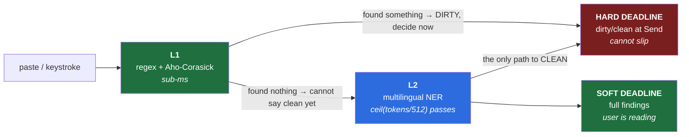

# 06 — Performance and Scale

> **Scope:** the budget. Assumptions resolve to [`ASSUMPTIONS.md`](../ASSUMPTIONS.md); the gate's
> coupling to [`01`](01-hld.md) §0; the model arithmetic to [`03`](03-ai-ml-architecture.md) §4; the
> mechanism to [`05`](05-lld.md).
>
> **This document produces no tokens/sec, no timeout, and no TTL.** Docs 03 and 05 both held that line
> and this is the document where the pressure to break it is highest, because numbers are its whole
> subject. **Every figure below is cited, derived in place, or specified as an experiment.**

---

## 0. The short version

1. 🔴 **The budget is not one number against one workload. It is two deadlines**, and almost everything
   interesting is in the second (§1). **The hard deadline** — dirty/clean at Send — cannot slip. **The
   soft deadline** — full findings before the user finishes reading the modal — has hundreds of
   milliseconds of slack, because the user is stopped. **U6 conflates them**, which is why it has been
   measuring the wrong thing.
2. 🔴 **U6 is specified against the workload where latency doesn't matter.** Typing is debounced and
   the user's own keystroke gaps warm the cache for free. **Paste is one event followed by Enter — the
   only input on the critical path** — and U6 says *"a few hundred tokens,"* which is the typing case.
   **Split it: U6-a (typing, CPU/battery, deprioritize) and U6-b (paste, the number the gate lives
   on).** §3.
3. **The L1 short-circuit is what rescues the UX, and it is structural rather than an optimization**
   (§2.3, [ADR 0013](adr/0013-two-stage-verdict.md)). L1 is sub-millisecond even on a huge paste, and
   doc 00 §6's dominant threat — *"dumps a spreadsheet row or a customer record"* — **is structured
   identifiers, which is exactly what L1 decides deterministically.**
   > **The dangerous paste is gated in under a millisecond. The full L2 wait is only ever paid to say
   > *"clean"* — on a prose paste, where nothing was at stake. The latency lands on the safe pastes.**
4. **The rule that makes the short-circuit safe: the verdict cache is monotonic toward dirty.** L1 may
   write **dirty**. **Only a completed L1+L2 scan may write clean.** §2.4.
5. 🔑 **`max_position_embeddings` = 512** *(cited, `config.json`)*. **So paste latency is
   `ceil(tokens/512) × per-chunk`, not one forward pass** — a fact doc 03 never recorded and doc 06
   cannot budget without. §4.
6. 🔴 **The wedge's languages are the slowest on the critical path, and this is the second time that
   pattern has appeared.** Chunk count is set by **tokens**, not characters, and **CJK produces far
   more tokens per character than English** *(direction certain, ratio unverified — §4.3)*. **The same
   paste box is roughly 3× the forward passes in Chinese** *(estimate)*. Doc 05 §1.3 found the naive
   gate breaks Chinese **input**; §4.3 finds the paste path is slowest in Chinese **too**.
7. 🔴 **And the memory fix taxes the latency budget, in the wedge's languages specifically** (§4.4).
   Vocabulary trimming (doc 03 §4.2) buys ~140 MB — **and if it is too aggressive, fertility rises on
   BM/ZH, which lengthens the sequence, which adds chunks.** **Doc 03 §6's prediction — *"trimming cuts
   memory ~50%, latency barely at all"* — is true per token and silent on token count.** It holds
   **only if fertility is preserved**, which is the very thing doc 03 §4.2 says is unmeasured.
   **Memory and latency are the same spike, and nobody had connected them.**
8. **Dead engine fails OPEN, to advisory, loudly — and fail-closed is rejected on doc 00's own
   argument** ([ADR 0014](adr/0014-degrade-to-advisory-never-closed.md)). **A dead engine that blocks
   ChatGPT sends the user to the ChatGPT desktop app** (doc 00 §1.4). **Fail-closed doesn't prevent the
   leak. It relocates it to the channel we cannot audit.** §7.

---

## 1. The budget is two deadlines

**The framing error this document exists to correct.** "How fast is the model?" is not the question,
because nothing in the product waits on the model *per se*. **Two things wait, they wait for different
answers, and their tolerances differ by two orders of magnitude.**

| | **Hard deadline** | **Soft deadline** |
|---|---|---|
| Who waits | **The gate.** `stopImmediatePropagation()` cannot be awaited (doc 01 §0) | **The modal**, which the user is reading |
| Needs | **One boolean** | The full finding set, to render |
| Tolerance | **Zero.** The answer is already known or the event is stopped | **Hundreds of ms**, free |
| Served by | **L1 for dirty** · a warm cache · **L2 only for clean** | L2, streaming |
| If missed | *"scanning…"* — friction, loud, self-clearing (doc 02 §2.4) | Findings appear as they resolve |

> **Read the "Served by" row — it is the whole document.** Once we have gated, latency stops mattering,
> because the user is stopped anyway. **Gating is the deadline. Completing is not.** U6 measures
> completion.

---

## 2. The hard deadline

### 2.1 Typing meets it for free, and that is why U6 has been measuring the wrong thing

**Nothing on the typing path is on the critical path.** Keystrokes arrive ~100–200 ms apart
*(estimate)*, we debounce at ~200 ms (doc 01 §3), and **the scan runs in the gap the user's own hands
create.** By the time they reach for Enter, the cache has been warm for several keystrokes.

> **The user's typing speed is the latency budget, and it is generous.** A scan can be slow and still
> finish first. **Typing-path latency governs CPU and battery — not the gate.**

### 2.2 Paste is the only input on the critical path

A paste puts a few thousand characters into the composer **in a single event**, and Enter can follow
immediately. **There is no gap. There is nothing to hide the scan behind.**

**And this is not an edge case — it is the modal case for the modal threat.** Doc 00 §6:

> *"**Accidental paste.** The dominant real-world case: someone dumps a spreadsheet row or a customer
> record into a prompt without thinking."*

**Doc 01 §4's gate diagram labels the cache-miss branch `paste-then-instant-Enter` and annotates it
*"rare path · costs one extra Send."*** *(Re-read rather than recalled, per the standing rule — it says
this in two separate strings, not one.)* **That annotation is true across all sends and deeply
misleading about the sends that matter:**

> **Paste is rare among sends and universal among the sends we exist to catch. The cache is cold by
> construction on precisely the threat the product is sold against.**

**Two cheap wins follow immediately, and both are free:**

| | Decision | Why |
|---|---|---|
| **Paste bypasses the debounce** | A `paste` event triggers an **immediate** scan | **The debounce exists to avoid scanning every keystroke. A paste is one discrete event — there is nothing to coalesce.** Debouncing it adds ~200 ms to the worst path in the product, for no benefit. |
| **Paste preempts the queue** | A paste scan jumps ahead of in-flight typing scans | One engine, many tabs (ADR 0006) means a queue. **The paste is the only queued item with a user waiting on it.** |

*(A third — the head start from the user's hand travelling `Ctrl+V` → `Enter` — is real, unmeasured,
and **not budgeted against.** A fast user makes it near-zero, and a budget that assumes human slowness
is a budget that fails for exactly the confident, habitual user doc 00 §6 says causes the leaks.)*

### 2.3 🔴 The L1 short-circuit — the dangerous paste is decided in under a millisecond

**L1 is regex plus Aho-Corasick over a wordlist** (doc 01 §6, ADR 0004). **It is sub-millisecond even
on a 5,000-character paste**, and it is deterministic. It has no sequence limit, no chunking, no model.

**Now look at what the dominant threat actually contains.** A pasted spreadsheet row or customer record
is **structured identifiers** — IC numbers, emails, phone numbers, account references, and (per ADR
0004) the org dictionary's codenames. **Every one of those is L1's job**, and per doc 00 §1.2 L1 is
~100% precise on them.

> **Decision: the gate consumes a two-stage verdict.** **L1 alone may return `DIRTY` and the gate acts
> on it immediately.** L2 continues in the background and populates the modal.
> [ADR 0013](adr/0013-two-stage-verdict.md).

**The asymmetry that makes this work, and it is worth stating precisely because it is counterintuitive:**

| L1 says | Can the gate decide? | Why |
|---|---|---|
| **Found something** | ✅ **Yes — `DIRTY`, now** | A finding is a finding. L2 can only add more. |
| **Found nothing** | ❌ **No** | **L1-clean is not clean.** A name in prose is invisible to regex and needs L2. |

> **`DIRTY` is decidable early. `CLEAN` requires completion.** The common case is therefore the slow
> one — **but the *dangerous* case is the fast one**, and that is the trade that matters:
>
> **The full-length L2 wait is only ever paid to say *"clean"* — on a prose paste, where nothing was at
> stake. The latency lands on the safe pastes, not the dangerous ones.**

**Doc 00 §1.2's inversion, paying us back for once.** That section's complaint is that *"you are best at
the detections that matter least."* **On the paste path, being best at the cheap detections is exactly
what saves the interaction** — because the cheap detections are the fast ones, and they are what the
dominant threat is made of. **The inversion is still true. Here it is an asset.**

### 2.4 The rule that keeps the short-circuit honest

A two-stage verdict means a partial scan can write to the cache. **That is a correctness hazard**, and
it gets a rule rather than a convention:

> 🔴 **The verdict cache is monotonic toward dirty.** **L1 may write `DIRTY`.** **Only a completed
> L1+L2 scan may write `CLEAN`.** A partial result may never downgrade a verdict.

**Without this, the short-circuit is a silent fail-open.** L1 finishes, finds nothing, and writes
`CLEAN` — the gate reads it, lets the send through, and **L2's name finding arrives after the prompt is
already at the provider.** The control would report a clean scan of a prompt it never finished
scanning. **Doc 00 §6's worst case, manufactured by an optimization.**

**I5 is unaffected**: the cache still holds hash + verdict, never text. The state space was already
tri-state in doc 01 §4 (`clean` / `dirty` / `unknown`). **The rule constrains transitions, not
contents.**

---

## 3. U6, re-specified

### 3.1 The claim measures the case that doesn't matter

**U6:** *"On-device L2 inference on a few hundred tokens = 30–100 ms on D2 hardware."*

`ASSUMPTIONS.md` calls U6 one of *"the two that can kill the design"* and *"the highest-priority number
to measure."* **Both are still true. The input it names is wrong.** *"A few hundred tokens"* is a typed
prompt — §2.1 shows that path has a generous budget it did not know it had.

> **U6 is not mis-prioritized. It is mis-specified.** It measures completion, on the workload with
> slack, and the gate needs a boolean, on the workload without.

### 3.2 The split

| | **U6-a — typing** | **U6-b — paste** |
|---|---|---|
| **Claim** | Per-debounce scan latency on a typed prompt | **Time from the `paste` event to a gate-usable verdict**, at P50/P95 paste length |
| **Governs** | CPU and battery on D2 | 🔴 **The gate. The cache-miss path. The dominant threat.** |
| **Deadline** | The next keystroke (~100–200 ms, *estimate*) — **and it may miss without user-visible cost**, because the next debounce supersedes it | **The user's `Ctrl+V` → `Enter` interval — unmeasured (§3.3)** |
| **If it fails** | The extension is a CPU hog. **A real problem, a fixable one, and not a design failure** | **The miss path dominates and the product becomes *"press Send twice on every paste"*** |
| **Priority** | 🟡 **Deprioritized.** Measure it, don't gate on it | 🔴 **The highest-priority number in the package** |

**U6-b's pass criterion, and it is not a number:**

> **PASS:** the time from `paste` to a gate-usable verdict is **below the measured `Ctrl+V` → `Enter`
> interval** for the P95 paste, **or** the L1 short-circuit (§2.3) resolves it before L2 is needed.
>
> **FAIL:** neither holds → the *"scanning…"* modal is the **normal** experience of pasting, not the
> exception → **doc 02 §2.4's "fails to friction" becomes the product's default interaction**, and
> that is a product decision to take deliberately, not to discover.

### 3.3 The deadline nobody has measured

**U6-b is measured against a human interval this package does not have and cannot honestly guess:**
**how long a user takes between pasting and pressing Send.**

> **No number here.** Doc 03 §6 refused to produce tokens/sec from parameter counts, and doc 05 refused
> to invent a token TTL. **This is the same refusal.** A paste-to-Send figure invented now would
> silently decide whether U6-b passes — **it would be the pass criterion, chosen by us, for our own
> test.**

**The experiment, which is cheap and needs no model:**

| Step | Method |
|---|---|
| 1 | Instrument the adapter: log `paste` → next `keydown: Enter` / Send-click, per event. **Hash only, no content — I3 and I5 hold.** |
| 2 | Run it with the **first design partner**, on real work, for a week. **Not on us — we know the tool is watching, which is exactly the bias that would flatter the result.** |
| 3 | Report the **distribution**, not the mean. **P05 is the number that matters** — the fastest users are the ones who defeat the budget, and per doc 00 §6 the habitual paster is the threat. |

**Note what this is coupled to: it needs a design partner, and B3 is doc 08's #1 item.** **U6-b's
deadline cannot be measured before someone deploys.** That is not a reason to invent it — **it is a
reason to say that U6-b's pass criterion is B3-blocked, and to rank it accordingly in doc 08.**

*(Until then, U6-b is still worth measuring **against paste length** rather than against a deadline. A
curve of "verdict latency vs. pasted tokens" is useful, falsifiable, and needs no human. **The curve is
ours. The threshold on it is the design partner's.**)*

---

## 4. The chunking math

### 4.1 The window is 512, and doc 03 never recorded it

| | Value | Source |
|---|---|---|
| `max_position_embeddings` | **512** | [`config.json`](https://huggingface.co/microsoft/mdeberta-v3-base/raw/main/config.json) |
| `vocab_size` | **251,000** | `config.json` |
| `hidden_size` | **768** | `config.json` · model card |
| Total params | **~279M** *(derived — the card states no total; doc 03 §4.1)* | Derived |

**Doc 03 owns the model and never mentions the sequence limit.** Its §4.4 comes closest — *"attention/
intermediate tensors, which scale with sequence length"* — which is about **memory**, not about the
**ceiling**. **There is a ceiling, it is 512 tokens, and the paste path lives on the wrong side of it.**

### 4.2 So paste latency is not one forward pass

> **`paste_latency ≈ ceil(tokens / 512) × per_chunk_latency + overhead`**

**A typed prompt is one chunk. A pasted document is not.** *(Chunking needs overlap so an entity
straddling a boundary is not split — a stride, not a clean partition. **The overlap fraction is
unmeasured and raises the count above the arithmetic below.** Doc 07 owns the accuracy consequence of
boundary splits.)*

| Paste | ≈ tokens *(EN, ~4 chars/token — estimate)* | Chunks |
|---|---|---|
| A sentence (280 chars) | ~70 | **1** |
| A paragraph (1,000) | ~250 | **1** |
| A customer record (2,000) | ~500 | **1** |
| A spreadsheet block (5,000) | ~1,250 | **3** |
| A pasted document (10,000) | ~2,500 | **5** |

**Read the 2,000-character row: it is one chunk, and it is the dominant threat.** A customer record
fits in a single window. **The multi-chunk cases are the big prose dumps — which per §2.3 are also the
ones L1 cannot short-circuit.** The two slow properties land on the same input.

### 4.3 🔴 The wedge's languages are the slowest, for the second time

**Chunk count is set by tokens. The user pastes characters. The conversion between them is
language-dependent, and it is worst exactly where we sell.**

| | Tokens per character | Same 5,000-char paste |
|---|---|---|
| **English** | ~0.25 *(≈4 chars/token — **estimate**)* | **~3 chunks** |
| **Chinese** | **~0.8** *(≈1.2 chars/token — **estimate**)* | **~9 chunks** |

> **A Chinese paste is roughly 3× the forward passes of an English paste of the same visible length**
> *(estimate — the ratio is **unverified** and is a one-hour measurement with a tokenizer and a corpus.
> **The direction is certain**: Chinese has no whitespace and a denser character set, so it tokenizes to
> far more tokens per character. Doc 03 §3.3 already says CJK "sequence length explodes" under an
> English-first tokenizer — **this is that effect, surviving into a multilingual one, and landing on
> latency instead of accuracy.**)*

**This is the second time the beachhead's language turns out to be the hard case in its own product.**
Doc 05 §1.3: the naive gate **breaks Chinese input entirely**, because Enter commits an IME
composition. §4.3: the paste path is **slowest in Chinese**. **Decision #4 chose EN/BM/ZH as the wedge,
and the wedge is where the engineering keeps being hardest** — which is a coherent thing for a moat to
look like, and a thing doc 08 should rank honestly rather than discover.

*(**Malay is Latin-script and close to English on this axis** — its cost is morphological (doc 03 §3.3),
not tokens-per-character. **The asymmetry is the same one doc 05 §1.3 named: CJK is where the risk
lives.** Do not spend equal effort on both.)*

### 4.4 🔴 The memory fix taxes the latency budget — and doc 03 §6's prediction is silent on it

**This is where doc 06's two halves collide, and the collision was not costed.**

**Doc 03 §6 leaves a falsifiable prediction:**

> *"Vocabulary trimming should cut memory ~50% and latency **barely at all**. (Derived from the
> parameter split — embedding is lookup, backbone is compute.)"*

**The reasoning is correct and its scope is narrower than it reads. It is true per token.** Trimming
removes embedding rows, embedding is a lookup, so **per-token cost is unchanged.** ✅

> 🔴 **But trimming changes the tokenizer, and therefore the token count.** Drop vocabulary entries that
> BM/ZH text was using, and those words fall back to shorter sub-word pieces or bytes — **fertility
> rises, the sequence lengthens, and the backbone runs on more tokens.** **Per-token latency is flat.
> Per-*scan* latency is not.** And per §4.2, longer sequences cross the 512 boundary sooner — **so
> fertility does not just lengthen the sequence, it adds whole chunks.**

**Doc 03 §4.2 already names the mechanism — as an accuracy risk:**

> *"Trim too aggressively and out-of-vocabulary text falls back to byte-level or `<unk>` — and
> fertility (tokens per word) explodes on exactly the low-resource text the wedge exists to serve."*

**Doc 06's addition: it is a latency risk on the same axis, in the same languages, from the same
cause.** And the two questions have the same answer, so **they are one spike, not two:**

| If the ~70K trim preserves BM/ZH fertility | If it does not |
|---|---|
| ✅ Doc 03 §6's prediction holds. Memory −50%, latency flat. **~140 MB and no latency cost.** | 🔴 **Memory −50%, and BM/ZH paste latency rises via token count *and* chunk count.** Doc 03 §6's prediction is **true per token and misleading per scan.** |

> **Doc 03 §4.2 called fertility "the trim metric" and said *"size is the easy metric and the wrong one
> to optimize alone."* It is more right than it knew: fertility is simultaneously the accuracy metric,
> the latency metric, and the chunk-count metric.** Measure it once; it settles three budgets.
>
> ⚠️ **And the spike is still blocked on the corpus (U14/C2), which depends on C3 — the least-confident
> assumption in the package.** Doc 03 §7 flagged this for the accuracy question. **It now blocks the
> latency budget too**, which raises C3's blast radius rather than changing it.

---

## 5. The soft deadline

**Once the gate has fired, the budget relaxes by two orders of magnitude**, and it is worth saying why
rather than assuming it: **the user is stopped and reading.** Doc 01 §4's modal offers Accept / Accept
All / Ignore+reason — **a decision, which takes a human seconds.**

| Decision | Rationale |
|---|---|
| **The modal renders on the L1 verdict** and streams L2 findings in | The user is reading the first finding while L2 resolves the rest |
| **The Accept button is disabled until the scan completes** | 🔴 **Accepting a partial finding set would mask a value we hadn't found yet** — the rewrite would be incomplete and the approval token (doc 05 §6) would bind to it |
| **No spinner if the scan completes first** | Which, per §4.2, is the common case — the dominant threat is one chunk |

**That second row is the one that matters and it is easy to get wrong.** A streaming modal that lets the
user Accept early **ships a prompt we told them was clean.** The stream is for *perceived* latency; the
Accept gate is for *correctness*. **They are not the same control and the second one is not optional.**

---

## 6. Memory

**Doc 03 §4 did this work and this section does not re-derive it.** What is open:

### 6.1 The runtime multiple — measure it, do not inherit it

**Doc 03 §4.4:** *"A ~1.5–2× multiple over weight size is the usual rule of thumb (estimate — this is
exactly the kind of number this document refuses to assert, and doc 06 must measure it)."*

**Doc 06 accepts the assignment and does not discharge it by restating the range.** The measurement:
resident set of the offscreen document, on D2, with the model warm, at P95 sequence length — **because
activation memory scales with sequence length (doc 03 §4.4), and §4.3 says the wedge's languages
produce the longest sequences. The memory measurement must be taken in Chinese, not English.**

### 6.2 The distillation trigger, restated because it is a Phase 0 gate

**Doc 03 §4.3:** the 86M backbone is **irreducible by trimming**. Vocabulary trimming buys **exactly
one halving** and is then exhausted.

> **Trigger, unchanged and now inheriting §6.1's measurement: if the D2 memory budget lands below
> ~140 MB of weights, distillation moves from a doc 08 risk to a Phase 0 requirement** — and its
> fallback depends on **C3**.

**§4.4 adds a second path to the same trigger, and it is worse because it is not about memory at all:**
if fertility forces us to **keep** a larger vocabulary to protect BM/ZH latency and accuracy, **we do
not get the halving**, and the ~140 MB target is missed **without ever having made a memory decision.**
**Doc 08 should carry that as the same risk with two entrances.**

### 6.3 int8 — the wedge is what quantization eats

**Doc 03 §7 hands over the int8 path** (dynamic vs. static, per-channel vs. per-tensor) as *"an open
accuracy/latency trade that lands on BM/ZH accuracy first."*

**Doc 06's only contribution is the ordering, and it is a warning:** every lever in this document —
trimming (§4.4), quantization (§6.3), distillation (§6.2) — **degrades BM/ZH first.** They are not
independent knobs; **they are three taxes on the same asset.** A budget that spends all three lands a
model that is small, fast, and **bad at the languages the company exists to be good at.** **Doc 07 owns
the eval that would catch it. Doc 06's obligation is to say that the budget cannot be set without it.**

### 6.4 WebGPU — U15, and the correction that is easy to lose

**D3 is unchanged: WebGPU is opportunistic, hardware- and policy-dependent, never a requirement.
CPU/WASM is the baseline.**

> ⚠️ **The offscreen document is a Window context, so WebGPU is available there** (doc 03 §5). **ADR
> 0006's choice preserves GPU access rather than trading it away** — a fresh reader can plausibly infer
> the opposite, and a budget built on that inference would be pessimistic in a way that changes
> conclusions.

**U15 remains open and it is doc 06's most annoying gap:** enterprise Chrome policy may disable WebGPU
**on exactly the managed fleet we are targeting** — the pessimistic case is also the likely one, and
**it is the same machine-policy channel as B3.** *(Checkable via policy documentation, not by
measurement. Not resolved here.)*

**A second lever, and it is ours rather than the fleet's:** the offscreen document is **our own page**,
so we can set COOP/COEP via the manifest and get `SharedArrayBuffer`, which is what ONNX Runtime Web
needs for **multi-threaded WASM** *([verify] — the manifest keys and ORT's threading requirements are
both **unverified** here)*. **Unlike WebGPU, this does not depend on the customer's policy.** If it
works, it is the more dependable lever, and §4.2's chunks are embarrassingly parallel.

---

## 7. Degradation — and fail-closed is rejected on doc 00's own argument

**Doc 02 §8 specified this to doc 06 and doc 01 §7 assigned the fail-open/fail-closed call here.**

### 7.1 Three triggers, one mode

**Doc 05 §3.3 added two triggers to doc 02 §2.4's one.** They resolve to the same state:

| Trigger | Source |
|---|---|
| **Engine dead** — offscreen crashed, model failed to load, OOM on D2 | doc 02 §2.4 |
| **Adapter broken** — `readText()` returns `""`, composer unresolvable | doc 05 §3.3 |
| **Surface unresolvable** — a page listener preempts the gate (U12-c) | doc 05 §1.4 |

> **One degradation state, three entrances: advisory mode, surfaced to the user *and* the admin as
> *"protection degraded."*** Decision #3 already ships advisory for solo — **this is a third trigger for
> a mode that exists, not a new mode.**

**The timeout: no value.** It is derived from U6-b's measured curve (§3.3) — **and note it cannot be a
constant**, because §4.2 makes latency a function of chunk count. **A fixed timeout would declare the
engine dead on a long Chinese paste** — i.e. on the wedge, on the dominant threat. **The timeout is a
function of pasted tokens, and its coefficients come from the measurement.**

### 7.2 🔴 Fail-closed is rejected, and the argument is already in doc 00

**The obvious position for a compliance product: if the control is dead, block the thing it controls.**
The buyer bought *"nothing leaks."* A dead engine that lets sends through is a control that isn't
controlling.

**It is wrong, and doc 00 §1.4 wrote the refutation before the question was asked:**

> *"You have **trained** the user to find the uncovered channel. A control that visibly blocks one door
> while an unlocked door sits beside it doesn't reduce leakage — **it redirects leakage to a channel you
> can't even audit.**"*

> 🔴 **A dead engine that blocks ChatGPT in the browser sends the user to the ChatGPT desktop app** —
> which ADR 0002 accepts we do not cover, and which is one click away on their dock.
>
> **Fail-closed does not prevent the leak. It relocates it to the channel we cannot see, at the exact
> moment our telemetry is already broken.** The compliance officer would get a dashboard showing zero
> sends — **and it would mean the opposite of what it appears to mean.**

**And the second-order effect is worse.** Per doc 00 §4 we optimize for **non-defection**, and per
`ASSUMPTIONS.md` §4 *"that the extension can't be removed"* is a **deliberate non-assumption** — in
Phase 0 it is one click. **A tool that blocks your work when it breaks gets uninstalled, and then it
detects nothing at all, forever.** Fail-closed trades a temporary gap for a permanent one.

> **Decision: the engine degrades to advisory. Always. There is no fail-closed mode in Phase 0 and we
> do not build one.** [ADR 0014](adr/0014-degrade-to-advisory-never-closed.md).

**The honest cost, stated rather than buried:** during degradation **we are not a control.** We are a
warning label plus an audit trail that says *"protection was degraded on this device from 14:02 to
14:09."* **That is a worse product for those seven minutes and an honest one** — and per doc 00 §6's
seatbelt framing, **a seatbelt with a broken sensor does not immobilize the car.**

**Decision rule for revisiting:** if a design partner's security review **demands** fail-closed, build
it — **and tell them what it does.** Per ADR 0009's standard: *one customer saying it is worth more than
our entire estimate of whether they will.* **Do not pre-build it against the possibility.**

---

## 8. Concurrency and scale

**ADR 0006:** *"Concurrency: one engine, many tabs. Needs a queue and a backpressure story (doc 06)."*

| Question | Answer |
|---|---|
| **Ordering** | **Paste preempts typing** (§2.2). Everything else FIFO. |
| **Backpressure** | **Typing scans are droppable — a superseded debounce is dead work.** Cancel the in-flight scan for a composer whose content-hash has changed. **Paste scans are never dropped.** |
| **Many tabs** | One engine serves all (ADR 0006). **N tabs typing is N droppable streams; N tabs pasting simultaneously is not a real workload** — humans paste into one composer at a time. |
| **The SW** | 30 s idle (U10 ✅ cited). **Offscreen→SW messages reset the timer** (doc 05 §5.1), so a busy engine keeps the SW alive for free. |

**The scale story is small and should be said plainly rather than dressed up:** the backend is policy,
dictionary, and hashed audit ingest (doc 01 §2). **Doc 02 §2.5 derived it at ~$0.10–0.15/user/month and
it falls with scale.** **There is no interesting server-side scale problem in Phase 0, because I1 means
there is no prompt path to the server at all.** *(The interesting scale problem is Phase 1's file
pipeline, which is doc 08's to size, and U17 gates it.)*

---

## 9. What this document hands forward

**To doc 07:**
- 🔴 **§4.2's chunk boundaries are an accuracy problem, not just a latency one.** An entity straddling a
  512-token boundary is split. **The stride/overlap fraction is unmeasured**, and it trades latency
  (more chunks) against recall (fewer splits). **Doc 07 owns which side to err on** — and per doc 04
  §8's handoff, **a recall miss breaks coreference for the entities we did catch.**
- **§4.4's fertility spike settles three budgets at once** (accuracy, latency, chunk count). **It is one
  experiment.** Blocked on the corpus (U14/C2 → C3).
- **§6.3: trimming, quantization and distillation all degrade BM/ZH first.** They are three taxes on one
  asset. **The eval that catches over-spending is doc 07's**, and the budget cannot be set without it.

**To doc 08, as ranked items:**
- 🔴 **U6-b's pass criterion is B3-blocked** (§3.3). The paste-to-Send interval needs a design partner
  on real work. **This couples the package's #1 engineering number to its #1 validation item** — and
  B3 was already ranked first. **It is now first for two independent reasons.**
- 🔴 **The distillation risk has two entrances, not one** (§6.2): the memory budget landing under
  ~140 MB, **or** fertility forcing a larger vocabulary. **Same risk, and the second entrance never
  involves a memory decision.**
- 🟠 **§4.3: the beachhead's language is the slowest on the critical path.** Second instance of the
  pattern after doc 05 §1.3's IME finding. **Rank it as the wedge's engineering cost, honestly.**
- 🟠 **U15** (WebGPU under enterprise policy) — the pessimistic case is the likely one, on the same
  machine-policy channel as B3.
- **The COOP/COEP threading lever** (§6.4) is **ours, not the fleet's** — unlike WebGPU it does not
  depend on customer policy. `[verify]` and worth an hour.

**New unverified claims** (added to `ASSUMPTIONS.md` §3):
- **U21** — **tokens-per-character for BM/ZH under the trimmed vocabulary.** §4.3's ~3× is an
  **estimate**; the direction is certain and the ratio sets chunk count. **One hour with a tokenizer
  and a corpus** — and it is the same measurement §4.4 needs.
- **U22** — **COOP/COEP via manifest → `SharedArrayBuffer` → ORT Web multi-threading** in an offscreen
  document.

**Resolved / re-specified by this document:**
- **U6 → U6-a + U6-b.** The claim was **specified against the workload with slack.** U6-b is now the
  package's highest-priority number and **its deadline is B3-blocked.**
- **`max_position_embeddings` = 512** ✅ cited (§4.1) — **doc 03 never recorded it and the paste budget
  is a function of it.**

---

### ADRs from this document

- [`adr/0013-two-stage-verdict.md`](adr/0013-two-stage-verdict.md)
- [`adr/0014-degrade-to-advisory-never-closed.md`](adr/0014-degrade-to-advisory-never-closed.md)

**Two.** 0013 changes the pipeline's contract with the gate and introduces the monotonic-toward-dirty
rule, which is a correctness invariant in everything but name. 0014 resolves a fork doc 01 §7
explicitly deferred here, against the intuitive answer, and it is **exactly the kind of decision that
gets re-litigated by the first customer who asks for fail-closed.** Everything else — the debounce
bypass, queue preemption, backpressure, the streaming modal — follows from §1's two deadlines and needs
no record of its own.

### Sources

- [microsoft/mdeberta-v3-base — `config.json`](https://huggingface.co/microsoft/mdeberta-v3-base/raw/main/config.json) — **`max_position_embeddings: 512`**, `vocab_size: 251000`, `hidden_size: 768`, `num_hidden_layers: 12`
- [Chrome — Service worker lifecycle](https://developer.chrome.com/docs/extensions/develop/concepts/service-workers/lifecycle) — 30 s idle (U10 ✅); offscreen-document messages reset the timer
