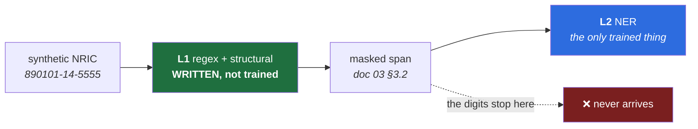

# 07 — ML Training and Data Strategy

> **Scope:** the data, the eval, and the accuracy target. Assumptions resolve to
> [`ASSUMPTIONS.md`](../ASSUMPTIONS.md); the detection stack to [`03`](03-ai-ml-architecture.md); the
> budget it must fit to [`06`](06-performance-and-scale.md); the buyer's economics to
> [`00`](00-critique-and-positioning.md) §4 and ADR 0001.
>
> **This document invents no precision target, no recall target, no corpus size, and no fertility
> ratio.** Docs 03, 05 and 06 each held that line. **This is the document with the least excuse to
> break it**, because an accuracy number with nothing behind it is the one fabrication an ML advisor
> is *looking* for.

---

## 0. The short version

1. 🔴 **C3 is about the wrong noun, and it has been since doc 03 §3 moved the wedge.** C3 reads
   *"synthetic **BM/ZH PII** can be generated at sufficient quality."* **"PII" is the identifier
   framing** — the one doc 03 §3 relocated on 2026-07-16 when it moved the wedge from identifiers to
   **BM/ZH text NER**. The correction reached doc 00 §5 and doc 01 §3. **It never reached C3**, the
   entry the whole beachhead rests on. §2.
2. 🔴 **And the noun matters, because half of C3 was never in doubt.** The NRIC's digits have a
   **published grammar** (doc 03 §2.1) and are consumed by **L1, which is written, not trained.**
   **No model ever learns from a synthetic NRIC.** The sentence *around* it has no grammar — and per
   doc 03 §2.3 that sentence is where *"the highest-value L1 rule in the product"* lives. **→ C3-a
   (specified, High) and C3-b (sampled, Low). C3-b carries the entire blast radius.** §2.3.
   > **The decision rule that falls out, and it is the document's spine: synthesize what has a
   > specification. Sample what you can only observe.** The line is **not** identifiers-vs-names. It is
   > **grammar-vs-distribution**, and it cuts *through* the NRIC — digits on one side, context tokens
   > on the other.
3. 🔴 **Doc 02 §4.7 repeated the ghost one document after doc 03 killed it.** It lists *"too-regular
   NRIC formats"* first among synthetic data's risks. **It is not a risk.** L1 is deterministic, L2
   never sees an NRIC (doc 03 §3.2 masks it first), and **nothing is trained on it.** ✅ **Corrected
   upstream in this commit.** §2.4.
4. 🔴 **The fertility spike is not blocked, and it has not been blocked the whole time.** Doc 06 §4.4
   and U21 say it is *"blocked on the corpus (U14/C2 → C3)."* **U14 is a *PII* corpus. Fertility and
   token-frequency are unsupervised and need no labels at all** — only raw EN/BM/ZH text, which
   demonstrably exists in quantity. **Doc 03 blocked the *vocabulary pick*, correctly. Doc 06 copied
   that blocker onto the *latency* question, which needs strictly less.** §3.
5. **So U21 splits, and the free half is a one-sided test.** **U21-a** — stock-vocabulary fertility —
   is measurable **this week**, on public text, and **a fail is final**: per doc 06 §4.4 trimming only
   *raises* fertility, so stock is the **floor**. **U21-b** — trimmed-vocabulary fertility — is
   genuinely corpus-blocked. **The package's highest-value measurement has a free lower bound nobody
   took.** §3.2.
6. **Precision over recall: confirmed — and the reason usually given for it dies exactly when B3
   succeeds.** *"A blocking tool that cries wolf gets uninstalled"* is **Phase 0's** failure mode.
   Under force-install the user **cannot** uninstall, and the argument evaporates at the moment the
   enterprise story becomes real. **It is a justification anti-correlated with our own success.** §1.2.
   > **What survives is stronger, and it is already written down.** Under force-install a
   > false-positive-heavy model does not cause uninstall — **it causes channel defection to the desktop
   > app** (doc 00 §1.4), which is **ADR 0014's exact argument against fail-closed.** **Over-blocking
   > *is* fail-closed, delivered gradually.** §1.3.
7. **Doc 04 §8's complication is real, narrower than stated, and it deflates rather than escalates.**
   A miss on entity **B** does not break coreference for entity **A** — I could not construct the case.
   What is true: **a miss on one *mention* of A breaks A's own coreference** — intra-entity, not
   inter-entity. **And that damage is the *split* failure ADR 0011 deliberately accepted as benign.**
   §1.4.
8. 🔴 **The eval set cannot be synthetic, and this is the document's one real fork.** The eval exists
   to catch doc 06 §6.3's three taxes — trimming, quantization, distillation — **all of which degrade
   BM/ZH first. A trim keeps the ~99.9%-coverage tokens. Synthetic Malay is made of exactly those
   tokens.** A synthetic eval is **blind to the damage it exists to measure**, by construction.
   → **[ADR 0015](adr/0015-eval-corpus-is-real.md)**: **real text as substrate, synthetic identifiers
   injected.** §5.
9. **U14 can never be marked ✅, and that is a property of its shape, not of our diligence.** It is a
   **universal negative** — *"no usable corpus exists."* A search can return *"found one"* (U14 false)
   or *"didn't find one"* (U14 **unresolved, forever**). **There is no citation for an absence.** It has
   survived seven documents because **the process that closes every other register entry structurally
   cannot reach it.** → re-specified as a **timeboxed search with a decision rule**. §3.4.
10. **The Ignore loop: never a label — and doc 00 §1.6's poisoning argument does not reach the *rate*.**
    The poisoner dismisses **indiscriminately**, so they move every class equally and **cancel out of the
    ranking.** *The very thing that makes the label worthless is what makes the aggregate robust.* §7.

---

## 1. The asymmetry

### 1.1 The claim, and it survives

> **Decision: precision over recall, explicitly, at L2 and at L1's ambiguous class.**

Per **ADR 0001** and doc 00 §4 this is **not an ML preference**:

> *"Every FP is a ticket **the admin** eats → the precision target becomes quasi-contractual. Doc 07's
> asymmetry isn't an ML preference — it's a **commercial commitment**."*

**The claim is right. This section is about the sentence bolted to it**, because per CLAUDE.md §2 that
is where this package's errors live, and this one has been repeated in three places without an audit.

### 1.2 🔴 The reason usually given dies exactly when B3 succeeds

**The standard justification**, and it appears in the brief for this document:

> *"A blocking tool that cries wolf gets uninstalled and then detects nothing — precision failures are
> self-amplifying."*

**Trace it.** It depends on the user being **able** to uninstall. Per `ASSUMPTIONS.md` §4 that is a
**deliberate non-assumption** — *"in Phase 0 it can be removed, trivially."* True today.

> 🔴 **And false the day B3 lands.** **B3 is force-install**, and force-install's entire purpose is
> that the extension **cannot be removed** and the user gets **no disable toggle** (ADR 0001). So:
>
> **The stated reason for the precision floor holds only while the enterprise control story is
> unreal, and evaporates at the exact moment it becomes real.** It is a justification
> **anti-correlated with the product's own success** — and B3 is doc 08's **#1 ranked item**, i.e. the
> thing we are actively trying to make true.

**Nobody audited it because the *conclusion* is obviously right.** That is CLAUDE.md §2's ledger in its
purest form: **a true claim with a "therefore" nobody read, because the ✅ on the claim looked like
closure.** Instance #7.

### 1.3 The two reasons that survive — and the second is already in ADR 0014

**Reason one — ticket economics. Survives force-install untouched.** ADR 0001's consequence is that
every false positive is *"a ticket the admin eats."* Force-install does not reduce ticket volume; **it
increases it**, because the user's only remaining channel for the friction **is** the ticket. **The
commercial argument gets stronger under B3, not weaker.**

**Reason two — and this is the one worth the section.** Ask what a user under force-install actually
does when the model cries wolf. They cannot uninstall. They cannot disable. **They have exactly one
exit, and doc 00 §1.4 named it before this question was asked:**

> *"You have **trained** the user to find the uncovered channel. A control that visibly blocks one door
> while an unlocked door sits beside it doesn't reduce leakage — **it redirects leakage to a channel
> you can't even audit.**"*

**That is ADR 0014's argument, verbatim, about a different cause.** ADR 0014 rejects fail-closed
because *"a dead engine that blocks ChatGPT sends the user to the ChatGPT desktop app… Fail-closed does
not prevent the leak. It relocates it."*

> 🔴 **A false-positive-heavy model does the same thing on a slower clock.** A dead engine blocks
> everything at once; an imprecise model blocks the wrong things repeatedly. **The user's conclusion is
> identical — *"the browser is policed, the dock is not"* — and so is the destination.**
>
> **Over-blocking is fail-closed, delivered gradually.** **The precision floor is not an ML target
> beside ADR 0014. It is the same control, expressed as a model quality number instead of a timeout.**

**Why this matters beyond tidiness:** ADR 0014 is a decision the package took *against* the intuitive
answer and expects to be re-litigated by the first customer who asks for fail-closed. **The precision
floor is the same decision, and it will be attacked from the same direction** — *"surely it's safer to
flag too much than too little."* **It is not, and the reason is not "users get annoyed." The reason is
that the leak relocates to the channel with no audit trail, at the moment our dashboard says leaks are
down.** Doc 00 §1.4's displacement problem, again.

**And note what this buys us:** the argument now runs on **doc 00 §1.4 + ADR 0014**, both of which
**strengthen** under force-install. **The justification is no longer anti-correlated with B3. It is
correlated with it.**

### 1.4 Doc 04 §8's complication is narrower than stated — and it deflates

**Doc 04 §8 hands this document a complication:**

> *"Placeholder quality is a detection-quality problem in disguise. **A missed entity isn't just
> unmasked — it breaks coreference for the entities we did catch**, because the model sees a
> half-anonymized text. **Recall failures degrade the output more than the precision framing
> implies.**"*

**The conclusion is right. The mechanism as written is not, and I could not construct the case it
describes.**

**Take it literally.** *"John Tan owes Ahmad RM5k."* We catch `John Tan`, miss `Ahmad`:

> *"PERSON_1 owes Ahmad RM5k."*

**Does that break coreference for `PERSON_1`?** No. The model reads two distinct entities and answers
correctly about both. `Ahmad` leaked — a **privacy** failure, and the one we always knew about — but
the **output is not degraded at all.** I tried this across type mixes (PERSON/ORG, PERSON/IC) and the
result holds: **a miss on B costs B's privacy and leaves A intact.**

**What is actually true is intra-entity, and it needs a *mention*, not an entity:**

> *"John Tan called. **Tan** said it's urgent."* → we catch `John Tan`, miss the bare `Tan`:
> *"PERSON_1 called. **Tan** said it's urgent."*
>
> **Now the model has two surface forms for one referent, one masked and one not**, and it may read
> them as two people.

**So the correction:**

| | Doc 04 §8 as written | What survives |
|---|---|---|
| **Unit** | Entity | 🔴 **Mention** |
| **Direction** | Inter-entity — a miss on B breaks A | 🔴 **Intra-entity — a miss on a mention of A breaks A** |
| **Consequence** | *"degrades output more than the precision framing implies"* | 🟠 **The model splits one person into two** |

**And here is where it deflates, because the package has already ruled on that exact failure.**
**[ADR 0011](adr/0011-monotonic-placeholder-numbering.md)** faced the same shape from a different cause
(a reclaimed vault) and decided it:

> *"**Conflation is a correctness failure. Splitting is a quality failure.** … The worst outcome after
> eviction is a model that thinks John Tan is two people. **That is a bad answer, not a false one.**"*

> **A partial-mention miss produces ADR 0011's *split* — the failure the package deliberately chose as
> the benign one, and paid for (a vault on disk, doc 04 §2.3's real cost) in order to get.**

**So doc 04 §8's escalation does not land.** The utility half of *"recall failures degrade output more
than the precision framing implies"* resolves to a failure mode we already accepted, on the record,
as the one worth having. **The real cost of a recall miss is the leak — which was always the cost, and
which the precision framing never denied.**

> **Net: the asymmetry is *less* complicated than the brief said, not more.** ✅ **The conclusion —
> recall matters, and mention-level recall is the unit — survives and is now correctly stated.**

**One honest residue, and I am not going to inflate it:** half-anonymized text is plausibly
**out-of-distribution** for the provider's LLM in a way fully-anonymized text is not. That is a
**distributional** claim about *someone else's model*, it is **unverified**, and it is not a coreference
claim. **It does not rescue doc 04 §8's mechanism** and I am recording it as a gap rather than as
support I happen to need. *(→ `ASSUMPTIONS.md` **U23**.)*

**The one real consequence, and it is a spec, not a slogan:**

> 🔴 **Recall is scored per *mention*, and reported per *entity*.** An entity whose mentions are caught
> **90%** is worse *on the utility axis* than one caught **0%**: at 0% it leaks and stays coherent, at
> 90% it leaks **and** splits. **Mention-level F1 hides this — it is an average over exactly the
> variable that matters.** The eval reports **the fraction of entities with 100% mention coverage**,
> alongside F1. *(§5.5.)*

### 1.5 The operating point is not ours to pick — and it costs one interview question

**"Precision over recall" is a direction. A floor is a number.** Docs 03, 05 and 06 each refused to
invent one; doc 06 §3.3 refused U6-b's threshold on the exact reasoning that applies here:

> *"A paste-to-Send figure invented now would silently decide whether U6-b passes — **it would be the
> pass criterion, chosen by us, for our own test.**"*

**Same shape. Same refusal. No number here.** A precision floor invented in this document would be **us
setting our own grade**, in the one document whose subject is our accuracy.

**Where the number actually lives:** per ADR 0001 the FP cost is *"a ticket the admin eats."* **The
floor is therefore the admin's ticket tolerance** — a business input, not an ML choice.

> **The curve is ours. The operating point is the customer's.** **Third instance of that pattern**
> after U6-b's deadline (doc 06 §3.3) and — per §5 — the eval's usability bar. **It is no longer a
> coincidence: every threshold in this package belongs to the customer and every curve belongs to us.**

**But — and this is the useful part — the disanalogy with U6-b is in our favour, and it is cheap:**

| | **U6-b's threshold** | **The precision floor** |
|---|---|---|
| Needs | The measured `Ctrl+V` → `Enter` interval | The admin's stated ticket tolerance |
| Method | 🔴 **Instrumentation on real work.** **Unaskable** — nobody knows their own paste-to-Enter interval | 🟢 **Askable.** The admin knows their ticket budget; it is their job |
| Blocked on | **A deployment** | **A conversation** |
| Cost to resolve | A week of instrumented use with a design partner | 🟢 **One question on the B3 interview script** |

> ✅ **Decision: the precision floor is set by adding one question to doc 08's B3 interview script —
> the 5–10 IT-lead interviews that are already the #1 pre-Phase-0 item.** It is a **free rider**: the
> interviews are happening anyway, and this costs one line.

**The question is about their present, not our hypothetical** — which is why it will get an honest
answer:

> *"You already run some control that flags things — Purview, a mail filter, a CASB. **How many false
> flags a week, per hundred staff, does your team absorb before you loosen it or turn it off?**"*

**That is a number they have lived**, not a number they have to imagine about a product they have not
seen. **A hypothetical asked of a mid-market IT generalist about a pre-seed vendor's unbuilt extension
would be worth nothing**, and asking it would be the interview equivalent of the fabrication we are
avoiding.

*(**Until it lands, doc 07 states the direction and no floor.** Doc 08 ranks the floor as B3-blocked
alongside U6-b's threshold — **B3's third independent reason.**)*

---

## 2. 🔴 C3 is about the wrong noun

### 2.1 What C3 says

> **C3** — *"Synthetic BM/ZH **PII** can be generated at sufficient quality by an LLM with a human
> audit loop."* **Low confidence · HIGH blast radius.** `ASSUMPTIONS.md` calls it *"the load-bearing
> assumption of the whole beachhead."*

**It is the most consequential entry in the register and I am not weakening it.** §2.3 makes it
**sharper and smaller**, which is the only kind of correction this package has produced so far.

### 2.2 The wedge moved on 2026-07-16. C3 did not.

**Doc 03 §3 relocated the wedge**, founder-approved, and the correction was propagated:

> *"**The multilingual advantage is real. It is about text, not identifiers.** … L1 catches the
> identifiers, in any language, with a regex — **nobody needs a model for that.** L2 earns its
> 190M-parameter embedding on the **text around** the identifiers."*

**It reached `docs/00` §5 and `docs/01` §3** — both carry dated notes (doc 03 §3.4). **It never reached
`ASSUMPTIONS.md` C3**, which still says **"PII."**

> **"PII" is the identifier framing.** It is the word you use when you think the asset is
> `890101-14-5555`. **The wedge is not the identifier. Doc 03 proved it, doc 00 and doc 01 were
> corrected, and the register entry that the whole beachhead rests on was not revisited.**

**This is the package's oldest failure mode, in its most expensive location.** CLAUDE.md §5:
*"corrections land in one place and not another… internal references are the ones to distrust."* **The
correction log records doc 00 §5 and doc 01 §3 as the docs to re-open. `ASSUMPTIONS.md`'s own C3 was
not on the list** — because the list was written by looking at *documents*, and C3 lives in the file
that *holds* the list. **Nobody audits the register while using the register.**

### 2.3 🔴 The split — and half of C3 was never in doubt

**Ask the question C3 never asks: what actually consumes a synthetic NRIC?**

**Two independent reasons no model ever learns from a synthetic NRIC, and either is sufficient:**

1. **L1 is not trained. It is written.** A regex plus the §2.2 structural validator plus the 86-of-100
   PB table (doc 03 §2.1, founder-verified). **Its behaviour is fully determined by a published
   grammar.** Synthetic NRICs are not training data for L1 — **they are unit-test fixtures**, and a
   fixture needs *grammar coverage*, which we can enumerate, not *distributional realism*, which we
   cannot.
2. **L2 never sees one.** Doc 03 §3.2: *"L1 masks matched spans before L2 runs… by the time the
   tokenizer runs, `890101-14-5555` has already been replaced by a mask token."*

> **So C3's *"can synthetic Malaysian PII be generated well?"* has, for the identifier half, an answer
> better than "yes": the question does not arise.** **The grammar is published. We are not sampling a
> distribution; we are instantiating a spec.**

**And the sentence around it has no spec at all.**

| | **C3-a — the specified half** | **C3-b — the sampled half** |
|---|---|---|
| **What** | NRIC digits, SSM structure, LHDN `IG` prefix, card/IBAN grammar | **Malay/Chinese prose, code-switching register, name distribution, and the context tokens around every identifier** |
| **Source of truth** | 🟢 **A published grammar** (doc 03 §2.1, §2.4 — verified individually) | 🔴 **A distribution nobody has written down**, and an LLM does not have it either |
| **Consumed by** | **L1 — written, not trained.** Fixtures, not data | **L2 — and doc 03 §2.3's context-token rule** |
| **Can an LLM make it?** | **Irrelevant. We generate it from the spec, deterministically** | **This is the whole question, and it is the one C3 was rated on** |
| **Confidence** | 🟢 **High** | 🔴 **Low — unchanged** |
| **Blast radius** | 🟢 **Near zero** | 🔴 **HIGH — all of it** |

> 🔴 **C3 bundled a near-certainty with a coin flip and rated the bundle Low.** That is not a
> conservative error — **it is a misdirected one.** It sends a reader looking for better NRIC
> generation, which is free, **and away from the thing that is actually load-bearing.**

**The decision rule, and it is the document's spine:**

> ✅ **Synthesize what has a specification. Sample what you can only observe.**

**And note it cuts *through* the NRIC rather than around it.** The digits are C3-a. **The words next to
the digits are C3-b** — and per doc 03 §2.3 those words are not incidental:

> *"SSM numbers appear as **"Company No. 201201234567"**, **"(201201234567-A)"**, **"Reg. No."**.
> NRICs appear as **"IC"**, **"NRIC"**, **"No. KP"**, **"MyKad"**. **A context window around the match
> is the highest-value L1 rule in the product** and it costs nothing at runtime."*

> 🔴 **The highest-value rule in L1 — the one that resolves §2.3's ~86% SSM collision — reads the
> sentence, not the digits. So even L1's most valuable rule sits on C3-b's side of the line.**
> Generate that context from an LLM's imagination and **you tune the product's best rule against a
> fiction**, in the beachhead's own languages.

**Why the mitigation changes, which is the point of doing this at all:**

> **You cannot fix C3-b by prompting the LLM better.** Per doc 02 §4.7 an LLM produces the
> **stereotypical** distribution — and it does so **because it does not have the real one either.**
> Better prompting produces a more confident stereotype. **C3-b is fixed by sampling real text, or it
> is not fixed.** → §4 and **[ADR 0015](adr/0015-eval-corpus-is-real.md)**.

### 2.4 ✅ Doc 02 §4.7 repeated the ghost — corrected upstream in this commit

**Doc 02 §4.7 was written *after* doc 03 §3's correction** and lists synthetic data's risks:

> *"An LLM generating Malay PII will generate the **stereotypical** distribution, not the real one:
> **too-regular NRIC formats**, name distributions skewed to whatever its training data
> over-represented, and code-switching patterns that read like a textbook."*

**Read the list. Items two and three are C3-b and are exactly right — they are the best statement of the
real risk anywhere in the package. Item one is a ghost.**

> **"Too-regular NRIC formats" cannot hurt us.** Nothing learns from them. **L1 is deterministic**, and
> **regularity is not a defect in a fixture — it is the specification being satisfied.** The item is
> listed **first**, so it reads as the primary risk, and it is the only one that is not a risk at all.

**And note the shape, because it is the reason this section exists rather than a one-line fix:** doc 02
§4.7 is **C3's own home section**. The pre-doc-03 framing survived *there* precisely because that is
where nobody thought to apply doc 03's correction — **it is a privacy section, and doc 03's correction
was filed as an ML one.** **The correction log's "docs to re-open" column lists the docs that *cite* the
claim. It does not list the docs that *are* the claim.**

✅ **`docs/02` §4.7 corrected in this commit** (founder-approved), carrying a dated note. **Its verdict
is unchanged — synthetic data is KEEP, and load-bearing.** **Only the risk list moves**, and it moves
in the direction of the two items that were always right.

✅ **`ASSUMPTIONS.md` C3 split into C3-a / C3-b** in this commit, with a §5 correction-log entry.

**Doc 03 §4.2 is *not* corrected, and that is worth recording:** it says *"we cannot pick a
**vocabulary** without the corpus we don't have."* **That is exactly right and it is narrower than what
doc 06 made of it** — see §3.

---

## 3. 🔴 The corpus is two corpora, and doc 06's blocker was sized for the wrong one

### 3.1 The false dependency

**Three places say the fertility spike is blocked:**

| Where | Text |
|---|---|
| **doc 06 §4.4** | *"the spike is still blocked on the corpus (U14/C2), which depends on C3"* |
| **doc 06 §9** | *"§4.4's fertility spike settles three budgets at once… **Blocked on the corpus (U14/C2 → C3).**"* |
| **`ASSUMPTIONS.md` U21** | *"One hour with a tokenizer and a corpus — **and it is blocked on the corpus (U14/C2 → C3).**"* |

**Now read U14:**

> **U14** — *"No usable public EN/BM/ZH code-switched **PII** corpus exists."*

**And read what the spike needs** (doc 03 §4.2):

> *"take a representative EN/BM/ZH code-switched corpus → **token frequency** → keep tokens covering
> ~99.9% of occurrences → **measure fertility** before and after."*

> 🔴 **Token frequency and fertility are unsupervised. They need no labels, no PII, and no annotation
> of any kind — only raw text.** **U14 is about a *labeled PII* corpus. The spike needs a *text*
> corpus. Those are different artifacts, and the chain treats them as one.**

**Raw EN/BM/ZH text demonstrably exists in quantity, and doc 03 §3.3 already cited the proof without
noticing what it proved:**

> *"**Malay** — … Trained on **CC100 Malay** — coherent subwords."*

**mDeBERTa's own multilingual competence — the entire reason it is our backbone — is evidence that
large Malay and Chinese text corpora exist and are public.** *(Whether any single source is
*representative of Malaysian office code-switching* is a different and real question — §3.3.)*

### 3.2 How the error was made, and it is not doc 06 being careless

**Doc 03 §4.2 stated the blocker correctly:**

> *"(The corpus problem is U14/C2 — doc 07 owns it, and this spike is blocked on it, which is worth
> noticing: **we cannot pick a vocabulary without the corpus we don't have.**)"*

**Doc 03 blocked the *vocabulary pick*. That is right** — choosing which ~70K tokens to keep, from a
frequency table, requires text that is *representative of what users type*, or you keep the wrong
tokens.

**Doc 06 §4.4 then discovered — correctly, and it is the best finding in that document — that fertility
also governs latency and chunk count. And it inherited doc 03's blocker along with the metric.**

> 🔴 **The blocker was correctly sized for the vocabulary pick and got copied onto a question with
> strictly weaker requirements.** **Doc 06's conclusion survives — it is one measurement, and it does
> settle three budgets. Its *blocker* does not, because the three budgets do not need the same corpus.**
> **Instance #8, and it is the *pointer* that was stale, not the reasoning.**

**The three budgets unblock at different times, because they need different degrees of fidelity:**

| Budget | Needs | Blocked? |
|---|---|---|
| **Latency / chunk count** (U21, doc 06 §4.3) | A **ratio** — tokens per character, BM/ZH vs. EN | 🟢 **No. Any large BM/ZH text. This week.** |
| **Memory / the vocabulary pick** (doc 03 §4.2, U5) | A **frequency table** representative of what users paste | 🟠 **Partly** — public text is a biased start (formal register) |
| **Accuracy** (the eval, §5) | **Labels** *and* the real distribution | 🔴 **Yes. Genuinely.** |

### 3.3 U21 splits, and the free half is a one-sided test

**The split, in doc 06 §3's own idiom:**

| | **U21-a — stock vocabulary** | **U21-b — trimmed vocabulary** |
|---|---|---|
| **Claim** | Tokens-per-character for BM/ZH under **stock** mDeBERTa (251,000) | Tokens-per-character under **the trimmed** vocabulary |
| **Needs** | 🟢 **Raw public BM/ZH text + the stock tokenizer.** No labels, no corpus we don't have | 🔴 **The trim** — which needs the vocabulary pick — which needs the representative corpus |
| **When** | 🟢 **This week** | 🔴 **Corpus-blocked** |
| **Governs** | **The floor** on doc 06 §4.3's chunk count, hence the floor on paste latency | The real number |

> 🔴 **U21-a is a one-sided test, and that is what makes it worth doing before anything else.** **Doc 06
> §4.4's whole finding is that trimming can only *raise* fertility** — drop rows BM/ZH was using and
> those words fall back to shorter pieces. **So stock fertility is the floor.**
>
> - **If stock-vocabulary Chinese fertility already blows the paste budget → the answer is final.**
>   Trimming cannot rescue it, and **doc 06 §6.2's distillation trigger fires through its second
>   entrance without a memory decision ever being made.** **We learn this in week 1, from public text,
>   for the cost of an afternoon.**
> - **If it passes → it passes *provisionally***, and U21-b is still owed.
>
> **A cheap test that can only deliver bad news definitively is the best kind to run first**, and this
> one has been sitting behind a blocker that does not apply to it.

**What this does to the schedule, stated plainly because it is the actionable half:**

> **Doc 06 called U21/§4.4 the measurement that settles three budgets and ranked it behind a design
> partner. Its latency third is free and available now.** **The package's highest-value measurement
> has a lower bound nobody took**, and doc 08 must not rank it as blocked.

*(**Honest limit, stated rather than discovered:** a ratio measured on Wikipedia/CC100 Malay is not a
ratio measured on WhatsApp-register Bahasa Rojak. **For a *ratio* this is second-order** — Chinese has
no whitespace in either register — **and for the *vocabulary pick* it is first-order**, which is
precisely why doc 03 blocked that and not this. **The distinction is the whole finding.**)*

✅ **`ASSUMPTIONS.md` U21 split; doc 06 §4.4 and §9 corrected** in this commit, both carrying dated
notes.

### 3.4 🔴 U14 is a universal negative and can never be marked ✅

**U14 has been open across seven documents. It is not because nobody got to it.**

> **U14** — *"No usable public EN/BM/ZH code-switched PII corpus **exists**."* Basis: *"assumption
> masquerading as a fact — treat with suspicion."*

**Read the shape.** Every other entry in the register is an existence claim about a **thing**, resolved
by **finding the thing**: U10 by the SW lifecycle doc, U11 by the webRequest doc, U13 by an AWS
announcement, U4 by `config.json`. **The register's method is: go and read the source.**

> 🔴 **There is no source for an absence.** A search can return **"found one"** → U14 is **FALSE**. Or
> it can return **"didn't find one"** → U14 is **not TRUE. It is unresolved**, and it stays unresolved
> after any finite search, forever.
>
> **U14 cannot be marked ✅ by the process that closed every other entry, because that process
> structurally cannot reach it. That — not diligence — is why it has survived seven documents.**

**The fix is doc 06's move on U6: re-specify rather than resolve.** Convert the unfalsifiable universal
into a **bounded search with a decision rule and a deadline**, so the output is an **honest decision
under uncertainty** rather than a verdict we cannot earn.

> ✅ **U14 → re-specified. It resolves to a decision, never to a ✅.**
>
> | | |
> |---|---|
> | **Timebox** | **Two days, week 1.** Not open-ended — an open-ended search for an absence never terminates, which is the failure mode we are in |
> | **Usability bar, declared BEFORE searching** | 🔴 **This is the part that makes it honest.** A bar chosen after seeing the candidates is a bar chosen to justify the conclusion we already reached. See below |
> | **Output** | **A written list of what was searched, and either the corpus or the sentence: "we searched N sources over two days against a bar declared in advance, found nothing meeting it, and are proceeding on C3-b"** |
> | **Decision rule** | **Anything meeting the bar → C3-b's blast radius collapses and §4's synthesis effort shrinks materially. Nothing → §4 proceeds, and doc 08 ranks C3-b with the search recorded as its evidence** |

**The usability bar — declared here, in advance, before anyone has looked:**

1. **Code-switched**, not parallel monolingual EN + BM + ZH. **The wedge is the mixture** (doc 03
   §3.3), and three clean corpora are not one messy one.
2. **Contains person/org/location spans, labeled** — NER-shaped. **Identifier labels are worthless to
   us** per §2.3; **L1 needs no corpus.**
3. **Malaysian register**, not Indonesian. *(Bahasa Melayu and Bahasa Indonesia are close enough to be
   confused by a search and far enough apart to matter for names and honorifics — doc 04 §4.3's
   `Dato' Seri` is Malaysian, not Indonesian.)*
4. **Licence permits commercial use.** A research-only corpus we cannot ship a model trained on is a
   corpus we do not have.

> **Anything failing bar 2 is still valuable for §3.3's U21-a and for the vocabulary pick** — it is raw
> text, which is all those need. **The search should record both outcomes separately**, because U14
> answering "no" does **not** mean the fertility work is blocked. **That conflation is §3.1's error and
> the search must not re-commit it.**

**This document names no candidate corpora.** Naming sources I have not opened would be the confident
fabrication `ASSUMPTIONS.md` exists to prevent — **and doc 03 §4.1 is what shipped the last time
something was attributed to a source nobody re-read.** **The search is specified. Its results are the
searcher's to record.**

---

## 4. The cold start

### 4.1 The four sources, and what each actually buys

**C1: no real prompts at t=0.** So the corpus is constructed. **The four sources are not
interchangeable and §2.3's rule sorts them:**

| Source | Buys | Costs | Verdict |
|---|---|---|---|
| **Identifier synthesis from the published grammar** (C3-a) | 🟢 **Exact, complete, free.** Enumerable coverage of doc 03 §2.1/§2.4's verified formats | Nothing. **Not even a privacy question** | ✅ **Ship. It is a fixture generator, not a corpus** |
| **Real public EN/BM/ZH text** (§3, ADR 0015) | 🔴 **The only source of C3-b** — real register, real code-switching, real name distribution | **Real personal data on our disk, pre-product.** §5.4 | ✅ **The substrate** |
| **LLM synthesis of prose** | Volume, on demand, privacy-clean | 🔴 **The stereotype** (doc 02 §4.7) — *"excellent on synthetic Malay and mediocre on Malaysia"* | 🟠 **Augmentation only. Never the substrate, never the eval** |
| **Human audit** (C3's *"with a human audit loop"*) | The only check on the above | **Malaysian, bilingual, paid, slow.** A real cost line | ✅ **Required — and see §4.4** |

### 4.2 The corpus design — real substrate, injected identifiers

> ✅ **Decision: real Malaysian code-switched text as the substrate; identifiers synthesized from the
> grammar and injected at positions we control.**

**Why this shape and not the obvious one** (LLM-generate whole labeled sentences):

1. **The identifier labels are free and exact.** *We placed them.* No annotation, no annotator
   disagreement, no LLM-as-labeler on the class where a wrong label is silent. **§2.3's rule says the
   identifier is the half we can specify — so specify it.**
2. **The text distribution is real**, which is the half we cannot specify and the half C3-b is about.
3. **It dissolves doc 02 §4.7's item one by construction** — *"too-regular NRIC formats"* were never a
   risk (§2.4), and here they are not even a possibility, because regularity **is** the spec.

**What it does not solve, stated plainly:** **the names.** A real name in real text is a **real
person**, and the label must be **produced**, not injected. That is the residue, and §4.3 and §5.4 own
it.

*(**And injection is not free of artifact.** A sentence written about someone else, with an identifier
dropped into it, is **naturalistic, not natural** — the surrounding text was not written about the
entity now standing there. **This is a known technique, not a validated one for our case, and I am
tagging it rather than asserting it.** → `ASSUMPTIONS.md` **U24**. **The human audit loop's first job is
to sample injected sentences and say whether a Malaysian reader would flinch.**)*

### 4.3 LLM-as-labeler — where it is safe and where it is exactly wrong

**The asymmetry is the same one that runs through this document:**

| Task | LLM-as-labeler? | Why |
|---|---|---|
| **Label identifiers** | ❌ **Never — and it is not needed** | §4.2 injects them. **Using a probabilistic labeler on the one class with a published grammar would be strictly worse than the regex we already ship** |
| **Label EN person/org spans** | ✅ **Yes, with audit** | Well-trodden; English NER is the LLM's strong case |
| 🔴 **Label BM/ZH code-switched spans** | 🔴 **The whole question, and it is C3-b wearing a lab coat** | **The LLM's Malay is the same Malay that produces the stereotype in §4.2.** A labeler that does not know the distribution **does not know it when labeling either** |

> 🔴 **State the trap precisely, because it is the sophisticated-looking mistake here.** LLM-as-labeler
> is usually justified as *"the model is better at recognition than generation."* **That is true in
> general and it is not a license.** Our labeler and our generator would be **the same model with the
> same gap in the same language.** **Using it to label the text it would have gotten wrong to generate
> is not independent verification — it is ADR 0012's *"second opinion from the same doctor,"* which the
> founder broke once already** (CLAUDE.md §2, ledger #4).
>
> **So: the human audit loop is not a quality gate on the LLM's labels. It is the only measurement.**
> Weight the sampling toward **BM/ZH code-switched spans**, not uniformly — uniform sampling spends
> the expensive Malaysian bilingual reviewer on the English cases where the labeler is already good.

### 4.4 Local labeling's honest cost — doc 02 §4.6 asked for this in writing

**Doc 02 §4.6 hands this document an obligation and names it:**

> *"**The honest limit:** local labeling produces *less* data and *noisier* data than centralizing
> would. We are accepting a slower improvement loop as the price of I1. **That's a real cost and doc 07
> should state it rather than pretend the loop is as good either way.**"*

**Stating it, and it is worse than "slower":**

> **Centralized labeling gets the hard cases. Local labeling gets the cases someone chose to look at.**
> The prompts we would most want labeled are the ones the model got wrong — **and per I1 those never
> leave the device**, so **we never know they exist.** **We are not sampling the tail more slowly. We
> are not sampling it at all.**

**The consolation is real and it is not a rescue:** §7's class-level Ignore rate is the **only** signal
that crosses the boundary, and it tells us **which detector** is misbehaving — **never which prompt.**
**It ranks our bugs. It does not label them.**

> **Accepted, and it is decision #2's price, not a Phase 0 shortcut.** I1 is *"contractual, not
> preferential"* (doc 02 §8) — every §6.4 questionnaire answer depends on it. **The improvement loop is
> what we sold to get those answers**, and pretending otherwise would make this document the place the
> package's central promise quietly develops an exception.

---

## 5. 🔴 The eval — and why it cannot be synthetic

### 5.1 The three taxes, and what happens if nothing watches them

**Doc 06 §6.3 hands this document the assignment in one paragraph:**

> *"every lever in this document — trimming (§4.4), quantization (§6.3), distillation (§6.2) —
> **degrades BM/ZH first.** They are not independent knobs; **they are three taxes on the same asset.**
> A budget that spends all three lands a model that is small, fast, and **bad at the languages the
> company exists to be good at.** **Doc 07 owns the eval that would catch it.**"*

**Each tax is individually reasonable, has a legitimate owner, and lands on the same asset:**

| Tax | Asked for by | What it eats |
|---|---|---|
| **Vocabulary trimming** | doc 03 §4.2 / D2's memory budget | BM/ZH tokens → **fertility** (doc 06 §4.4) |
| **int8 quantization** | doc 03 §5 / doc 06 §6.3 | *"lands on BM/ZH accuracy first"* |
| **Distillation** | doc 03 §4.3 / doc 06 §6.2's trigger | The 86M backbone — **the multilingual competence itself** |

> **Nobody will ever propose "make the model bad at Malay."** They will propose three defensible
> engineering decisions, each with a memory or latency justification, **and the wedge will be gone and
> no artifact will record when.** **This is the failure the eval exists to make visible, and it is the
> only thing that can.**

### 5.2 🔴 A synthetic eval is blind to exactly this

**Now the finding, and it is the reason ADR 0015 exists.**

**The trim's rule** (doc 03 §4.2): *"keep tokens covering **~99.9% of occurrences**."* So trimming
removes **low-frequency** tokens, and the damage is to text that **used** them.

**Synthetic text's property** (doc 02 §4.7): an LLM produces the **stereotypical** distribution —
high-frequency forms, textbook register, over-represented patterns.

> 🔴 **Put those together. Synthetic Malay is made, almost definitionally, of the tokens the trim
> keeps.**
>
> **A model degraded on real Malay will score fine on synthetic Malay** — because the synthetic text
> never reaches for the rows we dropped. **The eval would not be optimistic. It would be blind, and it
> would be blind specifically and only to the three taxes it exists to detect.**

**And the failure is silent and self-confirming, which is the worst shape available:**

1. Trim to ~70K → memory hits ~140 MB → doc 06 §6.2's trigger stays green.
2. Quantize to int8 → doc 06 §4.3's chunk count improves.
3. Eval on synthetic BM/ZH → **scores hold.**
4. **Ship a model that is small, fast, well-evaluated, and bad at Malaysia** — with a green dashboard
   at every step and **not one artifact recording the loss.**

> **That is doc 00 §6's worst case, in the training pipeline instead of the gate: the control stops
> working while the evidence says it works.** **Fourth instance of the letter-vs-purpose trap**
> (CLAUDE.md §6.5) — *"the eval passed"* is satisfied to the letter while the eval's purpose is
> defeated. **And the first one that lives in a metric rather than an invariant.**

**Note what it does to C3, and it is the thing that settles the fork:**

> 🔴 **C3-b is unfalsifiable on a synthetic eval.** C3-b claims *synthetic BM/ZH text is good enough*.
> **Testing a synthetic-trained model on a synthetic eval tests the claim against itself.**
>
> **The package's least-confident, highest-blast-radius assumption would have no detector.** Doc 08
> would rank it as a top risk with **no experiment attached** — and per ADR 0009's standard, an
> unfalsifiable risk is not a risk you are managing. **It is one you are hoping about.**

### 5.3 ✅ Decision — real substrate, synthetic identifiers, and the eval is where it is not optional

> ✅ **[ADR 0015](adr/0015-eval-corpus-is-real.md): the eval corpus's text substrate is real. The
> training corpus may be synthetic; the eval corpus may not.**

**They have opposite requirements and that is the whole argument, so state it in one line:**

> **The training set's job is to teach the distribution. The eval set's job is to measure the gap
> between what we taught and what is real. A synthetic eval measures the gap between the synthetic
> distribution and itself, which is zero, by construction, regardless of the truth.**

**Founder-decided 2026-07-17**, on the option set in §5.4. **Rejected alternatives, with their real
arguments rather than strawmen:**

| | Why it was tempting | Why it lost |
|---|---|---|
| **Fully synthetic eval** | Free, privacy-clean, zero legal surface, ships this week | **§5.2. It cannot see the three taxes, and C3-b gets no detector.** The one thing the eval exists for |
| **Wait for a design partner's prompts** | The **true** distribution — the real thing | **C1's trap, in `ASSUMPTIONS.md`'s own words: *"a DPA obligation before you have a product to sell — a real trap, not a gift."*** And **B3-blocked**: C3-b would be untestable until someone deploys. ✅ **Correct as the Phase 1 upgrade, wrong as the Phase 0 plan** |

### 5.4 🔴 The tripwire is on the training set. The real data arrives in the eval set.

**Doc 02 §4.5 rejects DP-SGD and sets its revisit trigger with unusual care:**

> *"**Revisit — and this is a real trigger, not a formality:** the moment we train on **real customer
> prompts**, DP-SGD stops being theater… **The day the training set contains a real person, re-open
> this section.**"*

**That trigger is correct about DP-SGD and I am not touching it.** DP-SGD's guarantee is about
**training-set membership**; §5.3's real text is **never in a gradient**, so there are no members to
protect and **DP-SGD stays rejected on doc 02 §4.5's own reasoning, unchanged.** ✅

> 🔴 **But look at what the trigger is watching, and what §5.3 just did.** **The first real personal
> data to enter this company arrives in the *eval* set — and it arrives *because* the training set is
> synthetic.** §5.2's argument is precisely that synthetic training **forces** a real eval.
>
> **The package set one tripwire, on the training set, and the door that opens first is the eval set.
> Nothing is watching it.**

**This is not doc 02 being wrong.** Its section is about DP-SGD and is right about DP-SGD. **It is an
uncovered case, and doc 07 is the document that opens the door, so it is doc 07's to name.**

**What actually attaches to a real eval corpus, stated rather than absorbed:**

| | |
|---|---|
| **DP-SGD** | ❌ **Still rejected.** Never trained on → no training-set members → doc 02 §4.5's *"rigorous guarantee about nobody"* still holds. **Unchanged** |
| **PDPA** | 🔴 **Applies.** We would hold personal data of Malaysian data subjects. Per doc 02 §6.1, processors are **directly liable** under the Security Principle since **2025-04-01** (RM1m and/or 3 years), and **DPO + breach notification since 2025-06-01** — **dates already past** (**U18**) |
| **Lawful basis** | 🔴 **`[verify]` — and it is the question, not a footnote.** *"Publicly available"* is **not** self-evidently a lawful basis under PDPA as amended. **This is A3's first real invoice and it is counsel's call, not mine.** → **U25** |
| **Residency** | 🟢 **Bounded.** `ap-southeast-5` is GA (U13 ✅, doc 02 §6.2). The corpus lives in-country |
| **Retention** | 🔴 **F4 says zero-retention. A corpus is retention.** Different pipeline, different promise — **but a security questionnaire does not care about our internal boundaries.** The answer must be ready before it is asked |

> **The honest summary: §5.3 is the decision that puts real personal data into this company for the
> first time, before there is a product, and it is the right decision.** **The eval is the only detector
> C3-b will ever have** — and C3-b is the beachhead. **But it is a legal and cost event, not a data
> engineering task, and doc 08 ranks it as one.**

### 5.5 What goes in the eval — and three docs already specified it

**The eval is not a benchmark score. It is the wedge's quality story, in the wedge's languages, and
four documents have been handing it rows:**

| Row | Owner | Why it is in the eval and not a note |
|---|---|---|
| 🔴 **BM/ZH accuracy at every trim / quant / distill setting** | doc 06 §6.3 | **The three taxes. The eval's reason to exist** (§5.1) |
| 🔴 **Entities with 100% mention coverage** — *not just mention-F1* | §1.4 | **F1 averages over exactly the variable that matters.** 90%-caught is worse than 0%-caught on utility |
| 🔴 **`NRIC_OR_SSM_AMBIGUOUS` — the over-firing rate** | doc 03 §2.3, §6.3 below | **~86% of 2001–2012 incorporations.** The systematic FP source, in the layer whose precision is quasi-contractual |
| 🟠 **Malay honorific spans** — `Dato' Seri` masked **with** the name | doc 04 §4.3 | A **re-identification** vector. Masking the name and leaving the pointer is a **compliance** failure, not a cosmetic one |
| 🟠 **Register loss on masked honorifics** | doc 04 §8 | doc 04 accepted it **with a revisit rule**. An accepted cost you cannot measure is an **unaccepted** cost |
| 🟠 **Entities straddling a 512-token boundary** | doc 06 §9, §6.2 below | The stride's own metric — **it is the only thing that makes §6.2's decision checkable** |
| 🟢 **Placeholder idempotency** — `rewrite(rewrite(x)) == rewrite(x)` | doc 05 §6.2 | **A test, and it must be an eval row too.** §6.1 explains why the unit test is not enough |

**Gender is deliberately *not* a row** (doc 04 §4.2): we encode none, Malay's `dia` does not inflect,
and doc 03 §2.1's gender digit is **unverified — do not gate on it.** **Three independent reasons, and
a row here would be the first step back toward encoding it.**

---

## 6. Inherited detection requirements

### 6.1 The L1 placeholder-grammar mask — doc 05 §6.2's, and it is a detection requirement

**Doc 05 §6.2 found the pipeline eats its own tail:** we write `PERSON_1` into the composer, the
typing-time scanner fires on our own output, **and L2 is a NER model for which `PERSON_1` is exactly
the shape of a person.** Its fix lands here because it is a **detection** rule:

> *"Add a placeholder-grammar rule to L1 — `^(PERSON|IC|ORG|CODENAME|…)_\d+$` — so placeholders are
> recognized and masked as **already handled**, and **L2 never sees them.**"*

✅ **Accepted, unchanged, and it is L1's rule** — the L1-masks-before-L2 ordering (doc 03 §1) makes it
one line rather than a special case. **Two implementation notes, neither of which reopens it:**

1. **The anchors are wrong for the actual input.** `^…$` matches a composer containing **nothing but**
   `PERSON_1`. The rewritten prompt is *"PERSON_1 owes RM5k"* — **it must be a word-boundary match**
   (`\b…\b`), not a whole-string one. *(Doc 05 was writing the grammar, not the regex; recording it so
   nobody ships the anchored version.)*
2. **The type list must be generated from the placeholder minter, not typed twice.** Add a placeholder
   type in doc 04's minter, forget this list, **and L2 tags the new type as an entity** — the exact
   loop doc 05 §6.2 closed, reopened silently by an addition elsewhere. **ADR 0011's lesson: the
   dangerous version of a fix is the one a future engineer can undo without noticing.**

> 🔴 **And it needs an eval row, not just a unit test — this is §5.5's last row and doc 05's own
> warning is the reason.** *"The token masks this and that is what makes it dangerous… the loop never
> becomes visible in testing."* **A unit test asserts the regex matches `PERSON_1`.** It cannot assert
> that **L2 does not tag `PERSON_11`, or `PERSON_1's`, or a `PERSON_1` inside a code block** — those are
> model behaviours, and **model behaviours are eval rows.** **The defect doc 05 found was invisible to
> testing by construction. Testing the fix the same way inherits the blind spot.**

### 6.2 The chunk stride — err toward recall, and the stakes are lower than doc 06 read them

**Doc 06 §9 hands over the fork:**

> *"**§4.2's chunk boundaries are an accuracy problem, not just a latency one.** An entity straddling a
> 512-token boundary is split. **The stride/overlap fraction is unmeasured**, and it trades latency
> (more chunks) against recall (fewer splits). **Doc 07 owns which side to err on.**"*

**Before deciding, ask which classes are actually exposed — and the answer narrows the fork
considerably.**

> 🔴 **L1 does not chunk.** Doc 06 §2.3, its own words: *"L1 is regex plus Aho-Corasick over a
> wordlist… **It has no sequence limit, no chunking, no model.**"* **512 is `max_position_embeddings`
> — a property of L2 alone.**

**So sort the classes by what a boundary can touch:**

| Class | Layer | Chunked? | Harm if missed (doc 00 §1.2) |
|---|---|---|---|
| **NRIC, SSM, LHDN, cards, keys** | L1a | 🟢 **No** | *"Real but **bounded**"* |
| **Org codenames, internal IDs** | L1b (ADR 0004) | 🟢 **No** | 🔴 ***"Existential. This is what ends careers."*** |
| **Names, addresses, orgs in prose** | **L2** | 🔴 **Yes** | *"Low-moderate"* |

> 🔴 **The boundary problem structurally cannot touch either high-stakes class**, because both are
> decided by a layer with no boundaries. **It lands entirely on doc 00 §1.2's middle band** — the
> classes whose harm that section rates lowest.
>
> **Doc 06 §9's handoff is true and its stakes are lower than it reads.** **Same shape as doc 06's own
> best finding** — narrowed in scope, not reversed in fact. *(And note ADR 0004 bought this: before the
> org dictionary, the existential class had **no** layer. It now sits in the one layer a boundary
> cannot reach. **ADR 0004 keeps paying in places it never claimed.**)*

> ✅ **Decision: chunk with overlap. Err toward recall.**

**Three reasons, and the third is why it is not close:**

1. **The costs are asymmetric in kind.** A clean partition's recall cost is **unbounded and silent** —
   an entity on a boundary is simply invisible. Overlap's latency cost is a **percentage**, bounded,
   and measurable.
2. **The overlap is bounded by our own spec, not the user's text.** It must cover the **longest span we
   intend to detect, plus the context window doc 03 §2.3's disambiguation reads** — and per §2.3 that
   context is *"Company No."*, so the window is **leading**, not symmetric. **Both are tens of tokens,
   not hundreds** *(estimate — and the arithmetic is visible: a name is a few tokens, an NRIC's digits
   a dozen at most, `Company No.` two or three. Against 512, that is a single-digit percentage of extra
   chunks, not a multiple.)*
3. 🔴 **It is the one number in this document that is neither B3-blocked nor corpus-blocked.** The
   longest span is **a property of our own detector list.** The context window is **our own rule**.
   **We own both sides.** After §1.5, §3.4 and §5.4, that is worth noticing: **everything else here
   waits on a customer or a corpus. This waits on us.**

*(**Measurable in the same tokenizer pass as U21-a** — §3.3 — at zero marginal cost, this week. **And
§5.5 carries its eval row**, because a stride chosen and never measured is a guess with a decimal
point.)*

### 6.3 `NRIC_OR_SSM_AMBIGUOUS` — the brief asks for a precision target and the class cannot have one

**Doc 03 §7 and this document's brief both ask doc 07 for *"a precision target for the ambiguous
class."*** **The class cannot carry one, and the reason is doc 03's own finding.**

> ⚠️ **That reference read *"doc 03 §6.3"* until the pre-commit sweep. Doc 03 has no §6.3** — §6 is
> *"U6 — the number this document does not have"* and carries no subsections; the handoff is in **§7,
> the handoff section**. 🔴 **§7.3's exact pattern: off by a plausible amount, in the right document,
> in a direction nobody would question.** **And the script written to catch it missed it** — its regex
> matched lowercase `doc` and this sentence opens with a capital. **CLAUDE.md §9's first lesson,
> arriving on schedule: a claimed check is not a check.** *(Caught 2026-07-17, before commit, by
> hand-verifying one ref the script had passed.)*

> **Precision requires ground truth.** Doc 03 §2.3's finding is that **a 12-digit Malaysian number is
> not always decidable from the digits alone** — *"structure cannot fix it: the day filter is defeated
> by construction."* **Asking for the precision of `AMBIGUOUS` is asking what fraction of them are
> *correctly* ambiguous — and ambiguity is a property of our information, not of the string.**

**So measure the thing that is actually wrong when this class misbehaves:**

> ✅ **Decision: the ambiguous class is scored on its *over-firing rate*, not its precision.**
> **Of all 12-digit findings, what fraction land in `AMBIGUOUS` when a context token was present and we
> failed to use it?** **That is a bug in the highest-value L1 rule (doc 03 §2.3), it has ground truth,
> and it is the thing we can fix.** A finding that is ambiguous **because the text was ambiguous** is
> the product working — per doc 04 §5.2 it is masked under the more restrictive class and never
> surfaced as a question.

**And there is a real, cheap asymmetry here that the package has not noticed:**

> 🔴 **Half of this collision's ground truth is public.** **SSM's register is public record**
> `[verify: whether a bulk list of registration numbers is obtainable at acceptable cost]`. **Real SSM
> numbers, in real sentences, are obtainable. Real NRICs are not** — and per §2.3 we would not want
> them, since the grammar is published.
>
> **So the *false-positive* direction — calling a real company number an IC — is measurable against
> real data, at zero privacy cost, right now. The false-negative direction is not.**
>
> **And per ADR 0001 the FP direction is the quasi-contractual one.** **The measurable half is the half
> that lands on the admin.** **This is C3-a and C3-b's rule paying out again: the SSM number has a
> published grammar *and* a public register, so it is the one entity where we can have both the spec
> and the real distribution.**

*(**Note what this makes possible and no other class allows:** an eval set of **real** Malaysian company
numbers in **real** Malaysian sentences, testing the FP source doc 03 §7 ranks as a doc 08 risk, with
**no personal data in it at all** — a company number is not personal data. **§5.4's entire legal
section does not apply to this slice.** It is the cheapest real-data row in the eval and it should be
built first.)*

---

## 7. The Ignore loop — poisoned as a label, robust as a rate

### 7.1 The settled half

**Doc 00 §1.6 is a decided position** (doc 00 §7's recommendation #3, and doc 02 §4.6 and doc 04 §5.1
both build on it): **the Ignore reason's primary consumer is the admin console, not the training
pipeline.** *"Users type `.` or `not sensitive` or `asdf`… you'd be training on labels produced by the
population with the strongest incentive to lie, about the cases the model already found hardest.
That's not active learning; it's active poisoning."*

✅ **Unchanged. The reason field is never a label.** Doc 04 §5.1 already bans the shape that would
invite it — no ML-friendly dropdown, no *"help us improve"* framing.

**Doc 00 §1.6 leaves one door open and this section closes it:** *"Doc 07 may **later** mine it with
heavy adjudication."*

### 7.2 🔴 The poisoning argument does not reach the rate — and the reason is the poisoner's own behaviour

**Read what doc 00 §1.6's adversary actually does:** *"Users type `.` … to make the popup go away"* and
*"the users who click Ignore most are, by selection, the ones least invested in getting it right."*

> 🔴 **That adversary is *indiscriminate*. They dismiss everything, fast, without reading the finding
> class.** **So they contribute equally to every class's ignore rate — they move the *mean* and they do
> not move the *ranking*.**
>
> **The very property that makes the label worthless — the poisoner does not look at what they are
> dismissing — is what makes the aggregate robust.** A user who ignores **selectively** is, by
> definition, reading the finding. **That is signal, not poison.**

**What that buys, concretely.** If **90% of `PASSPORT` findings are ignored** and **4% of `NRIC`
findings are — that difference cannot come from indiscriminate dismissal**, because indiscriminate
dismissal has no way to tell them apart. It is evidence about the **detector**. And doc 03 §2.4 already
predicted this exact result:

> *"**Passport** — `[A-Z]\d{8}` is a **very loose pattern.** Will collide with other alphanumeric refs.
> **Needs context tokens.**"*

> ✅ **Decision: the class-level differential Ignore rate is a *detector prioritization* signal. It is
> never a label, it never touches a gradient, and it needs no adjudication — because it never treats a
> reason as a fact.** **It ranks our bugs. It does not label them** (§4.4).

**Three reasons this is free, and the third is the check that matters:**

1. **It is already in the audit log's shape.** **I3**: *"audit events carry hashes, classes, counts —
   never values."* **A rate is a count over a class.** **Nothing new crosses a boundary; I1 and I3 are
   untouched, and this required no new plumbing to be true.**
2. **It survives the only adversary doc 00 §1.6 describes** — §7.2.
3. **The adversary it does *not* survive is already out of scope.** A **coordinated, class-targeted**
   campaign — staff colluding to ignore only `NRIC` — would move the ranking. **That is doc 00 §1.5's
   determined insider**, and §1.5's verdict is *"don't chase it… an adversarial user always wins
   against a client-side control."* **Naming the gap and declining to close it is the position we
   already hold. It is not a new exposure; it is the same one, and the honest thing is to say so rather
   than to claim robustness we have not got.**

### 7.3 The honest cost — a compliance log used for product analytics

> 🔴 **This is a new *purpose* for data collected under a compliance promise, and it must be named in
> the DPA before it is used, not after.**

**The audit log is sold to the buyer as *their* evidence** — doc 00 §4: *"audit trail is a first-class
feature, not telemetry. It's half of what they're paying for."* **Using it for our own roadmap makes it
telemetry as well.** That is defensible — class + count, no values, doc 04 §7's I3 shape — **and it is a
second purpose, and a purpose not named in the DPA is a finding in diligence and a bad row on a
questionnaire.**

**And do not lose the framing while gaining the signal.** Doc 00 §1.6's insight is that the Ignore loop
is *"your weakest ML input"* converted into *"your strongest sales asset."* **§7.2 does not reverse
that — it takes a by-product that costs nothing.** **If the reason field ever gets reshaped to serve the
rate, we have re-made the mistake doc 00 §1.6 named, having read the section that names it.**

> → **doc 08 cost line: name the analytics purpose in the DPA.** **A paragraph now; a finding later.**
> **Same shape as §5.4** — the data was always going to be fine, and the *disclosure* is the work.

---

## 8. DP-SGD — unchanged, and its trigger is still right

**Doc 02 §4.5's rejection stands on its own reasoning, and this document adds nothing to it except a
door it was not watching (§5.4):**

> *"**DP-SGD's guarantee is about the members of your training set**… Per **C3**, our Phase 0 training
> data is **synthetic**… **Synthetic records have no data subjects.** … **DP-SGD on a synthetic corpus
> is a rigorous guarantee about nobody.**"*

✅ **REJECT for Phase 0, unchanged.** ✅ **The trigger — *"the day the training set contains a real
person"* — is unchanged and correct.** **§5.3's real text is eval-only and never enters a gradient**, so
it does not trip it and **must not be read as tripping it.**

> ⚠️ **The trap for a future session, and it is the reason this section is three lines longer than it
> needs to be:** §5.3 puts real personal data in the building. **The obvious next thought is *"so
> re-open DP-SGD."* No.** **DP protects training-set members; an eval set has no members.** Re-opening
> DP-SGD here would **cost BM/ZH accuracy — the wedge — to protect people who are not in the training
> set**, which is doc 02 §4.5's *"actively harmful"* outcome with an extra step. **§5.4's obligations
> are PDPA obligations. They have a lawyer's answer, not a gradient's.**

---

## 9. What this document hands forward

**✅ Corrected upstream in this commit (founder-approved 2026-07-17), each with a dated note, none
silently patched:**
- **`ASSUMPTIONS.md` C3 → C3-a / C3-b** (§2.3). **The wedge moved on 2026-07-16 and C3 did not.**
  **C3-b keeps Low / HIGH; C3-a was never in doubt.**
- **`ASSUMPTIONS.md` U21 → U21-a / U21-b** (§3.3). **U21-a is free, available now, and one-sided.**
- **`ASSUMPTIONS.md` U14 → re-specified** as a timeboxed search with a **bar declared in advance**
  (§3.4). **It can never be marked ✅ and never could have been.**
- **`docs/06` §4.4 and §9** — *"blocked on the corpus (U14/C2 → C3)"* is a **false dependency** (§3.1).
  **Doc 06's conclusion survives; its blocker was sized for doc 03's vocabulary pick.**
- **`docs/02` §4.7** — *"too-regular NRIC formats"* is a **pre-doc-03 ghost** (§2.4). **The verdict
  (KEEP, load-bearing) and the other two risks are unchanged and were always right.**
- **`docs/03` §4.2 is NOT corrected** — *"we cannot pick a vocabulary without the corpus we don't
  have"* is **exactly right and narrower than what doc 06 made of it.** **Recorded because a fresh
  session sweeping the same phrase would otherwise "fix" the one instance that is correct.**

**To doc 08, as ranked items:**
- 🔴 **The eval corpus is a legal event, not a data task** (§5.4). **It puts real personal data in the
  company before there is a product.** **Lawful basis is `[verify]` (U25) and it is A3's first real
  invoice.** **It is also the only detector C3-b will ever have** — the cost is not optional.
- 🔴 **B3's third independent reason** (§1.5): **the precision floor's operating point is the admin's.**
  **Unlike U6-b's threshold it is *askable*** — **one question on the interview script**, on their
  present rather than our hypothetical. **The cheapest open item in the package after doc 05 §3.4's
  self-test.**
- 🔴 **U21-a is free and must not be ranked as blocked** (§3.3). **A one-sided test whose failure is
  final, on public text, in week 1.** **It can fire doc 06 §6.2's distillation trigger through the
  second entrance before a memory decision is ever made.**
- 🔴 **C3-b is the beachhead's assumption and it now has a detector** (§5). **Rank it with the
  experiment attached** — per ADR 0009's standard, a risk with no experiment is not managed, it is
  hoped about.
- 🟠 **U14's search produces a decision, not a verdict** (§3.4). **Doc 08 ranks the decision and records
  the search as its evidence.** **Do not carry it as an open question forever; it cannot close.**
- 🟠 **Two DPA paragraphs, both cheap now and both findings later**: the eval corpus's basis (§5.4) and
  the audit log's analytics purpose (§7.3).
- 🟢 **The SSM slice is the cheapest real-data row in the eval and has no personal data in it**
  (§6.3). **Build it first.** It measures doc 03 §7's ranked FP risk with a public register.

**To the code scaffold:**
- **L1's placeholder-grammar mask is `\b…\b`, not `^…$`**, and **its type list is generated from doc
  04's minter, not typed twice** (§6.1).
- **Chunk with overlap, leading-biased**, sized from our own detector list — **the one number we own
  both sides of** (§6.2).
- **Identifier fixtures are generated from the grammar** (§4.2), **never from an LLM** (§4.3).

**New unverified claims** (added to `ASSUMPTIONS.md` §3):
- **U23** — **half-anonymized text is out-of-distribution for the provider's LLM.** §1.4's residue.
  **Recorded as a gap rather than used as support**, because it would have rescued an argument I had
  just refuted.
- **U24** — **identifier injection into real sentences produces naturalistic, not natural, text**
  (§4.2). **The human audit loop's first job.**
- **U25** — **lawful basis under PDPA (as amended) for holding publicly-sourced Malaysian personal data
  as an eval corpus** (§5.4). **Counsel's, not ours.**

**Re-specified by this document** — **and all three had the same defect: a claim whose *shape* the
register's method cannot resolve:**
- **C3 → C3-a / C3-b.** Bundled a specification with a distribution.
- **U21 → U21-a / U21-b.** Bundled a free measurement with a blocked one.
- **U14 → a timeboxed search.** A universal negative, which no citation can close.

---

### ADRs from this document

- [`adr/0015-eval-corpus-is-real.md`](adr/0015-eval-corpus-is-real.md)

**One, and the restraint is deliberate** — per doc 04's standard, *"a package that mints an ADR per
section devalues the ones that record real forks."* **0015 is a real fork**: it puts real personal data
in the company, it is expensive to reverse, and **the natural reading of doc 02 §4.7 argues against
it.**

**Three candidates were considered and rejected, which is worth recording so nobody re-derives them:**

- **The precision floor's refusal (§1.5)** — **doc 06 refused U6-b's threshold and minted no ADR.**
  Same shape, same precedent. **Consistency, not laziness.**
- **The stride (§6.2)** — follows from ADR 0013 and doc 06 §4.2. **Doc 06's debounce bypass and queue
  preemption set the precedent for following-from decisions living in the body.**
- **The Ignore rate (§7.2)** — **a refinement inside doc 00 §7's recommendation #3**, which is itself
  a decided position with no ADR. **Refining a decision is not a fork.**

### Sources

- [microsoft/mdeberta-v3-base — `config.json`](https://huggingface.co/microsoft/mdeberta-v3-base/raw/main/config.json) — `vocab_size: 251000`, `hidden_size: 768`, **`max_position_embeddings: 512`**. **§6.2's boundary is L2's alone; L1 has no window.**
- [microsoft/mdeberta-v3-base — model card](https://huggingface.co/microsoft/mdeberta-v3-base) — **86M backbone**, 250K vocab → **190M embedding**. ⚠️ **States no total** (doc 03 §4.1). **Cited here only for §5.1's distillation row.**
- [Malaysian identity card — Wikipedia](https://en.wikipedia.org/wiki/Malaysian_identity_card) — `YYMMDD-PB-###G`; the full place-of-birth table. **§2.3's "published grammar" is this.**
- **No corpus is cited, deliberately.** §3.4 specifies the search; **naming sources I have not opened is
  what doc 03 §4.1 did**, and it is the one fabrication this package has shipped.
