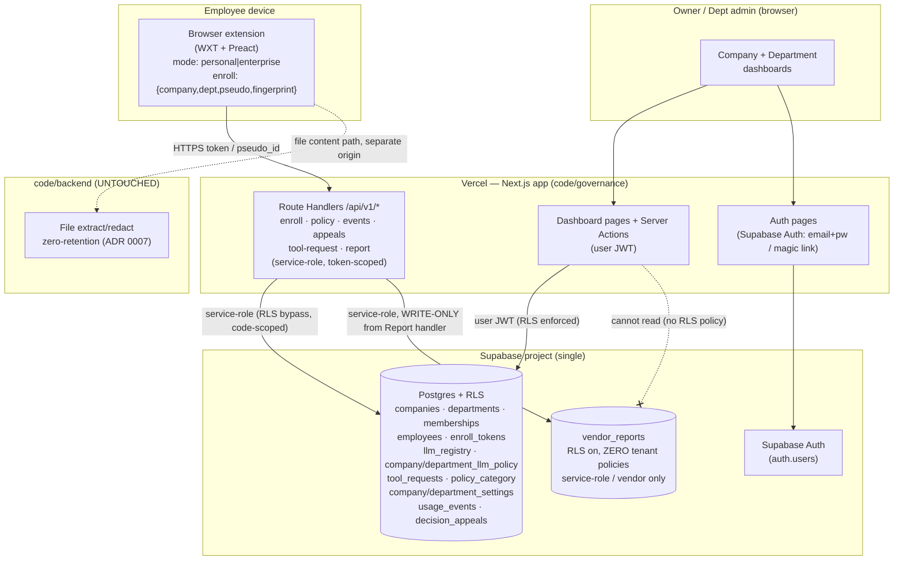

# Governance Platform v2 — Vercel + Supabase Port — Implementation Plan

> **For agentic workers:** REQUIRED SUB-SKILL: Use superpowers:subagent-driven-development
> (recommended) or superpowers:executing-plans to implement this plan task-by-task.
> Steps use checkbox (`- [ ]`) syntax for tracking.

---

## Context — why this build exists

`code/policy/` today is a **pitch demo**: FastAPI + a single in-process SQLite connection + a Preact
SPA, with per-department **shared** enroll tokens, a revoke that only blocks *future* enrollments
(no `employees`↔`enroll_tokens` link, so already-enrolled staff keep working — documented in
`code/policy/README.md:63` and surfaced in the Tokens UI), and org login = `org_name + password`
adjudicated server-side against `admin_password_hash`. The extension client (`code/extension/src/policy/`)
polls `/v1/policy` by `org_id` with an ETag, degrades to cached policy on failure (ADR 0014), and
uploads `usage_events` that are structurally forbidden from carrying prompt text
(`extra="forbid"` on 7 models + a 422 handler at `code/policy/app/main.py:31` that strips Pydantic's
`input`/`ctx` so a rejected body never echoes back).

We are **porting the domain (Architecture A), not lifting-and-shifting the demo**. The host moves to
**Vercel**, persistence to **Supabase Postgres with RLS**, human auth to **Supabase Auth**, and the
extension's backend collapses to **one surface: Next.js Route Handlers** (founder decision,
2026-07-22 — full replace, FastAPI retired). We simultaneously upgrade the product per the locked
grill-me decisions: one-person one-time enroll tokens, **live** revoke, Personal/Enterprise mode with
Leave-org, a company + department dashboard split with a real permission matrix, a single Tools list
with a request lifecycle, `allow_ignore` default-false for enterprise, focus-seconds "hours of AI",
and a **vendor-only** Report false-detection store isolated from every tenant dashboard.

`code/backend/` (the file extract/redact service, ADR 0007) is **out of scope and untouched** — its
defining property is that it stores nothing (`tests/test_zero_retention.py`), and the design spec
§3.1 already rejected merging governance into it. Governance must never gain a foothold there.

**Intended outcome:** a Vercel-hosted governance platform the founder's team can drive end-to-end —
create a company on the website, invite dept admins, mint one-person tokens, enroll the extension,
and see live enforcement + dashboards — with the privacy invariants (I1/I3, decision #5) preserved
*by construction* in the new stack, not by hope.

---

## Pushback — four places the brief needs a decision before code, not after

### Pushback 1 🔴 — "Enterprise-without-enroll = hard Send lock" collides with ADR 0014, and the collision is real
ADR 0014 is load-bearing: *degrade to advisory, never fail-closed*, because a hard block on ChatGPT
relocates the leak to the ChatGPT **desktop app** (doc 00 §1.4) — the channel we cannot audit. A hard
Send lock is exactly a fail-closed block.

**They are not the same failure and the plan keeps them apart in code — this is not papering over.**
- **Engine-dead / scan-timeout** → ADR 0014 governs → **advisory** (existing behavior, unchanged).
- **Enrollment-gate** (Enterprise mode chosen, not enrolled, or revoked) → **hard Send lock is
  correct**, because the block is not a detection verdict that can fail open — it is a *configuration
  state the user chose* and can exit two documented ways (enroll, or Leave org). There is no third
  "send anyway," so there is no silent fail-open to relocate.

**Decision:** two distinct blocked-states with two distinct modals. `gateReason: 'engine_degraded'`
→ advisory banner, Send proceeds. `gateReason: 'not_enrolled' | 'revoked'` → hard block, Send stops,
escape = enroll / Leave org. The implementer must not collapse them into one timeout path. *(This is
the ADR-0014 letter-vs-purpose check applied to our own new feature.)*

### Pushback 2 🔴 — "Live revoke blocks immediately on next Send" cannot await a network call (decision #2/#8)
The Send gate decides synchronously (`stopImmediatePropagation()` cannot be awaited). A fresh revoke
re-check is a network round-trip. If the gate awaits it, we have reintroduced the stop-and-replay that
decision #8 forbids.

**Decision:** revoke reuses the send-gate's existing pattern — **the poll is the cache**. The ≤60s
policy poll writes `enrollment.status` into `chrome.storage.local`; the gate reads the *cached* status
synchronously and blocks if `revoked`. On Send we *also* fire a best-effort refresh that can only
**tighten** (active→revoked takes effect next Send; it never unblocks mid-gate). This is ADR 0013's
monotonic-toward-dirty rule, reused. "Immediately on next Send" means *next Send after the poll that
saw the revoke*, worst-case ~60s idle — exactly the brief's "idle sync ≤~60s." Do not promise
sub-poll revoke; it would require awaiting in the gate.

### Pushback 3 🟠 — The default Report scrub is only as good as L1 recall, and the FN path is *defined by* an L1 miss
"Structure-preserving randomize of **every L1 hit**" protects nothing L1 didn't catch. The **FN
"report a miss"** path exists *because* detection missed something — so by construction the thing being
reported may not be an L1 hit, and the default scrub won't touch it. Under the default (no-raw) consent
box the user may still paste a real identifier the randomizer can't see.

**Decision:** (a) the default scrub randomizes L1 hits **and** the FN modal shows the user the exact
text that will be sent, post-scrub, before they consent — the user is the last line on their own
pasted text; (b) real identifier numbers ride **only** the second, default-OFF checkbox — never silent
raw under one consent box (locked, Q7); (c) we **do not** auto-mask all L2 (locked). The plan makes the
"here is exactly what leaves your device" preview a **required** modal element, not optional. This is
honest about a residual, not a fix — flag it in §9 gaps.

### Pushback 4 🟢 — Focus-seconds is the most surveillance-adjacent feature in the package; keep it pseudonymous and metadata-only
"Hours of AI" per employee is more invasive than class+count audit — it is behavioral timing. It stays
inside the posture **only** because it carries no prompt text and no real identity: `pseudo_id` +
`department` + `seconds`, aggregated. The plan forbids any per-keystroke or per-URL timing; the unit is
focus-seconds on a *covered host* (host, not path), pausing on blur/hidden. Label the UI "browser-
extension coverage only" (locked, Q5). Do not let this grow a `url` or `title` column.

---

## Goal / Non-goals

**Goal:** Port the governance domain to Next.js Route Handlers on Vercel + Supabase Postgres/Auth/RLS,
and ship all v2 features (one-person live-revocable tokens, Personal/Enterprise mode + Leave org,
company/department dashboards with an executable permission matrix, single Tools lifecycle,
`allow_ignore` default-false, focus-seconds analytics, vendor-isolated Report FP/FN), preserving I1/I3
and decision #5 by construction.

**Non-goals (this build):**
- **Quotas / usage "control"** (soft or hard) — this build is **analytics only** (Q10). Quotas =
  **Phase 2**.
- **Force-install / hide-Personal / policy-disabled Leave-org (B3)** — noted as future; local state is
  designed so a later policy flag hides Personal and disables Leave, but no MDM/policy channel is built
  now (Q3).
- **File-content Report surfaces** (FP/FN on Slice-2 file review) — same controls, **follow-on task**
  (Q7); this build does chat FP (Send modal) + FN (popup) only.
- **SSO / SAML** for owner/dept-admin — Supabase email+password / magic link only; SSO is a production
  gap (§9).
- **MDM token distribution** — tokens are minted in-dashboard and pasted by hand (§9).
- **The `ml/` sensitive-vs-not classifier** and the **ethics classifier training** (`code/classifier/`)
  — the ethics *block + appeal* path is ported as existing behavior; model training is separate.
- **Rehydration** — never (E2, settled kill).

---

## Architecture

Full replace: the extension talks to **one** origin (Vercel Route Handlers), which use the Supabase
**service-role** key server-side (bypassing RLS, enforcing token/pseudo scoping in code). The dashboard
is Next.js pages that talk to Supabase **directly with the signed-in user's JWT**, so **RLS is the
permission matrix** for reads and most writes; privileged mutations that need service-role (mint token,
decide request) go through Route Handlers guarded by an explicit role check. `vendor_reports` has RLS
**enabled with zero tenant policies** → no dashboard query can ever read it; only the service-role
Report handler writes it. `code/backend/` file-extract is a separate deploy, untouched.



**Tech Stack:**
- **Vercel**: Next.js 15 (App Router, Route Handlers + Server Actions), TypeScript, Node runtime for
  the extension API routes *(decision: Node not Edge — service-role key + `@supabase/supabase-js`; cheap
  to revisit per-route)*.
- **Supabase**: Postgres 15 + Row-Level Security, Supabase Auth (email+password and magic link),
  `@supabase/supabase-js` + `@supabase/ssr`, migrations via the Supabase CLI (`supabase/migrations/*.sql`).
- **Validation**: **Zod** with `.strict()` (the `extra="forbid"` port) + a shared error formatter that
  strips the offending value (the 422-handler port). This is a **privacy control**, TDD'd.
- **Extension**: unchanged stack — WXT + Preact + TypeScript; `code/extension/src/policy/*` evolves.
- **Tests**: Vitest + `supabase start` (local Postgres) for RLS/policy/handler tests; extension unit
  tests with the existing harness.

---

## Global Constraints

Copied from the governing documents. Every task inherits these.

1. 🔴 **I3 / decision #5 — automatic events carry class + count + salted hash, never raw values.**
   `/api/v1/events` bodies are Zod-`.strict()`; a body with a `prompt`/text field is **422**, and the
   422 response must not echo the value. Verified by test, every commit.
2. 🔴 **I1 — raw prompt text never leaves the device by default.** The only device→server text paths
   are opt-in: ethics-appeal `disclosed_text` (existing — **and server-scrubbed on write: always
   `scrubL1(..., {includeRaw:false})`, no real-digits opt-out, Task 12b/B3**, so opt-in never puts a raw
   NRIC-shaped value in the company DB), and Report (new, dual-consent, scrubbed).
   Automatic events, focus-seconds, policy polls, tool requests carry **no** prompt text. (Revoke has
   no endpoint of its own — it rides the policy poll's cached `enrollment.status`, S1.)
3. 🔴 **`vendor_reports` is vendor-only.** RLS enabled, **zero** policies for `authenticated`/`anon`.
   No tenant dashboard API may read it. No `pseudo_id`, no `company_id`, no `department` on the row.
4. 🔴 **`code/backend/` is untouched.** No governance table, route, or dependency lands there.
5. 🔴 **Decision #2 + #8 — on-device scan, synchronous gate, the user presses Send. No auto-submit.**
   The revoke gate and enrollment gate read *cached* state synchronously (Pushback 2).
6. **ADR 0013 monotonic rule** — the gate/enrollment cache moves toward *blocked*: a poll may flip
   active→revoked and take effect next Send; a stale/failed poll never unblocks.
7. **ADR 0014** — engine-dead degrades to **advisory**. Only the enrollment-gate (not-enrolled/revoked)
   hard-blocks (Pushback 1).
8. **`allow_ignore` defaults FALSE** for new enterprise tenants (Q4). Personal mode Ignore is unchanged.
9. **Per-tenant isolation from day one** — every governance row is company-scoped; RLS is the boundary,
   not application filtering alone.
10. **Unknown tool default = blocked** (Q8/Q9). Owner deny wins; depts may **tighten** only.
11. 🔴 **Sole author `JeffTiong1031 <jefftiong1031@gmail.com>`, NO `Co-Authored-By` trailer of any
    kind.** Verify `git log -1 --format=%B` after each commit (CLAUDE.md §6.1).
12. **Every number cited or tagged `(estimate)`/`(unverified)`.** Estimates below are tagged.
13. **TDD is mandatory on any task touching policy, privacy, permissions, revoke, or scrub** — failing
    test first. UI-only tasks may use lighter component tests.

---

## Schema changes vs current SQLite

Current SQLite: 10 tables (`orgs`, `enroll_tokens`, `employees`, `llm_registry`, `org_llm_policy`,
`policy_category`, `access_requests`, `decision_appeals`, `usage_events`, `admin_sessions`),
`app/db.py:8-112`. The port to Postgres + RLS makes the following changes. **Bold = new or materially
changed.**

| Table | Change from SQLite | Why |
|---|---|---|
| `companies` (was `orgs`) | **Drop `admin_password_hash`.** Keep `id, name, policy_version, created_at`. | Human auth → Supabase Auth. Password no longer in domain DB. |
| **`departments`** (new) | `id, company_id, name, created_at`, unique `(company_id, name)`. | Departments become first-class rows (dept dashboards, dept-scoped RLS). Previously a bare string on tokens/employees. |
| **`memberships`** (new) | `id, company_id, user_id→auth.users, role ENUM('owner','dept_admin'), department_id NULL, created_at`. Owner: `department_id` NULL. Dept admin: one row per scoped dept. | **The permission matrix source of truth** (Q8). RLS reads this. Replaces the single `admin_password_hash`. |
| `enroll_tokens` | **One-person, one-time.** Add `department_id` (FK, replaces string), `max_uses INT DEFAULT 1`, `consumed_at`, `consumed_employee_id`, `created_by→auth.users`. Keep `token_hash UNIQUE, label, revoked, created_at`. | Q1/Q2: token binds pseudo_id→dept→company; revoke affects **that person only**. |
| `employees` | **Add `enroll_token_id` FK** (the missing link), `department_id` FK, `status ENUM('active','revoked') DEFAULT 'active'`, `last_seen_at`. Keep `pseudo_id UNIQUE`. **Still no name/email.** | **Enables live revoke** (the SQLite gap at `admin.py:145`). Privacy floor preserved. |
| `llm_registry` | Unchanged (global catalog, seeded). | — |
| `company_llm_policy` (was `org_llm_policy`) | `status ENUM('blocked','pending','approved')` + **`owner_banned BOOL DEFAULT false`**. PK `(company_id, llm_id)`. | Q9 lifecycle states; Q8 "owner deny wins". |
| **`department_llm_policy`** (new) | `department_id, llm_id, status ENUM('blocked','approved')`, PK `(department_id, llm_id)`. | Q8: depts may **tighten** (block) but never loosen an owner ban. |
| **`tool_requests`** (was `access_requests`) | `id, company_id, department_id, llm_id, requested_pseudo_id NULL, reason(<=500), scope ENUM('department','company'), status ENUM('pending','approved','denied'), cooldown_until, decided_by, created_at, decided_at`. | Q9: unified Tools+Requests lifecycle; owner-ban escalates `scope='company'`; **24h re-request cooldown** (`cooldown_until`, configurable). |
| `policy_category` → `company_policy_category` | Add `is_floor BOOL` (owner sets the ethics/PII floor). | Q8: owner sets floor; dept can tighten only. |
| **`department_policy_category`** (new) | `department_id, key, enabled`, PK `(department_id, key)`; a dept may enable a category the company left off, never disable a floor. | Dept tightening. |
| `usage_events` | **Add `department_id`, `seconds INT NULL`** (focus ticks), extend `type` set with `send_count`, `focus_tick`, `ignore` plus existing `visit_unapproved, warn_shown, request_sent, ethics_block, pii_block`. **No prompt-text column — unchanged invariant.** | Q1 automatic metadata events; Q5 focus-seconds; Q4 enterprise Ignore→metadata. |
| **`company_settings`** (new) | `company_id PK, allow_ignore BOOL DEFAULT false, report_enabled_company BOOL DEFAULT false, tool_recooldown_hours INT DEFAULT 24, ethics_floor / pii_floor` refs. | Q4/Q7/Q9 org settings. |
| **`department_settings`** (new) | `department_id PK, report_enabled BOOL DEFAULT false`. | Q7: dept admin toggles own-dept Report. |
| `decision_appeals` | Add `department_id`. Keep `disclosed_text` (opt-in), `prompt_hash`, `pass_used`. | Scope appeals to dept dashboards. |
| **`vendor_reports`** (new, ISOLATED) | `id, kind ENUM('fp','fn'), class, scrubbed_text, reason, include_raw BOOL, extension_version, ts`. **No `company_id`, no `pseudo_id`, no `department`.** RLS on, **no tenant policy**. | Q1/Q7: vendor-only, un-joinable to any tenant. |
| `admin_sessions` | **Dropped.** | Supabase Auth owns sessions. |

### RLS sketch (the executable permission matrix — SQL)

Helper predicates (SQL functions, `security definer`, used by every policy):

```sql
-- returns true if the current JWT user is owner of the company
create function is_owner(c uuid) returns boolean language sql stable as $$
  select exists (select 1 from memberships m
    where m.company_id = c and m.user_id = auth.uid() and m.role = 'owner');
$$;

-- returns true if owner OR a dept_admin scoped to department d in company c
create function can_admin_department(c uuid, d uuid) returns boolean language sql stable as $$
  select is_owner(c) or exists (select 1 from memberships m
    where m.company_id = c and m.user_id = auth.uid()
      and m.role = 'dept_admin' and m.department_id = d);
$$;
```

Representative policies (the same shape repeats per table — full DDL is Task 4/5):

```sql
alter table employees enable row level security;

-- Owner sees the whole company; dept_admin sees only their department(s).
create policy employees_read on employees for select using (
  is_owner(company_id) or can_admin_department(company_id, department_id)
);

-- Dept admin may revoke only within their department; owner anywhere in company.
create policy employees_revoke on employees for update using (
  can_admin_department(company_id, department_id)
);
```

```sql
-- vendor_reports: RLS on, and DELIBERATELY NO policy for authenticated/anon.
-- With RLS enabled and zero policies, every tenant-role select/insert returns 0 rows / is denied.
-- Only the service-role key (used solely by the Report Route Handler) can write it.
alter table vendor_reports enable row level security;
-- (no create policy ... here, on purpose — see Task 6 test that proves a tenant JWT reads nothing)
```

**Extension endpoints do not use RLS.** `/api/v1/enroll|policy|events|appeals|tool-request|report`
run server-side with the service-role client, which bypasses RLS; scoping (this token → this company;
this pseudo_id → this employee's company/dept) is enforced **in the handler** and covered by tests.
Rationale: the extension holds no Supabase session; a device-held anon key with row-level policies would
be reverse-engineerable and would leak the tenancy model. Keeping the service-role key server-only is
the boundary.

---

## Permission matrix as executable checks

Two enforcement layers, both tested — never UI-only.

**Layer 1 — RLS (dashboard reads + most writes, user JWT):** the `is_owner` / `can_admin_department`
predicates above. A dept admin literally cannot `select` another department's rows.

**Layer 2 — Route Handler / Server Action guards (privileged service-role mutations):** mint token,
decide request, change org settings, override appeal. A shared guard:

```ts
// code/governance/lib/authz.ts
type Role = 'owner' | 'dept_admin';
export async function requireScope(opts: {
  companyId: string; departmentId?: string; need: Role;
}): Promise<{ userId: string }> {
  const { userId } = await getSessionUser();            // throws 401 if no JWT
  const m = await memberships(userId, opts.companyId);  // service-role read
  if (opts.need === 'owner') {
    if (!m.some(r => r.role === 'owner')) throw new Forbidden();
  } else {
    const ok = m.some(r => r.role === 'owner')
      || m.some(r => r.role === 'dept_admin' && r.department_id === opts.departmentId);
    if (!ok) throw new Forbidden();
  }
  return { userId };
}
```

**The matrix (Q8), each row a test in Task 17):**

| Action | Owner | Dept admin (own dept) | Enforced by |
|---|---|---|---|
| Dept CRUD | ✅ | ❌ | `requireScope(need:'owner')` + RLS |
| Invite dept admins | ✅ | ❌ | `requireScope(need:'owner')` |
| Org settings (`allow_ignore`, company Report, floors, tool defaults/bans) | ✅ | ❌ | `requireScope(need:'owner')` |
| Mint/revoke enroll tokens | ✅ any dept | ✅ own dept only | `requireScope(need:'dept_admin', departmentId)` + RLS |
| Tools: approve/deny request | ✅ | ✅ own dept, **cannot loosen owner ban** | guard + `owner_banned` check |
| Tools: tighten (block) | ✅ | ✅ own dept | RLS on `department_llm_policy` |
| Appeals: view + decide | ✅ all | ✅ own dept (respect floor) | RLS + floor check |
| Dept Report toggle | ✅ (as company) | ✅ own dept | `department_settings` guard |
| Usage / insider-risk analytics | ✅ all depts | ✅ own dept | RLS |
| View `vendor_reports` | ❌ | ❌ | **no RLS policy exists** |

**Owner-ban rule (Q8/Q9):** a dept request for an `owner_banned` tool does not resolve in the dept
queue — the guard rejects a dept approval and re-files the request as `scope='company'` into the owner
queue. Test in Task 12/17.

---

## Task breakdown

Dependencies noted per task. Group order: **Foundation → Schema/RLS → Extension API → Dashboards →
Extension client → Migration → Full test/verify.** Extension-client tasks (E-group) depend only on the
API-group contracts and can run parallel to Dashboard tasks.

> Estimates are `(estimate)` — no comparable port to cite. Whole build ≈ **22–32 engineer-days**
> `(estimate)`; the two that can blow it are Supabase Auth↔dashboard wiring and the extension
> mode/gate rework. (Range bumped from 20–30 for the appeals port, B2, and the shared L1 package, S3.)

---

### Task 1: Scaffold `code/governance` Next.js app + Supabase local

**Files:** Create `code/governance/` (Next.js 15 App Router, TS), `code/governance/supabase/config.toml`,
`code/governance/.env.example`, `code/governance/lib/supabase/{server,service,browser}.ts`,
`code/governance/README.md`.

**Interfaces — Produces:** `serviceClient()` (service-role, server-only), `serverClient()` (user JWT via
`@supabase/ssr`), `browserClient()`.

- [ ] **Step 1:** `npx create-next-app@latest code/governance --ts --app --no-tailwind` *(decision:
  plain CSS to match the extension's no-Tailwind norm; cheap to add later)*. Add `@supabase/supabase-js`,
  `@supabase/ssr`, `zod`, `vitest`.
- [ ] **Step 2:** `supabase init` in `code/governance/`; commit `config.toml`. Write `.env.example` with
  `SUPABASE_URL`, `SUPABASE_ANON_KEY`, `SUPABASE_SERVICE_ROLE_KEY` (documented server-only).
- [ ] **Step 3:** Write the three client factories. `service.ts` throws if imported where
  `SUPABASE_SERVICE_ROLE_KEY` is absent (guards against shipping it to the browser bundle).
- [ ] **Step 4:** `supabase start`; `curl` the health page. Expected: local Postgres + a Next.js dev page.
- [ ] **Step 5:** Commit `chore(governance): scaffold Next.js + Supabase app`.

---

### Task 2: Port the 422 privacy handler + `extra="forbid"` as a Zod error formatter (TDD, privacy-critical)

**Files:** Create `code/governance/lib/validate.ts`, `code/governance/lib/validate.test.ts`.

**Interfaces — Produces:** `parseStrict<T>(schema, body): T` (throws `ValidationError`);
`validationResponse(err): Response` (422 JSON, **input value stripped**).

This is the port of `app/main.py:31` + `extra="forbid"`. It is a **privacy control** — TDD.

- [ ] **Step 1 (failing test):**
```ts
test('422 body never echoes the rejected value', async () => {
  const schema = z.object({ pseudo_id: z.string() }).strict();
  const res = validationResponse(catchParse(schema, { pseudo_id: 1, prompt: 'my NRIC 900101-01-1234' }));
  const text = await res.text();
  expect(res.status).toBe(422);
  expect(text).not.toContain('900101');      // no leaked value
  expect(text).not.toContain('my NRIC');
  expect(text).toContain('unrecognized_keys'); // strict rejects `prompt`
});
```
- [ ] **Step 2:** Run — FAIL (functions undefined).
- [ ] **Step 3:** Implement `parseStrict` (Zod `.strict()`), and `validationResponse` mapping Zod issues
  to `{code, path, message}` **omitting `received`/`input`** and never interpolating values into
  `message` (mirror `finding_hash`-style "names the format, not the value").
- [ ] **Step 4:** Run — PASS. Add a second test: a `missing`-field error does not echo the body.
- [ ] **Step 5:** Commit `feat(governance): strict validation with value-stripping 422 (I3)`.

---

### Task 3: Schema migration — core tenancy (companies, departments, memberships) + RLS helpers (TDD)

**Files:** Create `code/governance/supabase/migrations/0001_core.sql`,
`code/governance/tests/rls_core.test.ts`.

**Interfaces — Produces:** tables `companies, departments, memberships`; functions `is_owner`,
`can_admin_department`.

- [ ] **Step 1 (failing test):** with two seeded companies + a dept_admin JWT scoped to company A dept X,
  assert the admin can `select` A/X departments and **cannot** select company B departments.
- [ ] **Step 2:** Run — FAIL (tables absent).
- [ ] **Step 3:** Write DDL for the three tables (see schema section), `enable row level security`, the
  two helper functions, and read/write policies.
- [ ] **Step 4:** `supabase db reset`; run — PASS.
- [ ] **Step 5:** Commit `feat(governance): core tenancy schema + RLS`.

---

### Task 4: Schema migration — tokens, employees (one-person + live-revoke link) (TDD)

**Files:** Create `.../migrations/0002_enrollment.sql`, `tests/rls_enrollment.test.ts`.

**Interfaces — Produces:** `enroll_tokens` (one-person), `employees` (`enroll_token_id`, `status`).

- [ ] **Step 1 (failing test):** a dept_admin can `select`/`update` employees only in their dept; revoking
  an employee sets `status='revoked'`; a token with `consumed_at` set cannot be consumed twice.
- [ ] **Step 2:** Run — FAIL.
- [ ] **Step 3:** DDL per schema section; RLS as Task 3; a `check (max_uses = 1)` for now (one-person).
- [ ] **Step 4:** Run — PASS.
- [ ] **Step 5:** Commit `feat(governance): one-person tokens + revocable employees`.

---

### Task 5: Schema migration — tools lifecycle, categories, settings, usage_events, appeals (TDD)

**Files:** Create `.../migrations/0003_policy.sql`, `tests/rls_policy.test.ts`.

**Interfaces — Produces:** `llm_registry, company_llm_policy(+owner_banned), department_llm_policy,
tool_requests, company_policy_category, department_policy_category, company_settings,
department_settings, usage_events(+department_id,+seconds), decision_appeals(+department_id)`.

- [ ] **Step 1 (failing test):** `usage_events` insert with an unknown column fails; a dept_admin reads
  only own-dept events; `company_settings.allow_ignore` defaults `false`.
- [ ] **Step 2:** Run — FAIL.
- [ ] **Step 3:** DDL + RLS + seed `llm_registry` (8 rows from `app/seed.py`) + the 6 ethics categories.
- [ ] **Step 4:** Run — PASS.
- [ ] **Step 5:** Commit `feat(governance): tools lifecycle, settings, events, appeals schema`.

---

### Task 6: Schema migration — `vendor_reports` isolation (TDD, privacy-critical)

**Files:** Create `.../migrations/0004_vendor_reports.sql`, `tests/vendor_isolation.test.ts`.

**Interfaces — Produces:** `vendor_reports` (no tenant-joinable columns), service-role write path.

- [ ] **Step 1 (failing test):**
```ts
test('no tenant JWT can read vendor_reports', async () => {
  await service.from('vendor_reports').insert({ kind:'fp', class:'nric', scrubbed_text:'x', reason:'y' });
  const asOwner = clientWithJwt(ownerJwt);
  const { data, error } = await asOwner.from('vendor_reports').select('*');
  expect(data ?? []).toHaveLength(0);   // RLS returns nothing
});
```
- [ ] **Step 2:** Run — FAIL (table absent).
- [ ] **Step 3:** DDL with **no** `company_id`/`pseudo_id`/`department`; `enable row level security`; write
  **no** policy for `authenticated`/`anon`.
- [ ] **Step 4:** Run — PASS (owner reads 0 rows).
- [ ] **Step 5:** Commit `feat(governance): isolated vendor_reports store (vendor-only)`.

---

### Task 7: Auth pages + membership bootstrap — create company, invite dept admin (TDD on guard)

**Files:** Create `code/governance/app/(auth)/**`, `app/actions/company.ts`, `lib/authz.ts`,
`lib/authz.test.ts`.

**Interfaces — Consumes:** Task 3 tables. **Produces:** `requireScope`, Server Actions
`createCompany`, `inviteDeptAdmin`, `createDepartment`.

- [ ] **Step 1:** Wire Supabase Auth UI (email+password + magic link) via `@supabase/ssr`.
- [ ] **Step 2 (failing test):** `requireScope({need:'owner'})` throws `Forbidden` for a dept_admin;
  passes for owner. `inviteDeptAdmin` creates a `memberships` row scoped to one department.
- [ ] **Step 3:** Run — FAIL.
- [ ] **Step 4:** Implement `requireScope` + the Server Actions (`createCompany` also inserts the caller
  as `owner`). Q2: extension **never** creates tenants — there is no enroll path that writes `companies`.
- [ ] **Step 4b (invite flow — how, S6):** `inviteDeptAdmin(email, departmentId)` calls Supabase Auth
  `admin.inviteUserByEmail(email, { data: { company_id, department_id } })` (service-role) → the invitee
  receives an email → clicks it → sets a password → on first authenticated load an accept handler reads the
  invite metadata and writes the `memberships` row `(company_id, user_id, role:'dept_admin', department_id)`.
  The owner never sees or sets the invitee's password. Staff (employees) are **never** invited this way —
  they get an enroll token, not a dashboard login.
- [ ] **Step 5:** Run — PASS. Commit `feat(governance): auth + company/dept-admin bootstrap`.

---

### Task 8: Route Handler `/api/v1/enroll` — one-person token consume (TDD, contract-critical)

**Files:** Create `app/api/v1/enroll/route.ts`, `app/api/v1/enroll/route.test.ts`.

**Interfaces — Consumes:** `parseStrict`, `serviceClient`. **Produces:** response
`{ company_id, company_name, department_id, department, pseudo_id, policy, enrollment:{status:'active'} }`
— note the extension `Enrolment` type gains `department_id`, `company_id`, and `enrollment.status`.

- [ ] **Step 1 (failing test):** POST a valid unused token → 200, a new `employees` row with fresh
  `pseudo_id`, token now `consumed_at` set, `enroll_token_id` linked. POST the **same** token again →
  **409** (one-person, one-time). POST a revoked token → 401.
- [ ] **Step 2:** Run — FAIL.
- [ ] **Step 3:** Implement: look up token by `token_hash` where `revoked=0 and consumed_at is null`;
  transactionally mint employee + stamp `consumed_at, consumed_employee_id`; department comes from the
  **token row**, never the body (preserve `enroll.py:15` property).
- [ ] **Step 4:** Run — PASS.
- [ ] **Step 5:** Commit `feat(governance): one-person enroll handler`.

---

### Task 9: Route Handler `/api/v1/policy` — ETag/304 + `enrollment.status` for live revoke (TDD)

**Files:** Create `app/api/v1/policy/route.ts`, `+ .test.ts`.

**Interfaces — Consumes:** Task 5/8. **Produces:** `GET ?pseudo_id=` → `{ version, tools, categories,
enrollment:{status}, allow_ignore, report_enabled }` with `ETag` = `company.policy_version + ':' +
employee.status`; `If-None-Match` match → 304. The extension gates entirely off this payload — E6 needs
`tools`/`allow_ignore`, E7 needs `report_enabled` (B4).

**The payload the extension actually needs (B4) — all four beyond `enrollment`:**
- `allow_ignore` ← `company_settings.allow_ignore` (default false).
- `report_enabled` ← `company_settings.report_enabled_company` **OR** this employee's
  `department_settings.report_enabled` (Q7 scope: company-wide OR own-dept).
- `tools` ← the **effective** per-tool status after merging company + department policy (algorithm below).
- `categories` ← company floors + this dept's enabled categories.

**Effective-tools merge algorithm (documented so implementers don't invent it — B4):**
1. Start from `company_llm_policy[llm].status`; a host absent from the registry/policy → **`blocked`**
   (unknown default blocked in Enterprise, Q8).
2. If `company_llm_policy[llm].owner_banned` → **`blocked`**, final — **owner deny wins**, no department
   row can lift it.
3. Otherwise apply `department_llm_policy[llm]`: a dept row of `blocked` **tightens** the result to
   `blocked`. A dept row can **never** raise a company `blocked`/ban up to `approved` (depts tighten only).
4. Net: a tool is **`approved`** iff company = `approved` **AND** not `owner_banned` **AND** the dept row is
   not `blocked`; every other combination → **`blocked`**. `pending` is reported as-is (still blocked to the
   employee) so the UI can show "requested."

- [ ] **Step 1 (failing test):** first GET → 200 + ETag + all four fields; repeat with `If-None-Match` →
  304; after the employee is revoked, the **ETag changes** and GET → 200 with `enrollment.status='revoked'`
  (status is part of the ETag so a revoke busts the cache). **Merge tests:** an `owner_banned` tool is
  `blocked` even with a dept `approved` row; a company-`approved` tool with a dept `blocked` row is
  `blocked`; an unknown host is `blocked`. **Field tests:** `allow_ignore` reflects `company_settings`;
  `report_enabled` is true when *either* company or the employee's dept has Report on.
- [ ] **Step 2:** Run — FAIL.
- [ ] **Step 3:** Implement. Bump `policy_version` on any tool/category/settings write (port
  `bump_policy_version`); fold `employee.status` into the ETag so revoke propagates within one poll (≤60s);
  compute the effective `tools` per the algorithm; resolve `report_enabled` from company OR dept settings;
  update `last_seen_at`.
- [ ] **Step 4:** Run — PASS.
- [ ] **Step 5:** Commit `feat(governance): policy handler — revoke-aware ETag + effective tools + settings`.

---

### Task 10: Route Handler `/api/v1/events` — strict metadata ingest + focus-seconds (TDD, I3-critical)

**Files:** Create `app/api/v1/events/route.ts`, `+ .test.ts`.

**Interfaces — Consumes:** `parseStrict`, resolves `employee` by `pseudo_id`. **Produces:** `202
{accepted}`. Event Zod schema: `{ host, type: enum, category?, finding_hash?(hex64), seconds?(int),
ts }` `.strict()`; batch cap 100.

- [ ] **Step 1 (failing test):** a batch with a `prompt` field → **422**, response body contains no
  fragment of the prompt (reuses Task 2). A `focus_tick` with `seconds:45` → 202 and a row with
  `seconds=45`, no text. An `ignore` event → 202 (enterprise Ignore→metadata, Q4).
- [ ] **Step 2:** Run — FAIL.
- [ ] **Step 3:** Implement; log **count only** (port `events.py:41`). Stamp `department_id` from the
  employee row (never the body).
- [ ] **Step 4:** Run — PASS.
- [ ] **Step 5:** Commit `feat(governance): strict events + focus-seconds ingest (I3)`.

---

### Task 11: Route Handler `/api/v1/report` — vendor-only, dual-consent scrub (TDD, privacy-critical)

**Files:** Create `app/api/v1/report/route.ts`, `+ .test.ts`. (Scrub lives in `code/shared/l1/` — Task 11a;
do **not** recreate a `lib/scrub.ts` under governance.)

**Interfaces — Consumes:** L1 detector list (shared with extension — see Task 11a). **Produces:** `201`;
writes `vendor_reports` via service-role only. Body: `{ kind:'fp'|'fn', class?, scrubbed_text, reason,
include_raw:boolean, extension_version }`. **No pseudo_id / company / department accepted or stored.**

- [ ] **Step 1 (failing test):** a report body containing a `pseudo_id` or `company_id` field → **422**
  (`.strict()` rejects it — the isolation is enforced at the schema, not just the table). A valid `fp`
  report → 201, row in `vendor_reports`, and **no** tenant JWT can read it (reuse Task 6).
- [ ] **Step 2:** Run — FAIL.
- [ ] **Step 3:** Implement. The handler **never** looks up an employee; it is identity-free by contract.
- [ ] **Step 4:** Run — PASS.
- [ ] **Step 5:** Commit `feat(governance): vendor-only report handler`.

---

### Task 11a: `scrub.ts` — structure-preserving L1 randomize (TDD, privacy-critical)

**Files (S3 — shared package boundary):** Create `code/shared/l1/` — a **framework-free** package (L1
grammars + `scrubL1`), imported by **both** `code/governance` and `code/extension`. Test:
`code/shared/l1/scrub.test.ts`. 🔴 **Next.js must NOT import the WXT/extension tree** (bundler + build-tool
mismatch, and it would drag extension globals into a server build). The shared L1 logic lives in
`code/shared/l1/`; both sides depend on it. If a shared package proves impractical in the monorepo, the
fallback is duplicated grammars **plus a parity test** that fails when the two copies diverge — but the
shared package is the default.

**Interfaces — Produces:** `scrubL1(text, {includeRaw:false}): {text, hitCount}` — replaces every L1
identifier hit with a **format-matching random** value (NRIC digits→random valid-shaped digits, etc.);
with `includeRaw:true` returns text unchanged (the opt-in checkbox path).

- [ ] **Step 1 (failing test):** `scrubL1('IC 900101-01-1234', {includeRaw:false})` returns a string of
  the **same shape** (`\d{6}-\d{2}-\d{4}`) but **not** `900101-01-1234`; length and separators preserved.
  With `includeRaw:true`, returns the original.
- [ ] **Step 2:** Run — FAIL.
- [ ] **Step 3:** Re-home the extension's existing L1 detector grammars into `code/shared/l1/` (do **not**
  re-invent them); `scrubL1` replaces matched spans with same-grammar random digits. **Do not touch L2
  PERSON/ORG** (locked). Both `code/governance` and `code/extension` now import L1 from `code/shared/l1/`.
- [ ] **Step 4:** Run — PASS. Add the Pushback-3 test: text with **no** L1 hit is returned unchanged with
  `hitCount===0` so the UI can warn — assert `scrubL1` does not silently pass raw off as "scrubbed".
- [ ] **Step 5:** Commit `feat(governance): structure-preserving L1 scrub`.

---

### Task 12: Route Handler `/api/v1/tool-request` + owner-ban escalation (TDD)

**Files:** Create `app/api/v1/tool-request/route.ts`, `app/actions/tools.ts`, `+ .test.ts`.

**Interfaces — Produces:** employee submits `{pseudo_id, llm_id, reason}` → `tool_requests` (scope from
`owner_banned`); dashboard Server Actions `decideRequest`, `setCompanyTool`, `setDeptTool`.

- [ ] **Step 1 (failing test):** requesting an `owner_banned` tool files `scope='company'` (owner queue),
  not the dept queue; a dept_admin `decideRequest(approve)` on an owner-banned tool → `Forbidden`;
  re-requesting a `denied` tool before `cooldown_until` → **409**; after 24h → allowed.
- [ ] **Step 2:** Run — FAIL.
- [ ] **Step 3:** Implement lifecycle `blocked→pending→approved|denied`; approve flips
  `company_llm_policy`/`department_llm_policy`; deny sets `cooldown_until = now + tool_recooldown_hours`.
- [ ] **Step 4:** Run — PASS.
- [ ] **Step 5:** Commit `feat(governance): tool request lifecycle + owner-ban escalation`.

---

### Task 12b: Route Handlers `/api/v1/appeals` (+ allowances/consume) — port the live appeals API + L1 scrub on write (TDD, privacy-critical) — B2/B3

**Files:** Create `app/api/v1/appeals/route.ts` (POST + GET), `app/api/v1/appeals/allowances/route.ts`
(GET), `app/api/v1/appeals/allowances/consume/route.ts` (POST), `+ .test.ts`.

**Why this task exists (B2):** the extension **already** calls these four endpoints today
(`code/extension/src/policy/appeals.ts` — `submitAppeal`, `fetchMyAppeals`, `grantPassIfAllowed`). Task 16
retires the FastAPI that serves them; without this port, ethics/PII appeals and one-time passes **die** on
cutover. The contract must match the existing client verbatim.

**Interfaces — Consumes:** `parseStrict`, `serviceClient`, `scrubL1` (Task 11a). **Produces:**
- `POST /api/v1/appeals` body `{ pseudo_id, decision_type:'ethics'|'pii', category, reason,
  disclosed_text?, prompt_hash? }` `.strict()` → `201 {id, status}`.
- `GET /api/v1/appeals?pseudo_id=` → the employee's own appeals (`AppealRow[]`).
- `GET /api/v1/appeals/allowances?pseudo_id=` → `string[]` of overturned prompt hashes.
- `POST /api/v1/appeals/allowances/consume` body `{ pseudo_id, prompt_hash }` → `{consumed:int}`, burns
  the pass (`decision_appeals.pass_used=1`).

**B3 decision — appeals ALWAYS scrub L1 on write; NO "include real digits" checkbox.** *(Recommended
option taken.)* Rationale: the `disclosed_text` consumer is the **admin adjudicating intent**, who needs the
surrounding **L2 context** (register, wording, who/what), not the real NRIC/SSM/TIN digits — those add
company-DB liability for zero review value. This differs from Report's dual-consent **on purpose**: Report's
consumer is *us*, improving a model that must see real error shapes; appeals' consumer is the admin. So the
`disclosed_text` that lands in the company DB is **always** `scrubL1(text, {includeRaw:false}).text` — I1 /
decision #5 hold even on the one opt-in text path into the company DB. **We do NOT auto-mask L2** (Q1 locked).

- [ ] **Step 1 (failing test):** POST an appeal with `disclosed_text:'leaked 900101-01-1234 to a vendor'`
  and the opt-in provided → 201; the stored `decision_appeals.disclosed_text` contains **no**
  `900101-01-1234` (the NRIC-shaped value is randomized by `scrubL1`) while L2 context ('leaked', 'vendor')
  survives. A body with a `prompt` field → **422** (`.strict()`). Omitting `disclosed_text` stores **NULL**
  (never defaulted to carrying the prompt — mirrors `appeals.ts:43`).
- [ ] **Step 2:** Run — FAIL.
- [ ] **Step 3:** Implement the four handlers against the existing wire contract; resolve the employee by
  `pseudo_id`; on POST, when `disclosed_text` is present store `scrubL1(disclosed_text,{includeRaw:false}).text`.
  Allowances = the employee's `overturned` appeals whose `prompt_hash` is not yet `pass_used`; consume flips
  `pass_used=1` idempotently.
- [ ] **Step 4:** Run — PASS.
- [ ] **Step 5:** Commit `feat(governance): appeals + allowances handlers with L1-scrubbed disclosed_text`.

---

### Task 13: Company dashboard — settings, depts, tokens, matrix wiring

**Files:** Create `app/(dash)/company/**` (React pages + Server Actions already built in Tasks 7/12).

- [ ] **Step 1:** Departments + dept-admin invite screen (owner-only via `requireScope`).
- [ ] **Step 2:** Org settings: `allow_ignore` toggle (default off), company Report toggle, ethics/PII
  floor, tool org defaults/bans (`owner_banned`).
- [ ] **Step 3:** Company AI-usage: trends **by department**, top employees by focus-hours **across all
  depts**, top apps by hours, timestamps include department.
- [ ] **Step 4:** Company insider-risk: blocked counters (sensitivity · unrecognised site · ethics) +
  **bar chart: which department blocked most**.
- [ ] **Step 5:** Component test that an owner JWT renders all depts; commit `feat(governance): company dashboard`.

---

### Task 14: Department dashboard — tokens, Tools(+requests), reviews, usage, insider-risk

**Files:** Create `app/(dash)/department/**`.

- [ ] **Step 1:** Employee enroll tokens — mint (one-person, plaintext shown once) / revoke, own-dept only.
  🔴 **Two revoke targets, do not conflate — this is the old demo bug (`admin.py:145`, S2):** revoking an
  **unused** token sets `enroll_tokens.revoked=1` (blocks a *future* enroll only); revoking an **already-
  enrolled person** sets `employees.status='revoked'` — the gate keys off *this* (Task E3, live revoke) — and
  optionally also flips the linked token to revoked. The UI must expose the **person-level** revoke, or an
  enrolled user stays live after their token is revoked (exactly the demo bug we are porting away from).
- [ ] **Step 2:** **Tools** merged with requests: approve/deny pending; allow/block; cannot loosen owner
  ban (surface the escalation).
- [ ] **Step 3:** Reviews / ethics appeals (existing behavior, scoped to dept, respect floor).
- [ ] **Step 4:** Usage: count, timestamps (employee · time · app), bar charts (top employees/apps by
  hours). Insider-risk: blocked totals (sensitivity · unrecognised site · ethics) + timestamps + bar
  chart of employees blocked most.
- [ ] **Step 5:** Component test that a dept_admin JWT sees only own-dept rows; commit `feat(governance): department dashboard`.

---

### Task E1: Extension — local mode state + first-run picker (TDD on state machine)

**Files:** Modify `code/extension/src/policy/store.ts`, `types.ts`; create
`code/extension/src/policy/mode.ts` + `mode.test.ts`; new first-run UI in `entrypoints/`.

**Interfaces — Produces:** `getMode()/setMode()`; storage `vg_mode: 'personal'|'enterprise'`,
`vg_enrol` now `none | {company_id, department_id, pseudo_id, token_fingerprint}`.

- [ ] **Step 1 (failing test):** transitions — fresh install → picker; Personal↔Enterprise while
  `enrol===none` allowed; Enterprise+enrolled → Personal **rejected** unless via `leaveOrg()`;
  revoked → stays Enterprise.
- [ ] **Step 2:** Run — FAIL.
- [ ] **Step 3:** Implement the state machine + first-run picker UI.
- [ ] **Step 4:** Run — PASS. Commit `feat(extension): personal/enterprise mode + first-run picker`.

---

### Task E2: Extension — Join / Leave organization flows (TDD)

**Files:** Modify `client.ts`, `store.ts`, options/popup UI.

- [ ] **Step 1 (failing test):** `joinOrg(token)` (Personal→Enterprise) stores enrolment + `token_fingerprint`;
  `leaveOrg()` requires a destructive confirm flag and clears enrolment → Personal.
- [ ] **Step 2–4:** Implement against Task 8's enroll response shape; store `token_fingerprint =
  sha256(salt+token).slice(0,16)` (reuse `detection/hash.ts`), **not** the token.
- [ ] **Step 5:** Commit `feat(extension): join/leave organization`.

---

### Task E3: Extension — live revoke check on Send (TDD, Pushback-2)

**Files:** Modify `code/extension/src/policy/guard.content.ts`, `client.ts`, gate code.

- [ ] **Step 1 (failing test):** with cached `enrollment.status='revoked'`, the Send gate blocks
  synchronously with `gateReason:'revoked'`; a Send also triggers a best-effort refresh that only
  tightens; poll interval ≤60s.
- [ ] **Step 2–4:** Read cached status synchronously in the gate; fire non-awaited refresh; change
  `pollMs` production default to **60_000** (demo may keep 5_000 behind a flag).
- [ ] **Step 5:** Commit `feat(extension): live revoke gate`.

---

### Task E4: Extension — enrollment hard-lock vs engine-advisory (TDD, Pushback-1)

**Files:** Modify gate + banner/modal code.

- [ ] **Step 1 (failing test):** `gateReason:'not_enrolled'|'revoked'` → **hard block** (Send stops,
  escape = enroll/Leave); `gateReason:'engine_degraded'` → **advisory** (Send proceeds). The two are
  distinct code paths.
- [ ] **Step 2–4:** Implement two modal variants; do not route enrollment blocks through the ADR-0014
  timeout path.
- [ ] **Step 5:** Commit `feat(extension): enrollment hard-lock distinct from engine-advisory`.

---

### Task E5: Extension — focus-seconds collector (TDD, Pushback-4)

**Files:** Create `code/extension/src/policy/focus.ts` + test; wire into `guard.content.ts` + `events.ts`.

- [ ] **Step 1 (failing test):** in **Enterprise with active enroll**, accumulates seconds while a covered
  host is visible+focused; **pauses on `blur`/`visibilitychange=hidden`**; emits `focus_tick {host, seconds}`
  (no url/title) on interval, plus `send_count` on each authorized send. 🔴 **Second failing test (B5):** in
  **Personal mode** (and in Enterprise **without** active enroll), the collector emits **nothing** — assert
  **zero** `/api/v1/events` calls for focus/send (Q3: Personal = no company telemetry).
- [ ] **Step 2–4:** Page Visibility API + focus/blur; **gate the entire collector on
  `mode==='enterprise' && enroll.status==='active'`** — no accumulation, no emit otherwise; batch through the
  existing `emitGovernance`/`events.ts` path (metadata only).
- [ ] **Step 5:** Commit `feat(extension): focus-seconds + send-count collector`.

---

### Task E6: Extension — hard tool-allowlist enforcement + request UI + `allow_ignore` (TDD)

**Files:** Modify `lookup.ts`, `guard.content.ts`, gate/modal, `client.ts`.

- [ ] **Step 1 (failing test):** in Enterprise, a `blocked`/unknown host **blocks Send** (unknown default
  blocked, Q8) with a Request-access affordance; `pending` still blocks; `approved` allows. `allow_ignore`
  false → Enterprise false-detection modal is Accept-only (no Ignore); true → Accept+Ignore, and Ignore
  emits an `ignore` metadata event. Personal mode: no tool governance, Ignore unchanged.
- [ ] **Step 2–4:** Implement; `isApproved` no longer treats unknown as approved **in Enterprise**
  (reverses `lookup.ts:24`); wire `POST /api/v1/tool-request`.
- [ ] **Step 5:** Commit `feat(extension): tool allowlist enforcement + allow_ignore`.

---

### Task E7: Extension — Report FP (Send modal) + FN (popup) with dual-consent scrub (TDD, privacy-critical)

**Files:** Create `code/extension/src/report/{report.ts,ReportModal.tsx}` — importing `scrubL1` from
`code/shared/l1/` (S3; **no** local scrub copy in the extension); modify send-review modal + popup.

- [ ] **Step 1 (failing test):** FP modal builds a payload with `scrubL1(...,{includeRaw:false})` by
  default; a second **default-OFF** checkbox flips `includeRaw:true`; the modal **shows the exact
  outgoing text** (Pushback-3); no `pseudo_id`/company on the payload; Enterprise gates on
  `report_enabled` for the scope; Personal always allowed with consent.
- [ ] **Step 2–4:** FN popup "Report a miss" = paste + reason + consent + same scrub + preview. POST
  `/api/v1/report`.
- [ ] **Step 5:** Commit `feat(extension): report FP/FN with dual-consent scrub`.

---

### Task 15: Migration path from the `code/policy` demo (seed + old shared tokens)

**Files:** Create `code/governance/supabase/seed.sql`, `code/governance/scripts/migrate-demo.ts`,
`docs/governance-migration.md`.

- [ ] **Step 1:** `seed.sql` — a demo company, an owner (Supabase Auth user), depts (Engineering,
  Finance, Marketing, Legal), the 8-tool registry, 6 ethics categories, `company_settings` defaults
  (`allow_ignore=false`, `report_enabled_company=false`), and **one-person** tokens minted per demo
  employee (not per-department).
- [ ] **Step 2:** `migrate-demo.ts` (optional import from the checked-in `code/policy/policy.db`): map
  `orgs→companies`, `enroll_tokens(shared)→` **mark deprecated/revoked** (shared tokens have no
  one-person semantics — they cannot be carried; document this), `employees→employees` with
  `status='active'` but `enroll_token_id=null` (legacy, unlinked). Old shared tokens are **not**
  migrated as usable — they are demo artifacts.
- [ ] **Step 3:** Document the cutover in `docs/governance-migration.md`: the old demo is reseeded, not
  live-migrated; production starts clean on Supabase.
- [ ] **Step 4:** Run seed against local Supabase; verify login + enroll end-to-end.
- [ ] **Step 5:** Commit `feat(governance): seed + demo migration script`.

---

### Task 16: Retire `code/policy` FastAPI (reference-only) + point extension base URL at Vercel

**Files:** Modify `code/extension/src/policy/config.ts` (default base → Vercel URL / env), add a
`code/policy/DEPRECATED.md`.

- [ ] **Step 1:** Add `DEPRECATED.md` to `code/policy/` — kept read-only for migration reference; not
  deployed.
- [ ] **Step 2:** Change extension `POLICY_CONFIG` base default and `host_permissions` to the Vercel
  origin(s); keep localhost override for dev.
- [ ] **Step 3:** Manual smoke: extension enroll → policy → events against the Vercel dev deployment.
- [ ] **Step 4:** Commit `chore: retire code/policy FastAPI; point extension at Vercel`.

---

## ADRs to mint

**Confirmed 2026-07-22 by reading `docs/adr/`: the directory runs through
`0032-explainable-enforcement-and-appeals.md`. `0029` (sensitivity weights hub), `0030` (offscreen config
via messages), `0031` (governance sequencing departure) and `0032` are TAKEN** — the earlier draft's
0029–0031 collided (B1). The next free numbers are **0033–0035**, used below. Re-verify before minting in
case another branch has landed 0033+.

- **ADR 0033 — Port governance to Vercel + Supabase; depart from the demo token model.** Records: full
  replace of FastAPI with Next.js Route Handlers (one extension surface); Supabase Postgres + RLS as the
  permission boundary; **one-person one-time enroll tokens replace per-department shared tokens**; the
  `employees.enroll_token_id` link that enables **live revoke** (fixes the documented `admin.py:145`
  gap); `code/backend` stays separate/zero-retention. Consequence: the 422/`extra=forbid` privacy
  controls are **re-implemented in Zod** (Task 2) — they do not port for free off FastAPI.
- **ADR 0034 — Personal/Enterprise binary + Leave-org.** Records the local state machine, the
  enrollment **hard-lock vs engine-advisory** distinction (Pushback 1, reconciled with ADR 0014), and
  the B3 future (hide Personal / disable Leave by policy) as out-of-scope-but-designed-for.
  🔴 **Revoke-latency honesty (S7):** *"immediate on next Send"* means the next Send **after** the cached
  `enrollment.status` has become `revoked`; worst-case idle ≤~60s (poll cadence); if a revoke races a Send,
  **at most one Send may still use the pre-revoke cache** — the on-Send refresh is fire-and-forget and is
  **never awaited** (decision #2/#8). Do not claim sub-poll or zero-race revocation.
- **ADR 0035 — Report vendor store + L1-randomize default (and appeals L1-scrub).** Records:
  `vendor_reports` RLS-isolated, identity-free by schema **and** by handler contract; default scrub =
  structure-preserving L1 randomize; real numbers only via a second default-OFF consent; the residual
  (L1-recall-bounded, FN path) from Pushback 3; extends ADR 0026 (Report ≠ Ignore ≠ Accept; not a
  suppress-list). **Also records B3's appeals decision:** `disclosed_text` written to the *company* DB is
  **always** L1-scrubbed with **no** real-digits opt-out — a different consumer (admin adjudicating intent)
  than Report (us improving a model), hence a different consent shape.

*(Three ADRs by default; one combined file with three clearly-headed sections is acceptable if the founder
prefers fewer.)*

---

## Test plan (the load-bearing assertions, all automated)

| # | Assertion | Where |
|---|---|---|
| 1 | **I3** — `/api/v1/events` rejects any prompt/text field (422) and the 422 body never echoes the value | Task 2, Task 10 |
| 2 | **I3** — `/api/v1/report` rejects `pseudo_id`/`company_id` fields (identity-free by schema) | Task 11 |
| 3 | **Vendor isolation** — no tenant (owner/dept) JWT can `select` `vendor_reports`; only service-role writes | Task 6, Task 11 |
| 4 | **Live revoke** — after revoke, the policy ETag changes and the next poll returns `status='revoked'`; the Send gate blocks synchronously off cached status | Task 9, Task E3 |
| 5 | **One-person token** — a token consumes exactly once; second use → 409; revoked → 401 | Task 8 |
| 6 | **Owner-ban** — a dept_admin cannot approve an `owner_banned` tool; the request escalates to the owner queue | Task 12, Task 17 |
| 7 | **Leave-org while enrolled** — Enterprise→Personal requires `leaveOrg()` destructive confirm; direct `setMode('personal')` while enrolled is rejected | Task E1, E2 |
| 8 | **Permission matrix** — dept_admin reads/writes only own-dept rows (RLS); owner-only actions reject dept_admin (guard) | Task 3–5, Task 17 |
| 9 | **allow_ignore** — default false; Enterprise false-detection modal is Accept-only unless the org enabled it | Task E6 |
| 10 | **Scrub** — default randomizes every L1 hit, same shape, not the original; real numbers only via the default-OFF box | Task 11a, E7 |
| 11 | **Appeals scrub (B3)** — `disclosed_text` in the company DB never stores a raw NRIC-shaped value (always L1-scrubbed, no opt-out); a `prompt` field → 422 | Task 12b |
| 12 | **Effective tools merge (B4)** — `owner_banned`/company-blocked ⇒ blocked regardless of dept; dept `blocked` tightens; unknown host ⇒ blocked in Enterprise | Task 9, Task E6 |
| 13 | **Personal = no telemetry (B5)** — Personal mode emits zero focus/send events to `/api/v1/events` | Task E5 |
| 14 | **Appeals survive cutover (B2)** — `POST/GET /api/v1/appeals`, allowances, and consume match the existing `appeals.ts` client contract | Task 12b |

### Task 17: Cross-cutting permission-matrix + privacy integration suite (TDD)

**Files:** `code/governance/tests/matrix.test.ts`, `tests/privacy_invariants.test.ts`.

- [ ] Implement assertions #1–#14 above as an integration suite against local Supabase + running Route
  Handlers; each matrix cell is one test. Commit `test(governance): permission matrix + privacy invariants`.

> **Task-numbering note (S5):** tasks run 1–14, then the extension group E1–E7, then 15 (migration), 16
> (retire), then **17** (this suite). **12b** is a deliberate insertion (the appeals port, B2) kept as a
> sub-number so downstream references don't shift. There is **no gap** to invent — the old 16→20 jump is
> gone.

---

## Verification (end-to-end, before claiming done)

1. `supabase start && supabase db reset` (applies all migrations + seed). `cd code/governance && npm run
   dev`. Deploy preview to Vercel (or run locally).
2. **Bootstrap (Q2):** on the website, create a company → invite a dept admin (accept via email) →
   dept admin mints a one-person token → copies plaintext once.
3. **Extension enroll:** load the extension unpacked; first-run picker → Enterprise → Join org → paste
   token → verify `pseudo_id` issued, dept bound, cannot be reused (second paste 409).
4. **Live revoke:** dept admin revokes that employee → within ≤60s the extension's next Send on a covered
   host **blocks** (`revoked`); Leave org returns to Personal.
5. **Tools:** unknown host blocked; request access → owner-banned tool escalates to owner queue; approve
   → next poll unblocks.
6. **Analytics:** use ChatGPT/Claude for a few minutes → company dashboard shows focus-hours by dept +
   top employees; timestamps carry department.
7. **Report:** trigger a false detection → Send modal → confirm the **exact outgoing text** preview is
   scrubbed by default; enable the real-numbers box → preview changes; submit → confirm the row lands in
   `vendor_reports` and **neither** dashboard can see it.
8. **Privacy regression:** `npm test` green, including assertions #1–#14 (the full suite, Task 17); confirm no `/events` or
   `/report` path accepts prompt text.
9. `git log --format=%an -5` → all `JeffTiong1031`, **no `Co-Authored-By`** in any body.

---

## Honest demo vs production gaps (§9)

- **SSO / SAML** — owner/dept-admin auth is Supabase email+password / magic link. Real enterprises want
  IdP-federated login; not built. *(Server-side adjudication is the part that matters and is preserved;
  the client never adjudicates a role — RLS + guards do.)*
- **MDM token distribution** — one-person tokens are minted in-dashboard and pasted by hand. At scale
  they'd be pushed via MDM / `ExtensionInstallForcelist` policy (B3). Not built; local state is designed
  so a policy flag can later hide Personal and disable Leave-org.
- **Live revoke latency** — ≤~60s idle (poll cadence), not instantaneous (Pushback 2). Sub-poll revoke
  would require awaiting a network call in the synchronous gate, which decision #8 forbids.
- **Report FN residual** — the default scrub is bounded by L1 recall; the FN path reports a *miss*, so the
  user's preview of exact outgoing text is the real safeguard, plus the default-OFF real-numbers gate
  (Pushback 3). Not a silent-raw path, but not a guarantee either.
- **Focus-seconds** — browser-extension coverage only; no desktop/mobile AI usage is seen (labelled in
  UI, Q5). It is the most surveillance-adjacent signal and is kept pseudonymous + host-level.
- **Service-role key** — the extension API relies on a server-only service-role key bypassing RLS. If a
  Route Handler leaked it or mis-scoped a query, tenancy would break; mitigated by keeping it server-only
  (Task 1 guard) and by scoping tests, but it is a bigger blast radius than a pure-RLS design.
- **Personal Report abuse (S4)** — `/api/v1/report` is identity-free and accepts submissions with **no
  enroll** (Q7: Personal Report always allowed). By design there is no per-tenant identity to throttle on,
  so an open, identity-free ingest is spammable. Rate-limiting / abuse controls (per-IP throttle, size caps,
  proof-of-work, captcha) are **demo-grade / not built** in this pass — state plainly; harden before any
  public release.
- **Quotas** — analytics only; no soft/hard limits (Q10, Phase 2).
- **Vendor reports have no tenant provenance by design** — we cannot tell a customer "here's what your
  staff reported," which is the correct privacy posture but a support/debugging gap to state plainly.

---

## Self-review (against the brief)

- Q1 store model → Tasks 10 (metadata events, focus-seconds, ignore), 11/11a (Report scrub, vendor-only);
  **ethics-appeal `disclosed_text` L1-scrubbed on write (Task 12b, B3)** before it reaches the company DB;
  L2 not auto-masked. ✅
- Q2 credentials/bootstrap → Tasks 7 (company-first, invite email→accept→password, S6), 8 (enroll,
  extension never creates tenants). ✅
- Q3 Personal/Enterprise + Leave → Tasks E1, E2, E4 (hard-lock); **Personal emits no telemetry (Task E5,
  B5)**. ✅
- Q4 `allow_ignore` default false → Tasks 5 (schema default), 9 (in policy payload, B4), E6. ✅
- Q5 hours-of-AI hybrid → Task E5 (focus-seconds + send_count, **enterprise-only**), dashboards 13/14. ✅
- Q6 scope of port → all tasks; new features included; **existing appeals API ported (Task 12b, B2)**. ✅
- Q7 Report FP/FN, scrub, vendor store → Tasks 6, 11, 11a, E7; `report_enabled` (company OR dept) in the
  policy payload (Task 9, B4); shared L1 in `code/shared/l1/` (S3). ✅
- Q8 permissions → RLS (Tasks 3–5) + guards (Task 7/12) + matrix suite (Task 17). ✅
- Q9 tools lifecycle → Tasks 5 (states), 12 (escalation, cooldown), 9 (effective merge, B4), 14 (single
  screen). ✅
- Q10 analytics-only + revoke-immediate-next-Send → Tasks 9, E3; latency honesty in ADR 0034 (S7);
  quotas → Phase 2. ✅
- Dashboards (company + dept) → Tasks 13, 14; **person-level revoke, not token-only (Task 14, S2)**. ✅
- Appeals API port (B2) → Task 12b; architecture Route-Handler list includes `appeals`; `revoke-check`
  phantom removed (S1). ✅
- 422/`extra=forbid` preserved → Task 2 (privacy re-implementation). ✅
- `code/backend` untouched → Constraint 4, no task modifies it. ✅
- ADR numbers → **0033–0035**, collision with committed 0029–0032 fixed (B1). ✅

**Placeholder note:** privacy/policy/permission tasks carry concrete failing-test code; UI tasks (13,
14) are deliberately lighter (component tests) and inherit the guards/RLS built earlier — the executable
enforcement lives in Tasks 3–7 / 12 / 12b / 17, not the UI. This is intentional per the matrix-as-code
requirement.
